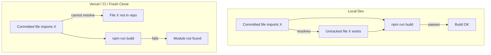

# After-Action Report: Build Module Graph Failures (March 2025)

## Summary

Vercel builds failed repeatedly due to **"Module not found"** errors. The root cause was **untracked files**: code that existed locally and was imported by committed files, but was never added to git. Vercel (and any fresh clone) only receives committed files, so imports to those modules failed at build time.

## Timeline

1. **Initial failure**: 22 Turbopack errors — missing `ImportPassagesForm`, `archetype-wave`, `adventure-progress`, `appreciation`, `charge-capture`, `charge-metabolism`, `extract-321-taxonomy`, `moves-library`, `AppreciationsReceived`, `RecentChargeSection`, `DashboardSectionButtons`, `book-section-mapper`, `book-toc`.

2. **First fix**: Added and committed 24 files (actions, components, lib modules). Build passed locally; pushed to main.

3. **Second failure**: 1 error — `@/lib/charge-quest-generator` not found. The `charge-capture` action (now committed) imported it, but the `charge-quest-generator` directory was still untracked.

4. **Second fix**: Added and committed `src/lib/charge-quest-generator/`. Build passed; pushed to main.

## Root Cause Analysis

**Why local build passed**: Node/Turbopack resolves imports from the filesystem. Untracked files exist locally, so imports succeed.

**Why Vercel build failed**: Git only pushes tracked files. Untracked modules are absent from the repo, so imports fail in CI.

## Contributing Factors

1. **Incremental development**: Features were built over many sessions; new modules were created and imported without being committed in the same change.

2. **No pre-push module audit**: The fail-fix workflow runs `npm run build` locally, but that doesn't detect untracked imports—the build passes because files exist.

3. **Skill gap**: Deftness and Roadblock Metabolism cover import/export resolution and type-check, but neither explicitly addresses "ensure all imported modules are tracked in git."

## Fixes Applied

| Batch | Files Added | Commit |
|-------|-------------|--------|
| 1 | ImportPassagesForm, archetype-wave, adventure-progress, appreciation, charge-capture, charge-metabolism, extract-321-taxonomy, moves-library, AppreciationsReceived, charge-capture/*, dashboard/*, book-section-mapper, book-toc | `fix: add missing modules to fix Turbopack build` |
| 2 | charge-quest-generator/* | `fix: add charge-quest-generator module for charge-capture` |

## Recommendations

1. **Add Module Graph / Git Hygiene to Deftness** (see proposed skill changes below).
2. **Pre-push check**: Run `git status` and ensure no untracked files are imported by tracked files. A script could detect this (e.g. parse imports from staged files, check if targets exist and are staged).
3. **Atomic commits**: When adding an import to a new module, add and commit the module in the same commit.
4. **CI safeguard**: Consider a CI step that fails if `git status` shows untracked files in `src/` that are imported by tracked files (optional; adds complexity).
