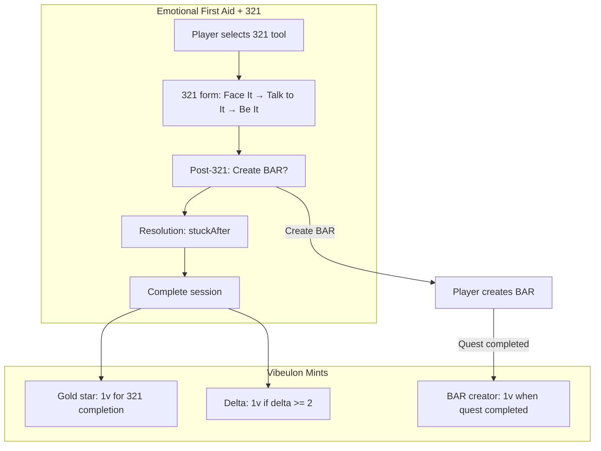

# Spec: 321 Integration with Emotional First Aid Kit

## Purpose

Integrate the 321 Shadow Process into the Emotional First Aid (EFA) kit so players can use 321 as a first-aid protocol. Reward players with a **gold star vibeulon** for completing a 321 session, separate from (a) the delta-based EFA mint and (b) the BAR creator mint when a quest using their 321-derived BAR is completed.

**Gold star thesis**: 321 is a high-value process. Players who do 321s and use them to accomplish goals deserve recognition at multiple points: for doing the process, and for turning it into BARs that serve quests.

## Design Decisions

| Topic | Decision |
|-------|----------|
| 321 as EFA tool | Replace `three-two-one-placeholder` with real 321; render Shadow321Form when tool key is `shadow-321` |
| 321 completion mint | Always mint 1 vibeulon when EFA session completes with 321 tool (gold star) |
| Delta mint | Unchanged: mint 1 when delta >= 2 (stuckness improvement) |
| Combined | 321 session can yield 1 (gold star) + 1 (delta) = 2 vibeulons max |
| BAR creator mint | Unchanged: when quest with BAR from 321 is completed, BAR creator gets 1 (already implemented) |

## User Stories

### P1: 321 as EFA Protocol

**As a player**, I want to select 321 as an Emotional First Aid protocol, so I can do shadow work in the medbay flow when I'm stuck.

**Acceptance**:
- 321 appears as a tool in EFA (key `shadow-321`; replaces or supersedes `three-two-one-placeholder`)
- When 321 is selected, render the 321 form (Face It → Talk to It → Be It) instead of Twine
- On 321 completion: advance to resolution (stuckAfter) → complete session
- Post-321 prompt (Create BAR / Import metadata / Skip) shown after 321 form, before or after resolution

### P2: Gold Star Mint for 321 Completion

**As a player**, I want to receive 1 vibeulon when I complete a 321 session as part of Emotional First Aid, so my effort is recognized regardless of stuckness delta.

**Acceptance**:
- When EFA session completes with tool key `shadow-321`: mint 1 vibeulon (source: `shadow_321_completion`)
- This is separate from delta-based mint (source: `emotional_first_aid`)
- VibulonEvent notes: "321 Shadow Process completed (gold star)"

### P3: Combined Rewards

**As a player**, I want to earn both the 321 gold star and the delta mint when my stuckness improves, so I'm rewarded for both doing the process and getting unstuck.

**Acceptance**:
- 321 session with delta >= 2: mint 1 (gold star) + 1 (delta) = 2 vibeulons
- 321 session with delta < 2: mint 1 (gold star) only

## Integration Points

### EmotionalFirstAidKit

- When `selectedTool.key === 'shadow-321'`: render `Shadow321Form` (or `Shadow321FormEFA`) instead of `FirstAidTwinePlayer`
- Shadow321Form receives `onComplete` callback; on 321 done, call `onComplete(metadata)` and advance to resolution
- Post-321 prompt: Create BAR / Import metadata / Skip — same as standalone 321; can open create-bar flow in modal or new tab

### completeEmotionalFirstAidSession

- Accept optional `toolKey` or resolve from `session.tool.key`
- If tool key is `shadow-321`: always mint 1 (gold star) with source `shadow_321_completion`
- Existing delta mint logic unchanged

### Seed / Admin

- Add or update tool: key `shadow-321`, name "321 Shadow Process", description referencing Face It / Talk to It / Be It
- Tags: frozen, overwhelm, head-spin, other (same as placeholder)
- TwineLogic: can remain minimal placeholder or redirect; runtime renders 321 form when key matches

## Vibeulon Flow Summary

## References

- [321 Shadow Process spec](../321-shadow-process/spec.md)
- [Emotional First Aid](../../src/actions/emotional-first-aid.ts)
- [EmotionalFirstAidKit](../../src/components/emotional-first-aid/EmotionalFirstAidKit.tsx)
- [emotional-first-aid lib](../../src/lib/emotional-first-aid.ts) — DEFAULT_FIRST_AID_TOOLS, three-two-one-placeholder
