# Plan: Admin CYOA Preview, DRAFT-Only, New Passage Form

## API-First Flow

1. **Define** contracts (preview param, status, createPassage linkFrom).
2. **Implement** API/action changes; then wire UI.

## Architecture (Deft: form enhancement, shared ChoiceBuilder)

```mermaid
flowchart TB
    subgraph Preview [Preview Flow]
        AdminPage[Admin Adventures Page] -->|preview=1| PlayPage[Play Page]
        PlayPage -->|isPreview| AdventurePlayer[AdventurePlayer]
        AdventurePlayer -->|fetch + preview=1| API[Adventures API]
        API -->|admin + preview| AllowDraft[Allow DRAFT]
    end

    subgraph Status [Status Contract]
        CreatePaths[createAdventure / publish / append] -->|always| DRAFT[DRAFT]
    end

    subgraph Form [New Passage Form]
        ConnectFrom[Connect from section] --> Content[Content section]
        Content --> Choices[Choices via ChoiceBuilder]
        Choices --> CreatePassage[createPassage + linkFrom]
        CreatePassage --> Wire[Wire from/branch]
    end

    ChoiceBuilder[ChoiceBuilder] -.->|shared| CreateForm[CreatePassageForm]
    ChoiceBuilder -.->|shared| EditForm[EditPassageForm]
```

## File Impacts

| File | Change |
|------|--------|
| `admin/adventures/[id]/page.tsx` | Preview: show when passages > 0; link with `?preview=1` |
| `adventure/[id]/play/page.tsx` | Preview: admin + preview=1 → no status filter |
| `api/adventures/[slug]/[nodeId]/route.ts` | Preview: admin + preview=1 → skip ACTIVE check |
| `AdventurePlayer.tsx` | Add `isPreview`; append `?preview=1` to fetch |
| `quest-grammar.ts` | All adventure-creation: `status: 'DRAFT'`; append → update DRAFT |
| `passages/create/actions.ts` | Extend `createPassage` with `linkFrom` |
| `components/admin/ChoiceBuilder.tsx` | New shared component (text + target dropdown rows) |
| `passages/create/CreatePassageForm.tsx` | Add Connect from; replace JSON with ChoiceBuilder |
| `passages/[passageId]/edit/EditPassageForm.tsx` | Replace JSON with ChoiceBuilder |

## Order

1. **Preview**: play page + API + AdventurePlayer → admin page link.
2. **DRAFT**: Grep `status: 'ACTIVE'` in quest-grammar; change to DRAFT; append sets DRAFT.
3. **Form**: `createPassage` linkFrom → ChoiceBuilder → enhance CreatePassageForm + EditPassageForm.
