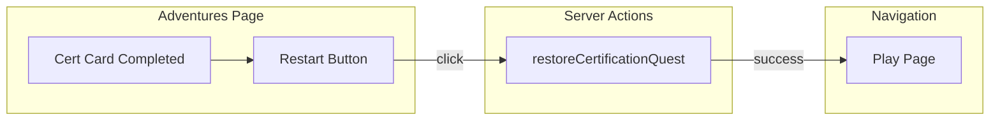

# Plan: Restart Completed Adventures

## Approach

Use **Option A**: Add a "Restart" button on the Adventures card for completed certification quests. On click, call `restoreCertificationQuest`, then navigate to the play page. Admin-only for v1.

## Changes

### 1. Adventures page (server + client)

- **Current**: `isCertCompleted` → `<Link href="/bars/available">` with "Restore in Market to re-run"
- **New**: `isCertCompleted` → render card with:
  - Primary action: "Restart" button (client component) that calls `restoreCertificationQuest(questId)`, then `router.push(/adventures/${storyId}/play?questId=${questId})`
  - Secondary: optional link to Market for "View in Graveyard"
- **Admin check**: Only show Restart for admins. Non-admins keep current behavior (link to Market) for now.

### 2. Client component for Restart

Create a small client component `AdventureRestartButton` (or inline with `'use client'`) that:
- Accepts `questId`, `storyId`
- On click: `restoreCertificationQuest(questId)` → on success, `router.push(...)`
- Shows loading state during restore
- Handles error (toast or inline message)

### 3. Adventures page structure

The Adventures page is a server component. We need to pass `questId`, `storyId`, `isAdmin` to a client component for the Restart button. The card can remain a server-rendered layout with a client island for the button.

## Data flow

## Files to create/modify

| File | Action |
|------|--------|
| `src/app/adventures/page.tsx` | Modify — replace Market link with Restart button for completed certs (admin) |
| `src/components/AdventureRestartButton.tsx` | Create — client component for Restart (optional; can inline) |

## Edge cases

- **Restore fails**: Show error; do not navigate.
- **Non-admin**: Keep link to Market (no Restart).
- **Quest without story**: Guard against missing `storyId`.
