# Plan: AID Decline Fork, Clock, and Lore Update

## Summary

Add configurable decline clock for AID offers; when steward declines (or offer expires), offerer can fork the linked quest and complete privately. Update lore, foundations, and architecture to reflect BARs Engine as Jira–GitHub–CYOA bridge with Architect Game Master as sys-admin teacher.

## Phases

### Phase 1: Decline clock (schema + config + offerAid)

- Add `expiresAt DateTime?` to `GameboardAidOffer` in Prisma schema.
- Add `aidOfferTtlHours` to AppConfig.features JSON (default 24). Parse in offerAid.
- In `offerAid`: compute `expiresAt = new Date(Date.now() + ttlHours * 3600000)` and store.
- Run `npm run db:sync` after schema change.

### Phase 2: Decline clock UI

- Extend slot include to pass `expiresAt` on aid offers.
- In GameboardClient: for each pending offer, show "Respond by [date]" or "Expires in Xh".
- When steward views offers: expired offers (read-time: `expiresAt < now`) are not actionable; treat as declined.

### Phase 3: Fork on decline (action + data + UI)

- Implement `forkDeclinedAidQuest(offerId)` in gameboard.ts:
  - Fetch offer; verify status (declined or pending+expired), type=quest, linkedQuestId, offererId=currentPlayer.
  - Call forkQuestPrivately(linkedQuestId) logic.
  - Optionally: add `forkedAt` or status `forked` to prevent double-fork; or filter forked offers from list.
- Add `getDeclinedAidOffersForOfferer(playerId)` or extend getOrCreateGameboardSlots to return declined quest-type offers for current player.
- UI: "Your declined AID" section (collapsible or panel) when declinedOffers.length > 0. Each: "Steward declined [Quest Title]. [Fork and complete it yourself]".

### Phase 4: Lore updates

- Create `docs/JIRA_GITHUB_CYOA_METAPHOR.md`: table mapping Jira (backlog, sprints, issues) → BARs (campaign deck, periods, quests); GitHub (branches, PRs, forks) → BARs (quest forking, AID, fork-on-decline); CYOA (choices, paths) → quest grammar, emotional alchemy.
- Update `.agent/context/game-master-sects.md`: Architect as virtual sys-admin teacher for backlog stewardship.
- Update FOUNDATIONS.md: version-managed backlog, Jira–GitHub–CYOA bridge, Architect.
- Update ARCHITECTURE.md: fork lifecycle, AID offer lifecycle, Architect in governance.
- Update `.specify/memory/conceptual-model.md`: version management, backlog stewardship.

### Phase 5: Verification quest

- Add `cert-aid-decline-fork-v1` Twine story: offer quest AID → steward declines → offerer forks → fork in hand.
- Add to `scripts/seed-cyoa-certification-quests.ts`.
- Run build, check.

## File Impacts

| File | Action |
|------|--------|
| `prisma/schema.prisma` | Add expiresAt to GameboardAidOffer |
| `src/actions/gameboard.ts` | Set expiresAt in offerAid; add forkDeclinedAidQuest; getDeclinedAidOffersForOfferer |
| `src/app/campaign/board/GameboardClient.tsx` | Show expiry on offers; "Your declined AID" section |
| `src/app/campaign/board/page.tsx` | Pass declined offers to client |
| `docs/JIRA_GITHUB_CYOA_METAPHOR.md` | New |
| `.agent/context/game-master-sects.md` | Architect as sys-admin teacher |
| `FOUNDATIONS.md` | Version-managed backlog, metaphor |
| `ARCHITECTURE.md` | Fork/AID lifecycle, Architect |
| `.specify/memory/conceptual-model.md` | Version management, backlog stewardship |
| `scripts/seed-cyoa-certification-quests.ts` | Add cert-aid-decline-fork-v1 |

## Data Flow (Decline → Fork)

```mermaid
flowchart TD
    subgraph offer [Offer Phase]
        A[Offerer offers quest AID] --> B[Offer created with expiresAt]
        B --> C{Steward responds}
    end
    subgraph decline [Decline Cases]
        C -->|Accept| D[Quest assigned to steward]
        C -->|Explicit decline| E[status=declined]
        C -->|Timeout| F[expiresAt passed, treat as declined]
    end
    subgraph fork [Fork Option]
        E --> G[Offerer sees Fork option]
        F --> G
        G --> H[forkDeclinedAidQuest]
        H --> I[Fork in offerer hand, complete privately]
    end
```

## Dependencies

- gameboard-deep-engagement (DB)
