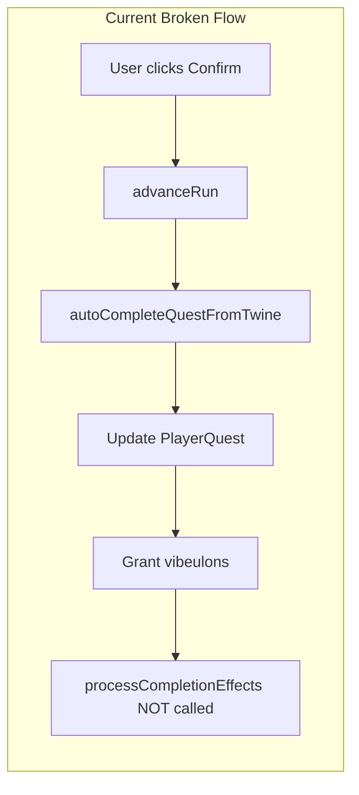
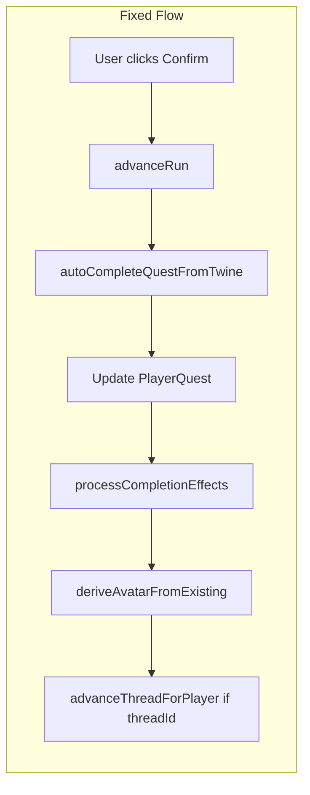

# Spec: Avatar Visibility Fix + Certification Report Issue

## Purpose

Fix two issues: (1) Existing players (admin, pre-avatar characters) cannot see their avatar in the flow or dashboard even after completing the "Build Your Character" quest; (2) Ensure all certification quests have the Report Issue feature on every step per certification-quest-ux spec.

## Rationale

- **Avatar bug**: The Build Your Character quest completes via the Twine flow (`advanceRun` -> `autoCompleteQuestFromTwine`). That path does NOT call `processCompletionEffects`, so `deriveAvatarFromExisting` never runs. The completion effects (including avatar derivation) are only executed when `completeQuest` is used. Root cause: `autoCompleteQuestFromTwine` bypasses the quest-engine completion pipeline.
- **Report Issue**: FR5 of certification-quest-ux requires each certification quest step to have a "Report Issue" link to FEEDBACK. Newer certification quests must be audited and any missing Report Issue links added.

## Expected Behavior (Avatar Flow)

1. **Before completion**: Players see their created character (derived from playbook and archetype) as a preview during the Build Your Character quest — no need to complete first.
2. **On completion**: Avatar is saved to `player.avatarConfig` and appears on the dashboard.

## User Stories

### P1: Avatar preview before completing quest

**As an existing player** with nation and archetype, I see my character (avatar derived from my playbook and archetype) as a preview in the Build Your Character flow before I click Confirm.

**Acceptance**: The Build Your Character quest (or play page) renders an avatar preview derived on-the-fly from `player.nationId` and `player.playbookId` when `avatarConfig` is null. Uses `deriveAvatarConfig` for display; no persistence yet.

### P2: Avatar saved and visible on dashboard after completion

**As an existing player**, when I complete the quest (Confirm), my avatar is saved and appears in the dashboard header and campaign flow.

**Acceptance**: When the quest is completed via the Twine player (advanceRun -> autoCompleteQuestFromTwine), `deriveAvatarFromExisting` runs; `player.avatarConfig` is set; avatar renders on dashboard.

### P3: Admin and pre-avatar players see avatar

**As admin** or a player created before the avatar feature, I have nation/archetype (or can complete Build Your Character), and I see my avatar in the quest preview and on the dashboard after completion.

**Acceptance**: Admin with nationId+playbookId: preview during quest; completing Build Your Character sets avatarConfig. Players without nation/playbook: fallback (initials) still renders; Build Your Character effect no-ops gracefully.

### P4: All certification steps have Report Issue

**As a tester**, every step of every certification quest has a "Report Issue" link to FEEDBACK, so I can report problems from any step.

**Acceptance**: Audit all certification quests in seed-cyoa-certification-quests.ts; every step passage has `{ label: 'Report Issue', target: 'FEEDBACK' }` in links; FEEDBACK passage exists.

### P5: Build Your Character has Report Issue

**As a tester**, the Build Your Character orientation quest has a Report Issue option so I can report if avatar derivation fails.

**Acceptance**: Build Your Character story (seed-onboarding-thread.ts) has FEEDBACK passage and Report Issue link on START.

## Functional Requirements

- **FR1**: `autoCompleteQuestFromTwine` MUST call `processCompletionEffects` when the quest has `completionEffects`. Use the quest's completionEffects JSON; inputs can be `{ completedViaTwine: true, runId }`. Export or invoke the effect processor from quest-engine.
- **FR2**: When `advanceRun` completes a quest that is in a thread, it MUST call `advanceThreadForPlayer` so ThreadProgress updates. Pass `threadId` through advanceRun (and from PassageRenderer).
- **FR3**: All certification quest passages (except START with only "Begin", FEEDBACK, END_SUCCESS) MUST include `{ label: 'Report Issue', target: 'FEEDBACK' }` in their links array.
- **FR4**: Build Your Character quest MUST have a FEEDBACK passage and Report Issue link on START (or the single content passage before END_SUCCESS).
- **FR5**: Build Your Character quest MUST display an avatar preview during the flow (before completion). When `player.avatarConfig` is null but `player.nationId` and `player.playbookId` exist, derive avatar on-the-fly for display using `deriveAvatarConfig` from `@/lib/avatar-utils`. Pass player or nation/playbook data to the Twine play page; render Avatar in the passage or layout.

## Non-functional Requirements

- No schema changes.
- Backward compatible: quests without completionEffects continue to work.

## Root Cause (Avatar)

## Out of Scope (v1)

- One-time backfill migration script.

## Reference

- Quest engine: [src/actions/quest-engine.ts](../../src/actions/quest-engine.ts)
- Avatar utils: [src/lib/avatar-utils.ts](../../src/lib/avatar-utils.ts) (deriveAvatarConfig)
- Twine auto-complete: [src/actions/twine.ts](../../src/actions/twine.ts) (autoCompleteQuestFromTwine)
- Certification UX: [.specify/specs/certification-quest-ux/spec.md](../certification-quest-ux/spec.md)
- Build Your Character seed: [scripts/seed-onboarding-thread.ts](../../scripts/seed-onboarding-thread.ts)
