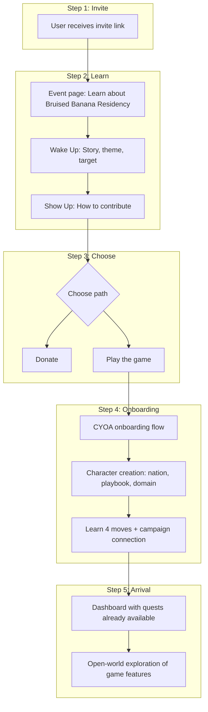

# Spec: Bruised Banana Onboarding Flow

## Purpose

Define and implement the desired new user onboarding flow for the Bruised Banana instance: invite → event page → donate OR play → CYOA onboarding → character creation → learn moves + campaign connection → dashboard with personalized quests. This spec is the source of truth for the flow and phased implementation.

## Desired Flow (Target State)

### Step-by-Step (Desired)

| Step | User action | System response |
|------|-------------|-----------------|
| 1 | Receives invite link | Lands on event page (or landing that routes to event) |
| 2 | Reads Wake Up, Show Up | Learns about Bruised Banana Residency, campaign context |
| 3 | Chooses: Donate OR Play the game | Donate: /event/donate. Play: enters onboarding |
| 4 | Plays through CYOA | Character creation (nation, playbook, domain), learns 4 moves, sees how moves connect to campaign |
| 5 | Completes onboarding | Arrives on dashboard with quests already available, personalized by choices |
| 6 | Explores | Open-world style: Market, BARs, wallet, adventures, etc. |

---

## Current System vs Desired

### What Exists Today

| Component | Current state | Desired |
|-----------|---------------|---------|
| **Invite link** | Copies `/event?ref=bruised-banana` | ✅ Implemented (Phase 1) |
| **Event page** | Wake Up, Show Up, Donate, "Play the game" | Matches |
| **Play the game CTA** | Links to `/campaign?ref=bruised-banana` | ✅ Implemented (Phase 1) |
| **Campaign (CYOA)** | `/campaign` = wake_up adventure. Center_Witness, 6 Faces. Sign-up node exists. Ref passed in campaignState. | Needs: (a) Event-driven content (Bruised Banana), (b) Nation/playbook/domain selection, (c) 4 moves teaching |
| **Post-sign-up** | createCampaignPlayer → /conclave/onboarding → quests → dashboard | Matches. Need quests personalized by CYOA choices |
| **Guided flow** | /conclave/guided: sign-up first | Different flow; not the CYOA |

### Two Onboarding Flows (Current)

| Flow | Entry | Auth timing | Character creation | Exit |
|------|-------|-------------|--------------------|------|
| **Guided** | /conclave/guided | Sign-up first | Nation/playbook via story nodes | /event or / |
| **Campaign** | /campaign | Sign-up when CYOA reaches signup node | From campaignState (nation, playbook if in state) | /conclave/onboarding → quests → dashboard |

The Campaign flow is closer to the desired "CYOA first, then character creation, then dashboard."

---

## Phased Implementation

### Phase 1: Route alignment (quick wins) — DONE

**Acceptance criteria:**

- **AC1.1**: InviteButton copies `/event?ref=bruised-banana` (not `/?ref=bruised-banana`).
- **AC1.2**: Event page "Play the game" links to `/campaign?ref=bruised-banana` (not `/conclave/guided`).
- **AC1.3**: Campaign page reads `ref` from URL searchParams and passes it to CampaignReader.
- **AC1.4**: CampaignReader includes `ref` in campaignState; CampaignAuthForm passes campaignState to createCampaignPlayer; ref is stored in storyProgress.

**Implementation:** InviteButton, event page, campaign page, CampaignReader.

### Phase 2: Campaign content for Bruised Banana — DONE

**Acceptance criteria:**

- **AC2.1**: Bruised Banana intro nodes (from instance.wakeUpContent, showUpContent) appear when ref=bruised-banana. ✅
- **AC2.2**: Nation, playbook, domain selection nodes exist before sign-up; choices stored in campaignState. ✅
- **AC2.3**: 4 moves teaching nodes (Wake Up, Clean Up, Grow Up, Show Up) explain each move and tie to campaign. ✅
- **AC2.4**: createCampaignPlayer applies nationId, playbookId, campaignDomainPreference from campaignState. ✅

**Implementation:** Adventures API returns dynamic BB_* nodes when ref=bruised-banana; campaign page uses BB_Intro as start; CampaignReader passes ref when fetching; createCampaignPlayer applies campaignDomainPreference.

### Phase 3: Event-Driven CYOA (AC) — PENDING

**Acceptance criteria:**

- **AC3.1**: Instance fields drive narrative; developmental assessment; personalized orientation quests.
- **AC3.2**: Implements Phase 2 in a maintainable, spec-driven way.

**Implementation:** Event-Driven CYOA backlog item (AC).

### Phase 3.1: 2-Minute Ride (AH) — Story Bridge + UX Expansion

**Acceptance criteria:**

- **AC3.1.1**: Story bridge copy (game world ↔ real world) editable via EventCampaignEditor; BB nodes render it.
- **AC3.1.2**: Instance.campaignRef; campaign page uses it when ref absent (Dashboard "Begin the Journey" → BB flow).
- **AC3.1.3**: Progress indicator, vibeulon payoff preview, optional donate link, error recovery.

**Implementation:** [2-Minute Ride spec](../two-minute-ride-story-bridge/spec.md) (AH).

---

## Functional Requirements (Phase 1 — Implemented)

- **FR1**: InviteButton MUST copy `${origin}/event?ref=bruised-banana`.
- **FR2**: Event page "Play the game" CTA MUST link to `/campaign?ref=bruised-banana`.
- **FR3**: Campaign page MUST accept `searchParams.ref` and pass it to CampaignReader as `campaignRef`.
- **FR4**: CampaignReader MUST include `ref: campaignRef` in initial campaignState; campaignState is passed to CampaignAuthForm and thence to createCampaignPlayer.
- **FR5**: createCampaignPlayer MUST persist full campaignState (including ref) in storyProgress.

---

## Gaps Remaining (Phase 2+)

1. **Campaign content alignment**: wake_up uses Construct Conclave lore (6 Faces). Needs Bruised Banana story, nation/playbook/domain nodes, 4 moves teaching.
2. **Character creation in CYOA**: Add nation/playbook/domain selection nodes; wire campaignDomainPreference into createCampaignPlayer.
3. **4 moves + campaign connection**: Add CYOA nodes that explain Wake Up, Clean Up, Grow Up, Show Up.
4. **Personalized quests**: assignOrientationThreads/assignGatedThreads to use storyProgress (nation, playbook, domain, developmental hint) for personalization.

---

## Backlog Alignment

| Backlog item | Relevance |
|--------------|-----------|
| **T** (Landing + Invitation) | Superseded by fundraiser-landing-refactor |
| **AC** (Event-Driven CYOA) | Core: event content → CYOA, character creation, moves, personalization |
| **AF** (Lore Index) | Supports "learn the story" with proper nouns |
| **AA** (Campaign Editor) | Done; edit Wake Up, Show Up for Bruised Banana |
| **AH** (2-Minute Ride) | Story bridge, campaignRef default, progress, vibeulon preview |

---

## Reference

- Plan: [bruised_banana_onboarding_flow_241bec5e.plan.md](/Users/test/.cursor/plans/bruised_banana_onboarding_flow_241bec5e.plan.md)
- InviteButton: [src/app/event/InviteButton.tsx](../../src/app/event/InviteButton.tsx)
- Event page: [src/app/event/page.tsx](../../src/app/event/page.tsx)
- Campaign page: [src/app/campaign/page.tsx](../../src/app/campaign/page.tsx)
- CampaignReader: [src/app/campaign/components/CampaignReader.tsx](../../src/app/campaign/components/CampaignReader.tsx)
- CampaignAuthForm: [src/app/campaign/components/CampaignAuthForm.tsx](../../src/app/campaign/components/CampaignAuthForm.tsx)
- createCampaignPlayer: [src/app/campaign/actions/campaign.ts](../../src/app/campaign/actions/campaign.ts)
