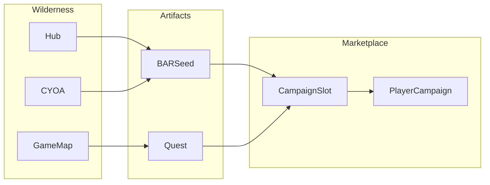

# Spec: Campaign marketplace slots & wilderness exploration IA

## Purpose

**Separate two player jobs** that are currently conflated on the main loop: **(1) exploration** — hub/spoke, game map, CYOA — as **wilderness** (self-paced discovery, BARSeeds, quests); **(2) marketplace** — **player-managed campaign slots** (“mall stalls”) where discoveries are **listed**, curated, and attached to **player-generated campaigns** under **scarcity** (initial **8 slots**, **high cost** to extend).

**Problem**: The **gameboard’s 8-slot draw** model ([gameboard-campaign-deck](.specify/specs/gameboard-campaign-deck/spec.md)) and **hub/spoke + map** ([campaign-hub-spoke-landing-architecture](.specify/specs/campaign-hub-spoke-landing-architecture/spec.md), [campaign-map-phase-1](.specify/specs/campaign-map-phase-1/spec.md)) describe **different graphs**, producing a **woolly** experience: players cannot tell whether slots are “official campaign work,” “my stall,” or “the map.”

**Practice**: Deftness Development — spec kit first, **API-first** (contracts before UI), deterministic rules for caps and costs; preserve **non-coercive** exploration while giving a **legible** answer to “what do I do with this BARSeed / quest?” → **take it to the market** (without mandating a single linear next step).

## Design Decisions

| Topic | Decision |
|-------|----------|
| Wild vs market | **Exploration surfaces** (hub, spokes, map nodes, initiation CYOA) = **discovery graph**; **marketplace** = **listing graph**. Different copy, different primary CTAs. |
| Slot metaphor | **Campaign slots** = **mall stalls**: start **empty**, **developed by players**; not the same as “today’s 8 drawn campaign cards.” |
| Initial cap | **8 campaign slots** per player (or per player–campaignRef scope — **TBD in plan**); **high vibeulon (or pack) cost** to unlock **slot 9+**. |
| Gameboard relationship | Existing **gameboard deck draw** is **reframed or migrated**: either (a) becomes **instance/system** “featured window” separate from **player stalls**, or (b) defers to marketplace spec in a later phase — **plan** picks one; this spec owns **player marketplace slots**. |
| BARSeed / quest pipeline | **Wild** produces **draft/private** artifacts; **market actions** **promote** to **slot-bound, campaign-visible** listings (quests, BAR offers, campaign hooks). |
| Canonical post-discovery CTA | **“Add to your campaign stall”** (or shorter **“List on marketplace”**) — **one** primary string family; appears after key discovery completions (see § Bridge IA). **Not** a forced navigation; optional dismiss. |
| Empty mall | **Mitigation required** before relying on empty stalls (see § Empty mall mitigation). |

## Conceptual Model

| Layer | WHO | WHAT | WHERE | Energy / scarcity |
|-------|-----|------|-------|-------------------|
| **Wilderness** | Player | CYOA runs, map exploration, hub/spoke epiphany paths, BARSeeds, quests in Hand | Domains, map regions, campaignRef context | Time, curiosity; **low coercion** |
| **Marketplace** | Player (+ audience) | **Campaign slot** listings: quests/BARs attached to **player-generated campaigns** | Marketplace route + stall UI | **Slots** (8 base), **high extension cost**, vibeulons |

**Personal throughput (4 moves)** remains the **grammar of the wild**: Stage 1 Game Master moves stay **specific** for **how** exploration is tagged; the **market** expresses **collective / public** structure.

## Bridge IA — canonical post-discovery CTA

**Goal**: One **recognizable** affordance after discovery so players are not lost, **without** a single forced global quest.

| Surface | When shown | CTA label (family) | Destination (conceptual) |
|---------|------------|--------------------|---------------------------|
| Post–CYOA completion / major passage | Player earned BARSeed or “portable” quest hook | **Add to your campaign stall** | Marketplace **stall composer** for chosen `campaignRef` |
| Hand / Vault | Item flagged `marketplaceEligible` or equivalent | Same + **secondary**: “Keep private” | Stall flow vs dismiss |
| Quest completion modal | Quest originated from wild; eligible for listing | **List on marketplace** | Stall attach flow |
| NOW / Throughput (optional, low prominence) | Player has unlisted eligible artifact | Short link: **Stalls** | `/campaign/marketplace` or routed stall hub |

**Rules**:

- **Never** replace exploration choices with a blocking modal; **offer** CTA with **dismiss** or **later**.
- **Copy** distinguishes **Explore** (wild) vs **Publish / List** (market) in tooltips or sublines.
- **Admin**: may tune which artifact types trigger CTA via config (future FR).

## Empty mall mitigation

| Risk | Mitigation |
|------|------------|
| **Empty mall** — no player stalls yet | **System / NPC stalls**: seeded **campaign listings** (e.g. Bruised Banana residency quests) visible as **read-only** or **instance-owned** stalls so the marketplace **never** renders zero context. |
| **Cold start** — first week | **Grace**: first **N** listings free or **discounted** slot unlock; or **ghost stalls** with copy “Your stall opens when you list your first quest.” |
| **Confusion** — wild vs stall | **Onboarding** one-pager or first-visit tooltip on marketplace: “You explore in the map and hub; you **publish** here.” |
| **Paywall shock** | **Transparent** slot math: “8 stalls included; slot 9+ requires …” before spend confirm. |

## API Contracts (API-First)

> Shapes are **targets** for implementation; names may align with existing `GameboardSlot` or new `CampaignMarketplaceSlot` — **plan** resolves migration.

### `listPlayerCampaignSlots`

**Input**: `{ playerId: string; campaignRef?: string }`  
**Output**: `{ slots: Array<{ slotIndex: number; campaignId?: string; listingQuestId?: string; listingBarId?: string; status: 'empty' | 'listed' }>; maxSlots: number; paidExtensions: number }`

### `attachArtifactToSlot`

**Input**: `{ playerId: string; slotIndex: number; source: { type: 'bar' | 'quest'; id: string }; campaignId: string }`  
**Output**: `{ success: true } | { error: string }`  
**Rules**: Enforce **ownership**; enforce **slot bounds**; **campaignId** must be **player-generated** or permitted.

### `purchaseAdditionalSlot`

**Input**: `{ playerId: string; campaignRef?: string }`  
**Output**: `{ success: true; newMaxSlots: number } | { error: string }`  
**Rules**: Cost curve **high** after slot 8; atomic **vibeulon** (or ledger) debit.

### `createPlayerCampaign` (may extend existing)

**Input**: Tied to instance/`campaignRef`; **Output**: `{ campaignId: string }`  
**Behavior**: Creates **empty** campaign shell for **stall** grouping.

- **Route vs Action**: Marketplace mutations = **Server Actions**; optional **GET** route for public **stall window** if SEO/share needed.

## User Stories

### P1: Wild vs market copy

**As a** player, **I want** hub/map/spoke language to sound like **exploration**, and marketplace language like **stalls**, **so** I don’t confuse the two graphs.

### P2: List discovery in a slot

**As a** player, **I want** to move a BARSeed or quest from exploration into a **campaign slot**, **so** others can see my campaign offering.

### P3: Slot scarcity

**As a** player, **I want** a clear **8-slot** baseline and **expensive** expansion, **so** slots feel valuable and curated.

### P4: Post-discovery CTA

**As a** player, **after** I finish a discovery beat, **I want** an optional **Add to stall** action, **so** I know where discoveries go without being forced down one path.

### P5: Non-empty mall at launch

**As a** new player, **I want** to see **some** stalls or system listings, **so** the marketplace doesn’t feel broken.

## Functional Requirements

### Phase A — IA & copy (no schema)

- **FR-A1**: Document and apply **wild vs market** terminology in **hub**, **map**, **board** entry points (cross-links to this spec).
- **FR-A2**: Implement **canonical CTA** surfaces per § Bridge IA (minimum: one path from Hand + one post-CYOA hook for BB `campaignRef`).

### Phase B — Data & actions

- **FR-B1**: Persist **player campaign slots** (8 base; extended count stored per player scope).
- **FR-B2**: `attachArtifactToSlot` + permission checks.
- **FR-B3**: `purchaseAdditionalSlot` with **high** marginal cost after slot 8.
- **FR-B4**: **Player-generated campaign** entity or reuse **EventCampaign** / thread pattern per plan.

### Phase C — Mitigation & polish

- **FR-C1**: **System stalls** or instance-owned default listings for active `campaignRef`.
- **FR-C2**: First-visit **marketplace** explainer (short).
- **FR-C3**: Reconcile **gameboard deck draw** with this model (deprecate, relocate, or dual-track — **plan**).

## Non-Functional Requirements

- **Backward compatibility**: Existing `GameboardSlot` users must not lose data; migrations explicit in plan.
- **Security**: Only owner (or steward rules TBD) may attach to personal stall.
- **Performance**: List slots with ≤1–2 queries per page load.

## Verification Quest

- **ID**: `cert-campaign-marketplace-slots-v1`
- **Seed**: `npm run seed:cert:campaign-marketplace-slots` (Twine + `CustomBar` in `scripts/seed-cyoa-certification-quests.ts`).
- **Steps**: (1) Open **wild** surface (hub or map) — copy reads exploration, not “shop.” (2) Complete or simulate discovery — **Add to your campaign stall** (or **List on marketplace**) appears and can be dismissed. (3) Open marketplace — see **≥1** system/instance stall when player stalls empty. (4) Confirm **8-slot** messaging and **extension** cost disclosure before purchase (when B3 shipped).
- **Narrative tie**: Framed as **Bruised Banana** residency — players prepare the **community marketplace** for the party economy.

## Dependencies

- [gameboard-campaign-deck](.specify/specs/gameboard-campaign-deck/spec.md) — reconcile slot semantics.
- [campaign-hub-spoke-landing-architecture](.specify/specs/campaign-hub-spoke-landing-architecture/spec.md) — hub as wild.
- [campaign-map-phase-1](.specify/specs/campaign-map-phase-1/spec.md) — map as wild.
- [game-map-gameboard-bridge](.specify/backlog/prompts/game-map-gameboard-bridge.md) — bridge narrative.

## References

- Plan: [plan.md](./plan.md)
- Tasks: [tasks.md](./tasks.md)
- Backlog prompt: [.specify/backlog/prompts/campaign-marketplace-slots.md](../../backlog/prompts/campaign-marketplace-slots.md)
