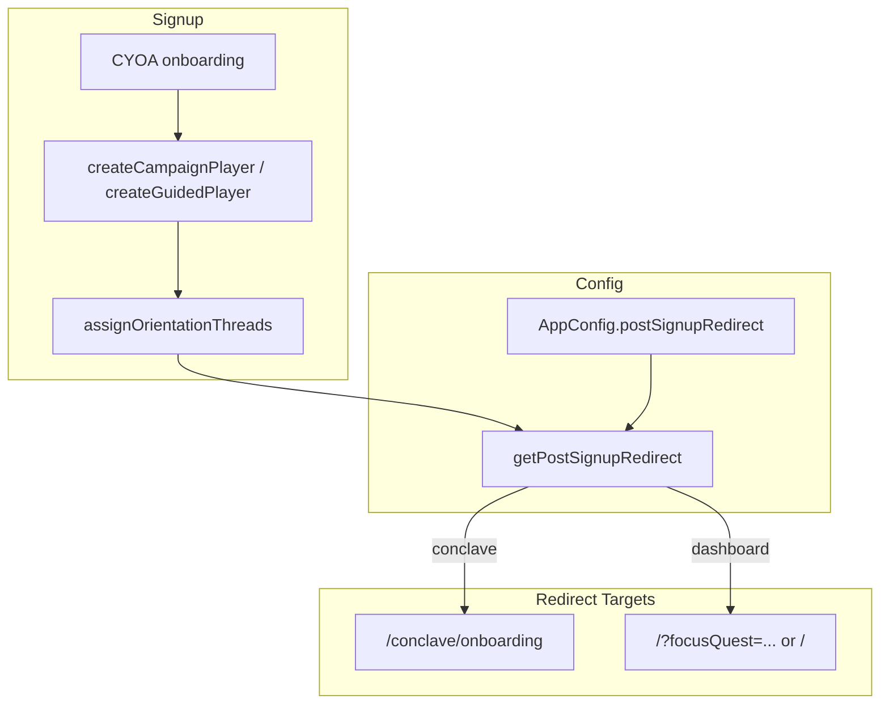

# Plan: Dashboard-First Orientation Flow

## Overview

Add configurable post-signup redirect (conclave vs dashboard). Default dashboard for new campaign model. Deprecate conclave for new campaigns. Ensure dashboard shows orientation quests with Game Master face style.

## Architecture

## File Impacts

| Action | File |
|--------|------|
| Add field | prisma/schema.prisma — AppConfig.postSignupRedirect String? |
| Create | src/actions/config.ts or extend getAppConfig — getPostSignupRedirect |
| Modify | src/app/campaign/actions/campaign.ts — use getPostSignupRedirect, redirect to dashboard when configured |
| Modify | src/actions/conclave.ts — createGuidedPlayer, same |
| Modify | src/app/campaign/components/CampaignAuthForm.tsx — handle redirectTo from action |
| Modify | src/app/login/page.tsx — if returnTo dashboard, respect |
| Seed | scripts/seed-app-config.ts or migration — set default postSignupRedirect |
| Create | scripts/seed-cyoa-certification-quests.ts — add cert-dashboard-orientation-flow-v1 |

## Phased Approach

### Phase 1: Config + Redirect (MVP)

1. Add `postSignupRedirect` to AppConfig (nullable; `'conclave' | 'dashboard'`).
2. Implement `getPostSignupRedirect()` — reads AppConfig, defaults to `'dashboard'`.
3. In createCampaignPlayer: after assignOrientationThreads, call getPostSignupRedirect. If `'dashboard'`, compute redirect URL (current orientation quest → `/?focusQuest=X` or `/`). If `'conclave'`, redirect to `/conclave/onboarding`.
4. In createGuidedPlayer: same logic.
5. CampaignAuthForm: use `state.redirectTo` from action (already supported).
6. Run `npm run db:sync` after schema change.
7. Seed or set default: `postSignupRedirect = 'dashboard'` for Bruised Banana instance.

### Phase 2: Verification + Docs

1. Add cert-dashboard-orientation-flow-v1 verification quest.
2. Document conclave deprecation in spec and developer docs.
3. Validate dashboard ritual banner and focusQuest flow.

### Phase 3: Instance-level override (optional)

- If needed later: Instance.postSignupRedirect overrides AppConfig for multi-instance.

## Redirect URL Logic (Dashboard)

When `postSignupRedirect === 'dashboard'`:

1. After assignOrientationThreads, fetch current orientation progress.
2. If progress exists and current quest has no Twine/Adventure: redirect to `/?focusQuest={questId}`.
3. If progress exists and current quest has Twine: redirect to `/adventures/{id}/play?questId=...` (same as conclave would) OR `/?focusQuest={questId}` — **decision**: for dashboard-first, send to dashboard with focusQuest; player clicks "Enter Ritual" to go full-screen. Keeps dashboard as landing.
4. If progress exists and thread has Adventure: same — dashboard with focusQuest.
5. If no progress or finished: redirect to `/`.

**Simplified**: Always redirect to `/?focusQuest={currentQuestId}` when there is a current orientation quest (even if it has Twine/Adventure). Dashboard shows it; "Continue Ritual" / "Enter Ritual" takes them to full-screen. This ensures "land on dashboard" consistently.

## Migration Path

- Existing instances: no AppConfig change → default `'dashboard'` → new behavior. If any instance needs conclave, set `postSignupRedirect = 'conclave'` explicitly.
- Conclave page: remains functional; linked from dashboard "Continue Ritual" when orientation active.
