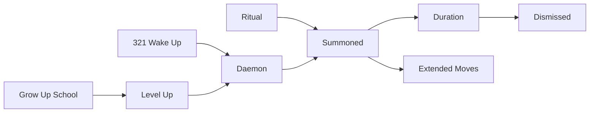

# Spec: Daemons System

## Purpose

Implement Daemons — collectible entities that extend a player's move set. Daemons can perform moves; they are discovered through a Wake Up variant of the 321 (Clean Up) process, leveled via Grow Up moves from a school, summoned by ritual, and dismissed after a duration.

**Parent**: [deftness-uplevel-character-daemons-agents](../spec.md)

**Related**: [daemons-inner-work-collectibles](../../../backlog/prompts/daemons-inner-work-collectibles.md), [TALISMAN_EXPLORATION.md](../../bruised-banana-quest-map/TALISMAN_EXPLORATION.md)

## Design Decisions

| Topic | Decision |
|-------|----------|
| Discovery | Wake Up version of 321 (Clean Up) — "321 Wake Up" = discovery path. Different from standard 321; emphasizes seeing what's available. |
| Leveling | Grow Up moves from a school — complete Grow Up quests at a school to level daemons |
| Summoning | Ritual required — player performs a ritual to summon daemons. Ritual = defined flow (e.g. CYOA, form, EFA-like) |
| Duration | Summoned for limited time; then dismissed. Timer or session-based. |
| Move extension | Daemons have moves; when summoned, player's available moves = base + playbook + daemon moves |

## Conceptual Model



- **WHO**: Player, Daemon (owned by player)
- **WHAT**: Daemon entity; moves it can perform
- **WHERE**: Discovery (321), Leveling (school), Summoning (ritual)
- **Energy**: Vibeulons — may be spent or earned in daemon flows
- **Personal throughput**: Daemons extends the 4 moves + playbook

## Schema (Sketch)

```prisma
model Daemon {
  id           String   @id @default(cuid())
  playerId     String
  player       Player   @relation(...)
  name         String   // player-given or generated
  source       String   // "321_wake_up" | "school" | ...
  level        Int      @default(1)
  discoveredAt DateTime
  moveIds      String   // JSON array of NationMove ids this daemon can do
}

model DaemonSummon {
  id         String   @id @default(cuid())
  daemonId   String
  daemon     Daemon   @relation(...)
  summonedAt DateTime
  expiresAt  DateTime   // duration; after this, dismissed
  status     String     // "active" | "dismissed"
}
```

## User Stories

### P1: Discovery via 321 Wake Up

**As a player**, I want to discover daemons by doing a Wake Up variant of the 321 process, so I can extend my moves through inner work.

**Acceptance**: "321 Wake Up" lives at `/shadow/321` (`Shadow321Runner`). On completion, daemon is created via `awakenDaemonFrom321` with `source: "321_wake_up"` and session lineage.

### P2: Leveling via Grow Up school

**As a player**, I want to level my daemons by completing Grow Up moves at a school, so they become more capable.

**Acceptance**: Grow Up quest completion at a school increments daemon level; may unlock new moves for that daemon.

### P3: Summon ritual

**As a player**, I want to summon my daemons via a ritual, so I can use their moves.

**Acceptance**: Ritual flow (CYOA or form); on completion, DaemonSummon created with `expiresAt = now + duration`. Daemon moves added to player's available set.

### P4: Duration and dismissal

**As a player**, I want my daemons to be dismissed after a time, so the extension is temporary and meaningful.

**Acceptance**: When `expiresAt` passes, summon status = "dismissed"; daemon moves removed from available set. Player can re-summon via ritual.

### P5: Extended moves in quest completion

**As a player**, I want to use daemon moves when completing quests, so I have more options.

**Acceptance**: Nation move application accepts daemon move IDs when daemon is summoned; completion works as with standard moves.

## API Contracts

### awakenDaemonFrom321({ playerId, phase2Snapshot, phase3Snapshot, daemonName, shadow321Name? })

**Input**: snapshots + name from `Shadow321Runner` completion.  
**Output**: `{ daemonId, sessionId, name, moveIds }` — persists `Shadow321Session` (`daemon_awakened`).

### discoverDaemon(playerId, source, metadata)

**Input**: `playerId`, `source: "321_wake_up" | "school" | "bar"`, `metadata`  
**Output**: `{ daemonId, name, moveIds }`  
**Note**: Prefer `awakenDaemonFrom321` for the `/shadow/321` path; `discoverDaemon` covers school/bar and legacy hooks.

### summonDaemon(playerId, daemonId, ritualInput?)

**Input**: `playerId`, `daemonId`, optional ritual payload  
**Output**: `{ summonId, expiresAt, durationMinutes }`

### getActiveDaemonMoves(playerId)

**Input**: `playerId`  
**Output**: `NationMove[]` — moves from all currently summoned daemons

### dismissDaemonSummon(summonId) — or automatic on expiry

**Input**: `summonId`  
**Output**: `{ success }`

## Functional Requirements

### Phase 1: Schema and discovery

- **FR1**: Daemon model; DaemonSummon model; relations to Player, NationMove
- **FR2**: 321 Wake Up flow — variant of 321 that triggers `discoverDaemon` on completion
- **FR3**: Seed or define initial daemon types/moves for discovery

### Phase 2: Summoning and duration

- **FR4**: Ritual flow for summoning; creates DaemonSummon with expiresAt
- **FR5**: Cron or on-request check: dismiss expired summons; update player available moves
- **FR6**: `getActiveDaemonMoves` used when applying nation moves

### Phase 3: Leveling

- **FR7**: Grow Up school quest completion → level up daemon; may add moves
- **FR8**: School = quest or adventure tagged with moveType: growUp, location/school metadata

## Dependencies

- [321-efa-integration](../../321-efa-integration/spec.md) — 321 flow; Wake Up variant
- [nation-moves](../../../src/actions/nation-moves.ts) — apply move with daemon
- [daemons-inner-work-collectibles](../../../backlog/prompts/daemons-inner-work-collectibles.md)

## Non-Goals (v0)

- Daemons as NPCs or autonomous agents
- Multiple daemons summoned simultaneously (or allow; design choice)
- Daemon trading or transfer
