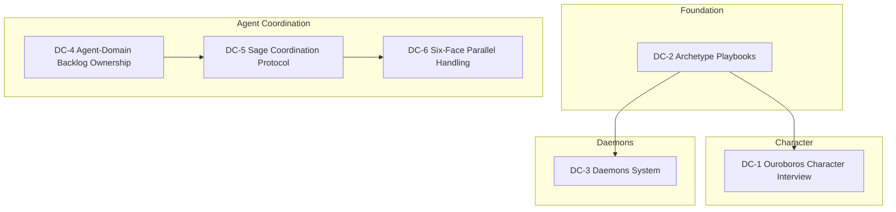

# Plan: Deftness Uplevel — Character, Daemons, and Agent Coordination

## Overview

This plan decomposes the deftness uplevel spec into implementation phases. Work is organized by child spec; dependencies flow from schema and shared concepts to UI and coordination.

## Phase Order

## Phase 1: Archetype Playbooks (DC-2)

**Owner**: Architect + Regent

- Verify/seed `NationMove.archetypeId` for all 8 archetypes
- Implement `getPlaybookForArchetype`, `getPlaybookForPlayer`
- Surface playbook in existing Archetype modal or character view
- **Files**: `src/actions/playbook.ts` (or extend bars.ts), `src/lib/quest-grammar/` (if playbook affects quest generation)

## Phase 2: Ouroboros Character Interview (DC-1)

**Owner**: Sage + Architect

- Create interview nodes (Adventure or Passage): lens → nation → archetype → playbook → domain → complete
- Implement `getOuroborosInterviewState`, `advanceOuroborosInterview`
- Build OuroborosInterview component or extend CampaignReader
- Route: `/character/create` or `/onboarding/character`
- On completion: persist archetypeId, nationId, campaignDomainPreference, avatarConfig
- **Files**: `src/app/character/create/page.tsx`, `src/actions/ouroboros-interview.ts`, `content/` or Passage API

## Phase 3: Daemons System (DC-3)

**Owner**: Shaman + Sage

- Schema: Daemon, DaemonSummon models
- 321 Wake Up flow: variant of 321 that triggers discovery
- Ritual flow for summoning; duration; dismissal (cron or on-request)
- `getActiveDaemonMoves`; integrate with nation-moves application
- Grow Up school leveling (Phase 3b)
- **Files**: `prisma/schema.prisma`, `src/actions/daemons.ts`, `src/components/shadow/Shadow321WakeUpForm.tsx`, ritual flow

## Phase 4: Agent-Domain Backlog Ownership (DC-4)

**Owner**: Sage

- Add `ownerFace` to backlog model (SpecKitBacklogItem or BACKLOG.md format)
- Implement `assignBacklogItemOwner`, `getBacklogItemsByOwner`
- Admin UI: assign owner when viewing backlog
- Agent context: include owned items when face is known
- **Files**: `prisma/schema.prisma` (if DB), `src/actions/backlog.ts`, admin backlog page, `backend/app/agents/` context builder

## Phase 5: Sage Coordination Protocol (DC-5)

**Owner**: Sage

- Extend `sage:brief` to output assignment suggestions
- Implement `getSageCoordinationSuggestions`
- Convergence detection: items sharing dependencies
- Optional: `runSageSynthesis` for multi-face outputs
- **Files**: `scripts/sage-brief.ts`, `src/lib/sage-coordination.ts` (or backend)

## Phase 6: Six-Face Parallel Handling (DC-6)

**Owner**: Sage

- v0: Document manual decomposition protocol
- v1: `decomposeFeature`, `runParallelFeatureWork`, `synthesizeFeatureOutputs`
- v2: Full pipeline (feature in → result out)
- **Files**: `src/actions/feature-decomposition.ts`, `scripts/run-parallel-feature.ts`, backend agent API

## File Impact Summary

| Area | Files |
|------|-------|
| Schema | `prisma/schema.prisma` — Daemon, DaemonSummon, ownerFace on backlog |
| Actions | `daemons.ts`, `ouroboros-interview.ts`, `playbook.ts`, `backlog.ts` |
| Components | OuroborosInterview, Shadow321WakeUpForm, ritual flow |
| Routes | `/character/create`, `/daemons`, `/admin/backlog` (owner column) |
| Scripts | `sage-brief.ts`, `run-parallel-feature.ts` |
| Backend | Agent context builder, coordination API |

## Verification

- **cert-ouroboros-character-interview-v1**: Complete Ouroboros interview; verify state persisted
- **cert-daemons-discovery-v1**: Discover daemon via 321 Wake Up; summon; use move
- **cert-agent-ownership-v1**: Assign backlog item to face; filter by owner; agent receives context
