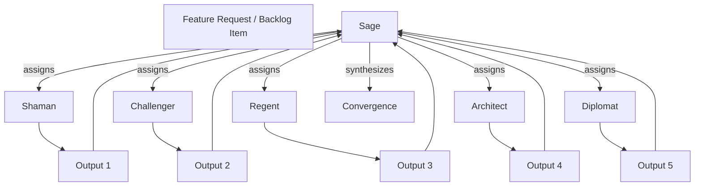

# Spec: Sage Coordination Protocol

## Purpose

Define how the Sage coordinates with the other five Game Master faces to assign work, converge outputs, and steer the development process. The Sage is a wise trickster and the meta-agent: integration, emergence, flow. The Sage can use the other faces as masks to promote their outcomes and goals from a different perspective.

**Parent**: [deftness-uplevel-character-daemons-agents](../spec.md)

## Design Decisions

| Topic | Decision |
|-------|----------|
| Sage role | Coordinator, not executor of all work. Assigns items to faces; synthesizes outputs; identifies blockers. |
| Daily brief | Sage brief (sage:brief) extended to include: work assignment suggestions, face-specific next moves, convergence points |
| Convergence | When multiple faces produce outputs (e.g. quest + copy + schema), Sage synthesizes or flags conflicts |
| Human in loop | Sage recommends; human approves assignments. No full autonomy in v0. |

## Coordination Flow

## User Stories

### P1: Sage assigns work to faces

**As the Sage**, I want to suggest which face should own each open backlog item, so work is distributed by domain.

**Acceptance**: Sage brief or coordination API outputs `{ itemId, suggestedOwner, rationale }`. Human can accept or override.

### P2: Sage identifies convergence points

**As the Sage**, I want to identify when multiple faces' work must converge (e.g. schema + UI + copy), so integration is explicit.

**Acceptance**: Sage flags items that depend on multiple faces; suggests order or parallelization.

### P3: Sage daily brief includes coordination

**As a developer**, I want the Sage brief to include coordination guidance (who does what next), so I know how to parallelize.

**Acceptance**: `npm run sage:brief` output includes "Assign to [Face]" or "Convergence: [items]" section.

### P4: Sage synthesizes cross-face outputs

**As the Sage**, I want to synthesize outputs when multiple faces have produced work for the same feature, so the result is coherent.

**Acceptance**: When feature has outputs from 2+ faces, Sage (or human) runs synthesis step; produces integrated artifact.

## API Contracts

### getSageCoordinationSuggestions(backlogItems)

**Input**: Open backlog items  
**Output**: `{ assignments: { itemId, suggestedOwner, rationale }[], convergenceGroups: { itemIds, suggestedOrder }[] }`

### runSageSynthesis(featureId, faceOutputs)

**Input**: `featureId`, `faceOutputs: Record<Face, unknown>`  
**Output**: `{ synthesized: unknown, conflicts?: string[] }`

## Functional Requirements

- **FR1**: Sage brief script (or API) calls coordination logic; outputs assignment suggestions
- **FR2**: Coordination uses agent-domain mapping from [agent-domain-backlog-ownership](../agent-domain-backlog-ownership/spec.md)
- **FR3**: Convergence detection: items that share dependencies or belong to same feature
- **FR4**: Synthesis: optional step when multiple faces have produced; can be manual (human reviews) or Sage-assisted

## Dependencies

- [sage-brief-v2](../../sage-brief-v2/spec.md)
- [agent-domain-backlog-ownership](../agent-domain-backlog-ownership/spec.md)
- [agent-admin-wiring](../../agent-admin-wiring/spec.md)
