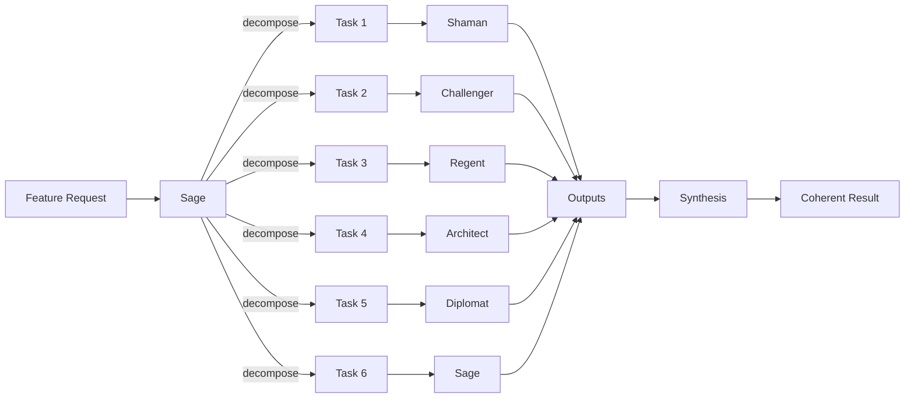

# Spec: 6-Face Parallel Feature Handling

## Purpose

Full maturity of the agent coordination system: feature requests are decomposed and handled by parallelized use of all six Game Master faces. Each face works within its domain; outputs are synthesized into a coherent result.

**Parent**: [deftness-uplevel-character-daemons-agents](../spec.md)

## Design Decisions

| Topic | Decision |
|-------|----------|
| Decomposition | Feature request → sub-tasks; each sub-task assigned to a face by domain |
| Parallel execution | When resource allows, invoke multiple faces concurrently |
| Synthesis | Sage (or synthesis step) combines outputs; resolves conflicts |
| Phasing | v0: manual decomposition and assignment; v1: Sage decomposes; v2: full parallel pipeline |

## Maturity Levels

| Level | Description |
|-------|-------------|
| **v0** | Human decomposes feature; assigns to faces; runs agents sequentially or manually parallel |
| **v1** | Sage suggests decomposition; human approves; parallel invocation via API |
| **v2** | Full pipeline: feature in → Sage decomposes → 6 faces run in parallel → synthesis → output |

## Flow (v2 Target)

## User Stories

### P1: Decompose feature into face tasks (v1)

**As the Sage**, I want to decompose a feature request into sub-tasks, each assigned to a face, so work can be parallelized.

**Acceptance**: Input: feature description. Output: `{ tasks: { face, task, dependencies }[] }`. Human approves before execution.

### P2: Parallel invocation (v1)

**As a developer**, I want to invoke multiple faces in parallel for a decomposed feature, so the work completes faster.

**Acceptance**: API or script: `runParallelFeatureWork(featureId, tasks)` → invokes agents concurrently; returns when all complete.

### P3: Synthesis of parallel outputs (v1)

**As the Sage**, I want to synthesize outputs from multiple faces into a coherent result, so the feature is complete.

**Acceptance**: Synthesis step takes `Record<Face, output>`; produces integrated artifact (spec, plan, code). Conflicts flagged.

### P4: Full pipeline (v2)

**As a developer**, I want to submit a feature request and receive a coherent result from all 6 faces, so development is accelerated.

**Acceptance**: Single entry point: feature request → decompose → parallel run → synthesize → result. Human reviews before commit.

## API Contracts

### decomposeFeature(featureDescription)

**Input**: `featureDescription: string`  
**Output**: `{ tasks: { face: GameMasterFace, task: string, dependencies?: string[] }[] }`

### runParallelFeatureWork(featureId, tasks)

**Input**: `featureId: string`, `tasks: DecomposedTask[]`  
**Output**: `Promise<Record<Face, unknown>>` — outputs when all complete

### synthesizeFeatureOutputs(featureId, outputs)

**Input**: `featureId`, `outputs: Record<Face, unknown>`  
**Output**: `{ synthesized: unknown, conflicts?: string[] }`

## Functional Requirements

### Phase 1 (v0)

- **FR1**: Document manual decomposition protocol; template for assigning tasks to faces
- **FR2**: Each face invokable independently; outputs collected manually

### Phase 2 (v1)

- **FR3**: `decomposeFeature` — Sage or heuristic produces task list
- **FR4**: `runParallelFeatureWork` — concurrent agent invocation
- **FR5**: `synthesizeFeatureOutputs` — combine outputs; flag conflicts

### Phase 3 (v2)

- **FR6**: Single pipeline: feature in → decompose → parallel → synthesize → result
- **FR7**: Human review gate before synthesis result is committed

## Dependencies

- [sage-coordination-protocol](../sage-coordination-protocol/spec.md)
- [agent-domain-backlog-ownership](../agent-domain-backlog-ownership/spec.md)
- [agent-admin-wiring](../../agent-admin-wiring/spec.md)

## Non-Goals (v0)

- Fully autonomous pipeline — human in loop
- Real-time collaboration — async batch
- Agent-to-agent communication — Sage mediates
