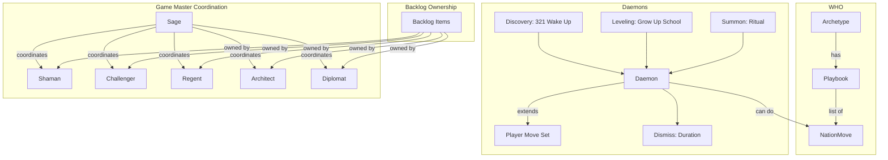

# Spec: Deftness Uplevel — Character, Daemons, and Agent Coordination

## Purpose

Uplevel the BARs Engine's deftness by (1) an Ouroboros character creation interview that reintroduces Archetype playbooks, (2) a Daemons system that extends player moves, and (3) Sage-led coordination of backlog work across the six Game Master agent faces. Player discoveries (character, daemons) guide where the story goes; agent-domain ownership and parallelized 6-face handling mature the development process.

**Practice**: Deftness Development — spec kit first, API-first, deterministic over AI. Child specs decompose work; this spec defines the coordination model and conceptual integration.

## Design Decisions

| Topic | Decision |
|-------|----------|
| Archetype vs Playbook | Archetype = identity (8 I Ching archetypes). Playbook = list of moves belonging to an archetype. Reintroduced as distinct concepts. |
| Daemons discovery | Wake Up variant of Clean Up move (321) — discovery path. Grow Up moves from a school — leveling path. |
| Daemons lifecycle | Summoned via ritual; duration-limited; dismissed after time. Extends player's available moves. |
| Sage coordination | Sage coordinates effort; other Game Master faces (Shaman, Challenger, Regent, Architect, Diplomat) own domain-specific backlog items. |
| Backlog ownership | Backlog items assigned to agent specialty domains; agents get better at solving problems within their domains. |
| Full maturity | Feature requests handled by parallelized use of all 6 faces to get development work done. |

## Conceptual Model

### Game Language Alignment

| Dimension | Meaning | Schema / Examples |
|-----------|---------|-------------------|
| **WHO** | Identity | Nation, Archetype, Playbook (moves list) |
| **WHAT** | The work | Quests, Daemons (extend moves) |
| **WHERE** | Context | Allyship domains |
| **Energy** | What makes things happen | Vibeulons |
| **Personal throughput** | How people get it done | 4 moves + Daemon moves |

**Big picture**: Player discoveries (character, daemons) feed back into the app; what they create guides where the story goes.

## Child Specs (Decomposition)

| ID | Spec | Owner | Description |
|----|------|-------|--------------|
| DC-1 | [Ouroboros Character Creation Interview](ouroboros-character-interview/spec.md) | Sage + Architect | Interview flow for character creation page; Archetype → Playbook reintroduction |
| DC-2 | [Archetype Playbooks](archetype-playbooks/spec.md) | Architect + Regent | Playbook = list of moves per Archetype; schema, seed, UI |
| DC-3 | [Daemons System](daemons-system/spec.md) | Shaman + Sage | Discovery (321 Wake Up), leveling (Grow Up school), summon ritual, duration, dismissal |
| DC-4 | [Agent-Domain Backlog Ownership](agent-domain-backlog-ownership/spec.md) | Sage | Backlog items owned by agent specialty; ownership field, routing |
| DC-5 | [Sage Coordination Protocol](sage-coordination-protocol/spec.md) | Sage | Sage coordinates with other faces; daily brief, work assignment, convergence |
| DC-6 | [6-Face Parallel Feature Handling](six-face-parallel-handling/spec.md) | Sage | Full maturity: feature requests split across 6 faces; parallel execution |

## Agent Specialty Domains (Ownership Mapping)

| Face | Specialty Domain | Example Backlog Areas |
|------|------------------|----------------------|
| **Shaman** | Mythic threshold, belonging, ritual, identity | Daemons discovery, character identity, blessed objects |
| **Challenger** | Action, edge, proving ground | Nation moves, quest completion, Show Up flows |
| **Regent** | Order, structure, roles, rules | Schema, playbook moves, campaign structure |
| **Architect** | Strategy, blueprint, quest design | Quest grammar, character creation flow, CYOA |
| **Diplomat** | Relational field, care, connector | Copy, community, campaign narrative |
| **Sage** | Integration, emergence, flow, coordination | Backlog coordination, deftness, meta-synthesis |

## Dependencies

- [conceptual-model.md](../../memory/conceptual-model.md)
- [playbook-to-archetype-rename](../playbook-to-archetype-rename/spec.md) — Archetype exists; Playbook reintroduced as child of Archetype
- [321-efa-integration](../321-efa-integration/spec.md) — 321 as Clean Up; Wake Up variant for daemons discovery
- [daemons-inner-work-collectibles](../../backlog/prompts/daemons-inner-work-collectibles.md)
- [agent-admin-wiring](../agent-admin-wiring/spec.md) — Game Master agents wired; extend for backlog ownership
- [sage-brief-v2](../sage-brief-v2/spec.md) — Sage brief; extend for coordination protocol

## Non-Goals (v0)

- Full AI agent autonomy — humans approve and route
- Daemons as NPCs — they extend moves, not replace players
- Real-time 6-face parallel execution — phased rollout; Sage assigns, faces work in parallel when resource allows

## References

- Game Master faces: [src/lib/quest-grammar/types.ts](../../../src/lib/quest-grammar/types.ts) — `GAME_MASTER_FACES`, `FACE_META`
- Archetype model: [prisma/schema.prisma](../../../prisma/schema.prisma) — `Archetype`, `NationMove`
- 321 / EFA: [src/components/shadow/Shadow321Form.tsx](../../../src/components/shadow/Shadow321Form.tsx), [src/actions/emotional-first-aid.ts](../../../src/actions/emotional-first-aid.ts)
- Talisman / Reliquary: [bruised-banana-quest-map/TALISMAN_EXPLORATION.md](../bruised-banana-quest-map/TALISMAN_EXPLORATION.md)
