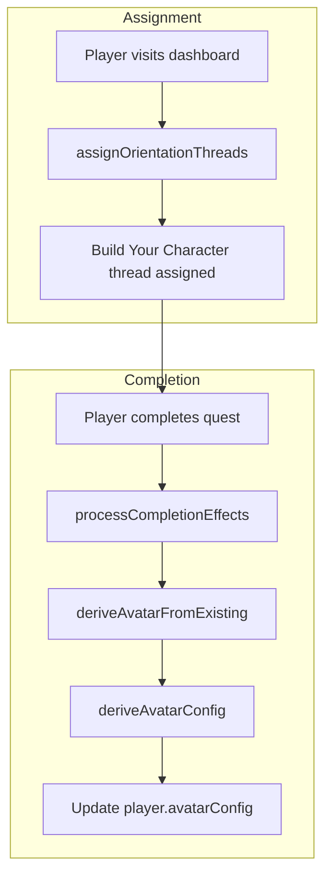

# Plan: Existing Players Character Generation (Orientation Quest)

## Summary

Add completion effect `deriveAvatarFromExisting` to the quest engine, create orientation quest "Build Your Character" with minimal Twine story, create orientation thread, and seed both. Existing players with nation/archetype but no avatar will receive the thread on next visit and can complete it to generate their avatar.

## Phase 1: Completion Effect

### 1.1 Add deriveAvatarFromExisting effect

**File**: [src/actions/quest-engine.ts](../../src/actions/quest-engine.ts)

- Import `deriveAvatarConfig` from `@/lib/avatar-utils`
- In `processCompletionEffects`, add case `deriveAvatarFromExisting`:
  - Fetch player (nationId, playbookId, campaignDomainPreference, pronouns)
  - If !nationId or !playbookId, break
  - Fetch Nation and Playbook by id for names
  - Call `deriveAvatarConfig(nationId, playbookId, campaignDomainPreference, { nationName, playbookName, pronouns })`
  - If result non-null, update player.avatarConfig

## Phase 2: Quest and Thread

### 2.1 Twine story

**File**: Seed script (see Phase 3)

- Create minimal story "Build Your Character":
  - Passage START: "Your nation and archetype define your avatar. Confirm your character to see your sprite in the Conclave." + link "Confirm" → END_SUCCESS
  - Passage END_SUCCESS: "Character confirmed. Your avatar is now derived from your nation and archetype." (no links)

### 2.2 Quest

- id: `build-character-quest`
- title: "Build Your Character"
- description: "Your nation and archetype define your avatar. Confirm your character to see your sprite in the Conclave."
- type: onboarding
- reward: 1
- twineStoryId: story from 2.1
- completionEffects: `JSON.stringify({ effects: [{ type: 'deriveAvatarFromExisting' }] })`

### 2.3 Orientation thread

- id: `build-character-thread`
- title: "Build Your Character"
- threadType: orientation
- status: active
- Single quest: build-character-quest at position 1

## Phase 3: Seed Script

### 3.1 Extend seed-onboarding-thread.ts

**File**: [scripts/seed-onboarding-thread.ts](../../scripts/seed-onboarding-thread.ts)

- After creating "Welcome to the Conclave" thread, add:
  - ensureSkeletonStory or inline passages for "Build Your Character"
  - Upsert TwineStory (slug: `build-character`)
  - Upsert CustomBar (id: `build-character-quest`)
  - Upsert QuestThread (id: `build-character-thread`)
  - Upsert ThreadQuest linking quest to thread

## Phase 4: Verification Quest

### 4.1 Add cert-existing-players-character-v1

**File**: [scripts/seed-cyoa-certification-quests.ts](../../scripts/seed-cyoa-certification-quests.ts)

- Add quest with steps:
  1. Ensure test player has nationId, playbookId, avatarConfig = null (or use admin to clear)
  2. Visit dashboard
  3. Find "Build Your Character" thread, complete quest
  4. Confirm avatar appears in header

## File Structure

| Action | File |
|--------|------|
| Modify | [src/actions/quest-engine.ts](../../src/actions/quest-engine.ts) |
| Modify | [scripts/seed-onboarding-thread.ts](../../scripts/seed-onboarding-thread.ts) |
| Modify | [scripts/seed-cyoa-certification-quests.ts](../../scripts/seed-cyoa-certification-quests.ts) |

## Data Flow

## Verification

- Run `npm run seed:onboarding`
- Use player with nationId, playbookId, avatarConfig = null
- Visit dashboard; confirm "Build Your Character" thread appears
- Complete quest; confirm avatarConfig is set and avatar renders
- Run `npm run seed:cert:cyoa`; confirm cert-existing-players-character-v1 exists

## Reference

- Spec: [.specify/specs/existing-players-character-generation/spec.md](spec.md)
- Depends on: [avatar-from-cyoa-choices](../avatar-from-cyoa-choices/spec.md), [jrpg-composable-sprite-avatar](../jrpg-composable-sprite-avatar/spec.md)
