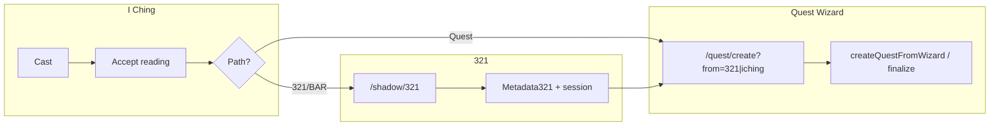

# Spec: 321 ↔ Quest Wizard, Canonical 321 Entry, I Ching → BAR / Quest

## Purpose

Close the loop so that:

1. **321 material** cleanly feeds **metabolizable quests** via the **Quest Wizard** (not only auto-generated `CustomBar` rows).
2. Players can start **canonical 321** from the **dashboard** (not only charge capture or hidden links).
3. **Emotional First Aid (EFA)** either embeds the **same** 321 implementation or **defers** to the canonical route (no divergent UX).
4. **I Ching** flows produce **grammatic quests** *and* offer **321-on-reading** (BAR) and **wizard-with-oracle-data** (quest) paths; **BAR as inspiration** can sit until the player expands to quest.

**Related specs (do not duplicate):**

| Spec | Role |
|------|------|
| [321-efa-integration](../321-efa-integration/spec.md) | EFA embeds `shadow-321` → real 321; gold-star mint |
| [iching-grammatic-quests](../iching-grammatic-quests/spec.md) | I Ching context in `compileQuest`, grammatic output |
| [quest-metabolism-wizard-gm](../quest-metabolism-wizard-gm/spec.md) | Wizard only emits metabolizable work |
| [typed-quest-bar-building-blocks](../typed-quest-bar-building-blocks/spec.md) | Typed edges, quality |

---

## Current behavior (inventory)

| Flow | Location | Notes |
|------|----------|--------|
| **321 runner** | `/shadow/321` (`Shadow321Runner.tsx`) | Canonical multi-phase 321 + artifact phase |
| **Turn into Quest** | `handleTurnIntoQuest` → `createQuestFrom321Metadata` | Creates quest **directly**; then `NAV['321_quest']` → `/hand?quest=` |
| **Quest Wizard** | `/quest/create` (`QuestWizard.tsx`) | **Not** used after 321 today |
| **Dashboard actions** | `DashboardActionButtons.tsx` | EFA, BARs, Conclave — **no 321 link** |
| **I Ching on dashboard** | `DashboardCaster` + `generateQuestFromReading` | Grammatic quest path; **no** post-reading branch to 321 or wizard |
| **NAV contracts** | `navigation-contract.ts` `321_quest` | Success → `/hand?quest=` |

---

## Target behavior

### A. 321 → Quest Wizard (after 321)

**As a player** who finishes 321 and chooses to create **work the system can metabolize**, I am sent to the **Quest Wizard** with **321-derived fields pre-filled** (title, description, move alignment, emotional alchemy payload, `Metadata321` reference).

**Acceptance:**

- [ ] New route query e.g. `/quest/create?from=321&sessionId=<id>` or secure server-stored draft keyed by session (avoid huge URLs).
- [ ] `QuestWizard` reads prefilled **draft** and shows a banner: “Completing your quest from 321.”
- [ ] **Publish** still runs through `createQuestFromWizard` **or** a unified `finalizeQuestFromSources({ source: '321', ... })` that enforces the same engine contract.
- [ ] **Optional:** Keep “quick create” (current `createQuestFrom321Metadata`) behind Advanced / power users, or remove once wizard parity is proven.

### B. Canonical 321 from dashboard

**As a player** on the home dashboard, I can open **321 Shadow Process** in one tap.

**Acceptance:**

- [ ] Dashboard includes a primary action: **321** → `/shadow/321?returnTo=/` (or equivalent).
- [ ] Copy distinguishes: **EFA** = medbay protocols; **321** = full shadow process (or EFA routes to same runner — see C).

### C. EFA vs canonical 321

**Either** (pick one in implementation; prefer minimal duplication):

| Option | Behavior |
|--------|----------|
| **C1 — Embed** | EFA tool `shadow-321` renders shared **`Shadow321Runner`** (or shared inner form) per [321-efa-integration](../321-efa-integration/spec.md). |
| **C2 — Link out** | EFA “321” opens `/shadow/321?returnTo=/emotional-first-aid` and completes EFA session when player returns with completion token. |

**Acceptance:**

- [ ] One **canonical** 321 definition (phases, validation, metadata shape) — `deriveMetadata321` / `Metadata321` unchanged at source.

### D. I Ching: draw → accept → branch

**Target steps:**

1. Player **draws** I Ching (existing `CastingRitual` / persistence).
2. Player **accepts reading** (explicit confirmation step if not already present).
3. Player chooses:
   - **(a) Do a 321 on this reading** — reading text becomes **charge / context** for BAR or 321 session; artifact can be **BAR (inspiration)** stored until expanded.
   - **(b) Turn reading into quest** — opens **Quest Wizard (I Ching instance)** with `ichingContext` + reading id **baked in** so the quest is **grammatic** and **metabolizable** (align [iching-grammatic-quests](../iching-grammatic-quests/spec.md)).
4. Quest can be **placed on gameboard** or **completed** as personal work; **BAR** remains **inspiration-only** until player uses **Expand to quest** (wizard).

**Acceptance:**

- [ ] `generateQuestFromReading` path remains **grammatic** (QuestPacket / adventure or agreed output per iching-grammatic-quests).
- [ ] New UI step: **Accept reading** → **Choose path** (321/BAR vs Wizard quest).
- [ ] Wizard variant: `/quest/create?from=iching&readingId=` + server-loaded `IChingContext`.
- [ ] 321 from reading: `/shadow/321?chargeBarId=` or pass reading text as `initialCharge` / linked `playerBar` id.

### E. Navigation contract updates

Extend `NAV` (or add keys):

| Key | On success |
|-----|------------|
| `321_quest_wizard` | `/quest/create?from=321&...` |
| `iching_quest_wizard` | `/quest/create?from=iching&...` |

Deprecate or narrow `321_quest` direct-to-hand when wizard becomes default.

---

## Data flow (conceptual)

---

## Non-goals (v1)

- Replacing all auto `createQuestFrom321Metadata` in one day without migration period.
- Full Notion-style block editor for readings.

---

## Verification

- [ ] E2E or manual: 321 → wizard → publish → `completeQuestForPlayer` succeeds.
- [ ] Dashboard link to `/shadow/321` visible when logged in.
- [ ] I Ching: reading → branch → BAR holds inspiration; wizard produces grammatical quest.
