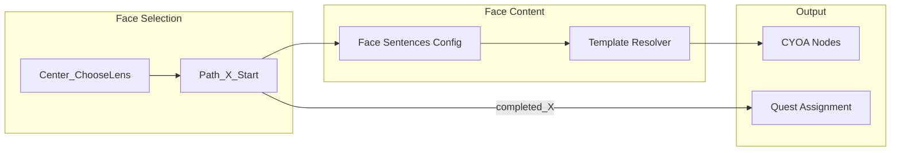

# Plan: Game Master Face Sentences

## Architecture

### Current state

- **Center_ChooseLens**: 6 face choices (Shaman, Challenger, Regent, Architect, Diplomat, Sage) with labels like "Shaman (Magenta)". Each choice → Path_*_Start, which sets `$active_face`.
- **Path_*_Start**: Generic "(Entering X Path)" text; no face-specific sentence.
- **Bruised Banana**: Developmental lens (Understanding/Connecting/Acting) in main flow; no 6 Faces integration yet.
- **Quest assignment**: `assignOrientationThreads` uses `completed_shaman`, etc. from storyProgress when available.

### Target state

1. **Face sentences**: Canonical sentences stored in a single source (config, seed, or Passage).
2. **Display**: When player selects a face, the face sentence is shown (in Path_*_Start or a dedicated node).
3. **State**: `$active_face` set on selection; available for template resolution in subsequent BB nodes.
4. **Quest alignment**: Face completion flags drive face-aligned quest assignment.

### Data flow

## Implementation Options

### Option A: Extend Path_*_Start with face sentence

Add the face sentence as the primary text of each Path_*_Start node. Content lives in JSON files.

- **Pros**: Minimal change; face sentence shown immediately on selection.
- **Cons**: 6 files to edit; content in code/content repo.

### Option B: Face sentences in seed/DB

Create a `FaceSentence` or config table; Path_*_Start fetches by face key. Or: seed into a config JSON that the API reads.

- **Pros**: Single source of truth; admin-editable if in DB.
- **Cons**: New schema or config surface; API must resolve.

### Option C: Face sentences in Passage (bruised-banana Adventure)

When BB migrates to Passages (Option C of onboarding-adventures-unification), store face sentences as template data or a dedicated Passage per face. Template resolver includes `faceCopy` in context.

- **Pros**: Aligns with full BB migration; editable via Admin.
- **Cons**: Depends on BB Passage migration; later phase.

### Recommendation

**Option A for v1**: Add face sentences to Path_*_Start JSON files. Fast, no schema change. When BB integrates 6 Faces into its flow, the sentences can move to a shared config or Passage.

## File Impacts

| File | Change |
|------|--------|
| content/campaigns/wake_up/Path_Sh_Start.json | Replace or prepend text with Shaman face sentence |
| content/campaigns/wake_up/Path_Ch_Start.json | Replace or prepend text with Challenger face sentence |
| content/campaigns/wake_up/Path_Re_Start.json | Regent |
| content/campaigns/wake_up/Path_Ar_Start.json | Architect |
| content/campaigns/wake_up/Path_Di_Start.json | Diplomat |
| content/campaigns/wake_up/Path_Sa_Start.json | Sage |
| src/lib/face-sentences.ts (optional) | Export canonical sentences for reuse (e.g. template resolver, tests) |

## Verification

- Play wake-up flow → select each face → confirm face sentence appears in Path_*_Start.
- When BB integrates 6 Faces: confirm face sentence (or equivalent) shown before BB_Intro/developmental nodes.
- Verification quest: Add step to cert-two-minute-ride-v1 or new cert quest if 6 Faces are in BB flow.
