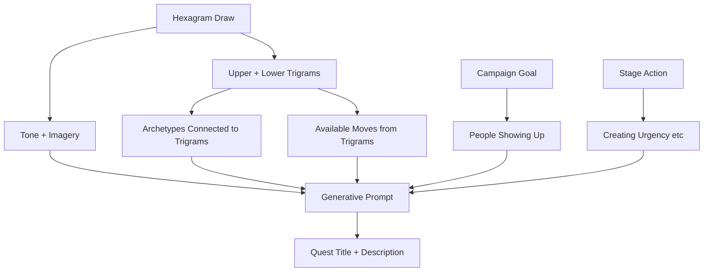

# Spec: Gameboard Deep Engagement — 3-Step Completion, Steward Visibility, Hexagram-Aligned Generation

## Purpose

Transform the gameboard from "Complete is the star" to a deep-engagement flow where players must Wake Up (read), Clean Up (reflect on obstacles), and only then Show Up (complete). Add steward visibility so the community sees who holds each quest; enable vibeulon bidding, AID offers, and private forks. Generate quests via hexagram + campaign-goal alignment—without Kotter stage names in titles—so each quest answers: *How does [stage action] directly tie to people showing up in the campaign goal?*

## Vision

**Current gap:** The Complete button is visually dominant. Players can complete without reading. There is no steward accountability, no way for others to unblock progress, and quest titles often echo Kotter stages instead of campaign throughput.

**Desired state:** Completion is earned through a 3-step journey. Steward names are visible; others can bid, offer AID, or fork. Quest generation uses hexagrams to craft quests that connect stage action → campaign goal → throughput.

## Conceptual Model

| Dimension | Meaning |
|-----------|---------|
| **Wake Up** | See the quest. Read it. Acknowledge. |
| **Clean Up** | Recognize inner obstacles that show up while reading. Name them. |
| **Show Up** | Complete the quest. Only available after Wake Up + Clean Up. |
| **Steward** | Player who has accepted a slot quest but not yet completed it. |
| **Throughput** | Actions that move the campaign goal forward (people showing up, resources gathered). |

**Generative question for quest titles:**  
*How does [stage action, e.g. creating urgency] directly tie to people showing up in the campaign goal?*

Do **not** use Kotter stage names (e.g. "Rally the Urgency") in generated quest titles. Use the question to derive concrete, actionable titles.

## User Stories

### P1: 3-step completion flow (minimum depth)

**As a player**, I must go through Wake Up → Clean Up → Show Up before I can complete a gameboard quest, so I can't skip reading and reflecting.

**Acceptance:**
- Step 1 (Wake Up): Player must explicitly acknowledge they've read the quest (e.g. "I've read this" or expand/collapse to view full description). Record `wakeUpAt` or equivalent.
- Step 2 (Clean Up): Player must name at least one inner obstacle they notice (free text or structured). Record `cleanUpAt` + reflection.
- Step 3 (Show Up): Complete button only appears/enables after steps 1 and 2. Record completion.

**UI:** Complete is not the primary CTA. The flow is: Read → Reflect → Complete. Visual hierarchy reflects this.

### P2: Steward visibility

**As a player**, I want to see who holds each gameboard quest when it's accepted but not completed, so I know who might be blocking progress and can offer help.

**Acceptance:**
- When a player accepts a slot quest (becomes steward), their name appears on the slot.
- Slot shows: quest title, steward name (if any), and progress (Wake Up / Clean Up / Show Up).
- Other players can see "Alice is stewarding this quest" and take action.

### P3: Bid to complete before steward

**As a player**, I want to bid vibeulons to complete a quest before the current steward, so I can unblock progress when the steward is stuck.

**Acceptance:**
- Any player can place a vibeulon bid to "take over" completion.
- Highest bidder (after a window or on steward timeout) can complete.
- Steward is notified; may counter-bid or release.
- Bids go to steward or campaign pool (design choice).

### P4: Offer AID or fork privately

**As a player**, I want to offer AID to a steward or fork the quest privately to complete on my own, so we can unblock progress without conflict.

**Acceptance:**
- **Offer AID:** Two forms of help: (1) Direct support (e.g. Emotional First Aid, "I can support you"). (2) Create quests that the helper believes will unblock the steward—e.g. a smaller quest or a different angle that addresses what might be blocking them. Steward receives offer; can accept or decline.
- **Fork privately:** Create a private copy of the quest for self; complete independently. Original slot remains with steward until they complete or release. Fork does not replace slot completion—design: does fork completion count for campaign? (Option: fork is for personal throughput; slot completion is for shared campaign.)

### P5: Hexagram-aligned quest generation for campaign throughput

**As a campaign owner or admin**, I want quests generated via hexagram + campaign goal alignment, so each quest answers "How does [stage action] tie to people showing up?" and increases throughput.

**Acceptance:**
- Quest generation uses: (1) hexagram (I Ching draw), (2) current Kotter stage *action* (not stage name), (3) campaign goal (e.g. "Bruised Banana Residency—people showing up").
- Generative prompt: *Given this hexagram and the campaign goal, how does [stage action] directly tie to people showing up?* Produce a quest title and description that is concrete, actionable, and throughput-oriented.
- No Kotter stage names in titles (e.g. avoid "Rally the Urgency" as a generated title; use derived actions like "Name what's at stake for one person who could show up").

**Hexagram connection:** The hexagram supplies (1) tone and imagery, (2) trigrams (upper/lower), (3) archetypes connected to those trigrams (via playbook/face mappings), and (4) available moves that flow from the trigrams. With trigrams come the moves—the canonical moves are keyed by element, and trigrams map to elements/archetypes. So the hexagram is not just atmosphere; it structures which archetypes and moves are in play for quest generation. Combined with campaign goal and stage action: a well-crafted quest that feels aligned and increases throughput.

## Functional Requirements

### FR1: 3-step completion gate

- Add `GameboardSlotProgress` or extend slot/PlayerQuest with: `wakeUpAt`, `cleanUpAt`, `cleanUpReflection` (text).
- Complete button disabled until both steps recorded.
- UI: collapsible or modal flow—Read (Wake Up) → Reflect (Clean Up) → Complete (Show Up).

### FR2: Steward model

- Add `stewardId` (Player) to `GameboardSlot` or a `GameboardSteward` join (slotId, playerId, acceptedAt).
- When player "takes" a slot quest, create steward record. When they complete or release, clear it.
- Slot UI shows steward name when present.

### FR3: Vibeulon bidding

- Add `GameboardBid` (slotId, bidderId, amount, createdAt) or similar.
- Action: `placeBid(slotId, amount)`. Logic for highest bidder, time window, steward release.
- On bid win: bidder can complete; steward loses slot.

### FR4: Offer AID / Fork

- **AID:** `offerAid(slotId, stewardId, message, type?)` — type: `'direct'` (EFA, support) or `'quest'` (create a quest to unblock). Creates notification or record; steward can accept. For `quest` type: helper creates a quest (e.g. via wizard or grammatical generation) and offers it as "I made this to help unblock you."
- **Fork:** `forkQuestPrivately(questId)` — creates a copy assigned to player, `visibility: 'private'`, `parentId` or `forkedFromId`. Completion of fork: clarify if it counts for campaign or only personal.

### FR5: Hexagram + campaign goal quest generation

- Extend `compileQuestWithAI` or add `generateCampaignThroughputQuest(hexagramId, campaignRef, period)`.
- Input: hexagram (upper/lower trigrams, tone, imagery), campaign goal, stage *action* (e.g. "creating urgency" not "Rally the Urgency").
- Hexagram supplies: (1) tone and imagery, (2) trigrams → archetypes (via trigram mappings), (3) trigrams → available moves (moves keyed by element; trigrams map to elements/archetypes). Use this structure to constrain or privilege moves for the generated quest.
- Prompt: *How does [stage action] directly tie to people showing up in [campaign goal]?* Use hexagram for tone, imagery, and available moves from its trigrams.
- Output: quest title + description; no Kotter stage names in title.

## Data Model (Proposed)

```
GameboardSlot (extend)
  - stewardId?: Player   // who has accepted but not completed

GameboardSlotProgress (new)
  - slotId
  - playerId (steward)
  - wakeUpAt?: DateTime
  - cleanUpAt?: DateTime
  - cleanUpReflection?: string

GameboardBid (new)
  - slotId
  - bidderId
  - amount (vibeulons)
  - createdAt
  - status (active, won, withdrawn)
```

## Hexagram → Campaign Throughput Flow



**Hexagram supplies:** Tone + imagery; trigrams; archetypes (via trigram→playbook/face mappings); available moves (trigrams map to elements; moves are keyed by element and primaryWaveStage).

**Prompt template:**  
*Given the I Ching hexagram [name]: [tone/text], its trigrams [upper/lower] and the archetypes/moves they imply, and the campaign goal of [goal], generate a quest that answers: How does [stage action] directly tie to people showing up? Use the hexagram's available moves. Output a concrete, actionable title and description. Do not use Kotter stage names in the title.*

## References

- [Gameboard UI Update](../gameboard-ui-update/spec.md)
- [Gameboard Quest Generation](../gameboard-quest-generation/spec.md)
- [I Ching Grammatic Quests](../iching-grammatic-quests/spec.md)
- [Bruised Banana Quest Map Stage 1](../bruised-banana-quest-map/STAGE_1_DESIGN.md)
- [Quest Grammar Compiler](../quest-grammar-compiler/spec.md)
