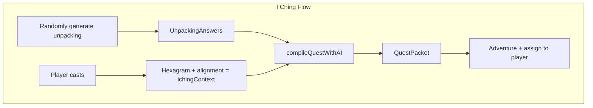

# Spec: I Ching Grammatic Quests

## Purpose

1. **I Ching context in compileQuest** — Whenever the system generates quests, include I Ching draw data (hexagram, trigrams, alignment) in the AI prompt.
2. **I Ching produces grammatic quests** — Replace CustomBar (inspiration) output with QuestPacket → Passages → CYOA. Random unpacking is generated first; the I Ching draw provides oracle context for the AI.

## Design Decisions

| Topic | Decision |
|-------|----------|
| Unpacking source | Randomly generated from predefined pools (EXPERIENCE_OPTIONS, SATISFACTION_OPTIONS, etc.) — before I Ching |
| I Ching role | Oracle layer: hexagram + alignment inform tone, imagery, emotional arc in AI prompt |
| Output | QuestPacket → Passages → Adventure (CYOA), not CustomBar inspiration |

## Conceptual Model



## API Contracts

### IChingContext

```ts
interface IChingContext {
  hexagramId: number
  hexagramName: string
  hexagramTone: string
  hexagramText: string
  upperTrigram: string
  lowerTrigram: string
  kotterStage?: number | null
  kotterStageName?: string | null
  nationName?: string | null
  activeFace?: string | null
  playbookTrigram?: string | null
}
```

### generateRandomUnpacking()

**Output**: `{ unpackingAnswers: UnpackingAnswers; alignedAction: string }`

Draws from EXPERIENCE_OPTIONS, SATISFACTION_OPTIONS, DISSATISFACTION_OPTIONS, SHADOW_VOICE_OPTIONS, LIFE_STATE_OPTIONS, MOVE_OPTIONS. No AI.

### QuestCompileInput / BuildQuestPromptContextInput (extended)

Add `ichingContext?: IChingContext`. When present, buildQuestPromptContext injects I Ching section.

## Functional Requirements

### Phase 1: I Ching Context in Quest Grammar

- **FR1**: Add IChingContext type to types.ts; extend QuestCompileInput and BuildQuestPromptContextInput.
- **FR2**: buildQuestPromptContext injects "## I Ching Context" section when ichingContext present.
- **FR3**: compileQuestWithAI and generateQuestOverviewWithAI include ichingContext in cache inputKey.

### Phase 2: Random Unpacking + I Ching Grammatic Flow

- **FR4**: generateRandomUnpacking() returns valid UnpackingAnswers + alignedAction from unpacking-constants pools.
- **FR5**: generateQuestFromReading (or generateGrammaticQuestFromReading) uses: random unpacking + hexagram → ichingContext → compileQuestWithAI → publishIChingQuestToPlayer.
- **FR6**: publishIChingQuestToPlayer creates Adventure + Passages, assigns to player.
- **FR7**: UI redirects to adventure play or shows link on success.

## Dependencies

- [I Ching Alignment](../iching-alignment-game-master-sects/spec.md)
- [Quest Grammar Compiler](../quest-grammar-compiler/spec.md)
- [Quest Grammar UX Flow](../quest-grammar-ux-flow/spec.md)

## References

- [src/lib/quest-grammar/](../../src/lib/quest-grammar/)
- [src/actions/generate-quest.ts](../../src/actions/generate-quest.ts)
- [src/lib/quest-grammar/unpacking-constants.ts](../../src/lib/quest-grammar/unpacking-constants.ts)
