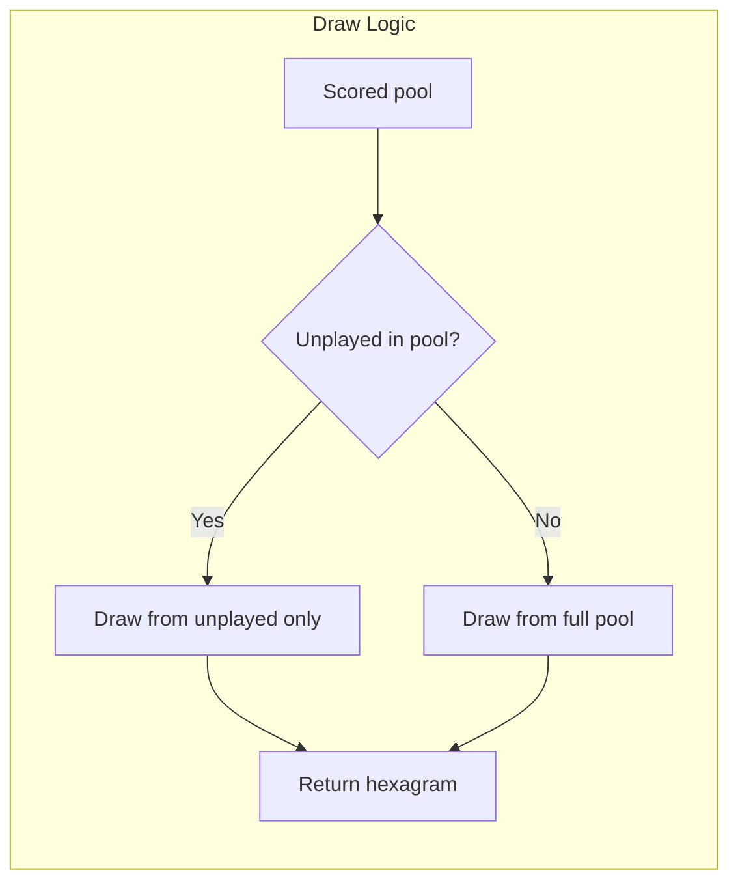

# Spec: I Ching Unplayed Hexagram Preference

## Purpose

Extend the I Ching alignment draw to prefer hexagrams the player has not yet received. Maximize unique draws before allowing duplicates. This measures throughput: the more that can be done with unique I Ching draws, the more effective the system. Goals that require more loops through the I Ching are less agile.

**Practice**: Throughput-first — prefer unplayed hexagrams; fall back to duplicates only when no unplayed hexagrams qualify.

## Design Decisions

| Topic | Decision |
|-------|----------|
| "In play" definition | Hexagrams the player has accepted (PlayerBar with source='iching') |
| Draw order | 1) Unplayed + aligned; 2) Played + aligned; 3) Unplayed + any; 4) All 64 |
| Data source | PlayerBar where playerId and source='iching' → barId (hexagram id) |

## Conceptual Model

**Throughput** = how many distinct hexagrams a player receives before repeating. Higher throughput = more agile system.



## User Stories

### P1: Prefer Unplayed Hexagrams

**As a player**, when I cast the I Ching, I want to receive hexagrams I haven't yet received before, so I experience more of the deck and the system feels more agile.

**Acceptance**:
- `drawAlignedHexagram` prefers hexagrams not in the player's played set
- When qualifying unplayed hexagrams exist: draw only from unplayed
- When all qualifying hexagrams have been played: allow duplicates (draw from full pool)

### P2: Throughput as System Metric

**As a contributor**, I want the draw logic to maximize unique hexagrams before repeating, so throughput can be measured and improved.

**Acceptance**:
- Played hexagram IDs are fetched from PlayerBar (source='iching')
- Context includes `playedHexagramIds` for draw logic

## API Contracts

### IChingAlignmentContext (extended)

```ts
type IChingAlignmentContext = {
  kotterStage: number | null
  nationName: string | null
  playbookTrigram: string | null
  activeFace: string | null
  playedHexagramIds: number[]  // NEW: barIds from PlayerBar where source='iching'
}
```

### getAlignmentContext (extended)

**Input**: `playerId: string`  
**Output**: `Promise<IChingAlignmentContext>`

MUST also fetch PlayerBar records where `playerId` and `source='iching'`, collect `barId` into `playedHexagramIds`.

### drawAlignedHexagram (extended)

**Input**: `context: IChingAlignmentContext`  
**Output**: `Promise<number>` (hexagramId 1–64)

1. Build scored pool (existing: score >= 1 or top 16)
2. Split pool into **unplayed** (id not in `context.playedHexagramIds`) and **played**
3. If `unplayed.length > 0`: weighted random from **unplayed only**
4. Else: weighted random from **full pool** (allow duplicates)

When `context.kotterStage == null` (pure random path):
1. Unplayed = [1..64] minus playedHexagramIds
2. If unplayed.length > 0: random from unplayed
3. Else: random from all 64

## Functional Requirements

### Phase 1: Extend Context

- **FR1**: `IChingAlignmentContext` MUST include `playedHexagramIds: number[]`.
- **FR2**: `getAlignmentContext(playerId)` MUST query `PlayerBar` where `playerId` and `source='iching'`, collect `barId` into `playedHexagramIds`.

### Phase 2: Extend Draw Logic

- **FR3**: `drawAlignedHexagram` MUST split the scored pool into unplayed and played by `context.playedHexagramIds`.
- **FR4**: When unplayed pool is non-empty: draw MUST be from unplayed only (weighted random).
- **FR5**: When unplayed pool is empty: draw MUST be from full pool (allow duplicates).
- **FR6**: When `kotterStage == null`: prefer unplayed from 1–64; fall back to all 64 when none unplayed.

## Non-Functional Requirements

- One additional DB query: `PlayerBar.findMany` where playerId + source. Index on (playerId, source) if not present.
- Minimal latency impact; query can run in parallel with player/instance fetch.

## Dependencies

- [I Ching Alignment and Game Master Sects](../iching-alignment-game-master-sects/spec.md) — getAlignmentContext, drawAlignedHexagram, IChingAlignmentContext

## References

- [src/lib/iching-alignment.ts](../../src/lib/iching-alignment.ts)
- [src/actions/cast-iching.ts](../../src/actions/cast-iching.ts)
- [prisma/schema.prisma](../../prisma/schema.prisma) — PlayerBar model
