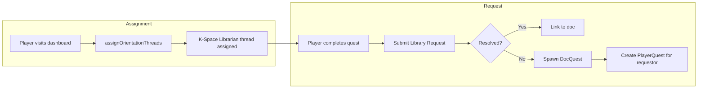

# Plan: K-Space Librarian Post-Onboarding (Basic Quest)

## Summary

Add an orientation thread "Help the Knowledge Base" with a single quest that teaches the Request from Library flow. Auto-assign spawned DocQuests to the requestor so they appear in Active Quests. Seed via `seed-onboarding-thread.ts` or a dedicated script.

## Phase 1: Auto-Assign Spawned DocQuest

### 1.1 Create PlayerQuest when request spawns

**File**: [src/actions/library.ts](../../src/actions/library.ts)

- In `submitLibraryRequest`, after creating the DocQuest and updating LibraryRequest with `status: 'spawned'`:
  - Create `PlayerQuest` with `playerId: player.id`, `questId: docQuest.id`, `status: 'assigned'`
- Revalidate `/` so dashboard refreshes.

## Phase 2: Orientation Quest and Thread

### 2.1 Twine story

**File**: Seed script (see Phase 3)

- Create story "Help the Knowledge Base" (slug: `k-space-librarian-basic`):
  - **START**: "Help improve the knowledge base. Submit a question via Request from Library. If we have an answer, you'll get a link. Otherwise, a DocQuest is created for the community." + link "Begin" → STEP_1
  - **STEP_1**: "Open the [dashboard](/). Click **Request from Library** in the header." + links "Next" → STEP_2, "Report Issue" → FEEDBACK
  - **STEP_2**: "Submit a request (e.g. 'How do I earn vibeulons?')." + links "Next" → STEP_3, "Report Issue" → FEEDBACK
  - **STEP_3**: "If resolved: confirm you got a link to a doc. If spawned: a DocQuest was created and added to your Active Quests." + links "Complete" → END_SUCCESS, "Report Issue" → FEEDBACK
  - **FEEDBACK**: Report an issue (tags: feedback)
  - **END_SUCCESS**: "Verification complete. You've helped the knowledge base." (no links)

### 2.2 Quest

- id: `k-space-librarian-quest`
- title: "Help the Knowledge Base"
- description: "Submit a Library Request to improve the app and knowledge base. Get a doc link or spawn a DocQuest."
- type: onboarding (or doc)
- reward: 1
- twineStoryId: story from 2.1
- isSystem: true, visibility: public

### 2.3 Orientation thread

- id: `k-space-librarian-thread`
- title: "Help the Knowledge Base"
- threadType: orientation
- status: active
- Single quest: k-space-librarian-quest at position 1

## Phase 3: Seed Script

### 3.1 Extend seed-onboarding-thread.ts or create seed-k-space-librarian-post-onboarding.ts

**File**: [scripts/seed-onboarding-thread.ts](../../scripts/seed-onboarding-thread.ts) (or new script)

- Add K-Space Librarian story, quest, thread after Build Your Character section.
- Upsert TwineStory (slug: `k-space-librarian-basic`)
- Upsert CustomBar (id: `k-space-librarian-quest`)
- Upsert QuestThread (id: `k-space-librarian-thread`)
- Upsert ThreadQuest linking quest to thread

## Phase 4: LibraryRequestModal Link

### 4.1 Update spawned result link

**File**: [src/components/LibraryRequestModal.tsx](../../src/components/LibraryRequestModal.tsx)

- When `result.status === 'spawned'`, link to `/` (dashboard) instead of `/adventures?quest=...` since the DocQuest will now appear in Active Quests after auto-assign.
- Optional: Add copy "Your DocQuest has been added to Active Quests."

## File Structure

| Action | File |
|--------|------|
| Modify | [src/actions/library.ts](../../src/actions/library.ts) |
| Modify | [scripts/seed-onboarding-thread.ts](../../scripts/seed-onboarding-thread.ts) |
| Modify | [src/components/LibraryRequestModal.tsx](../../src/components/LibraryRequestModal.tsx) |

## Data Flow

## Verification

- Run `npm run seed:onboarding` (or equivalent)
- New player completes onboarding; confirm "Help the Knowledge Base" appears in Journeys
- Complete quest: submit Library Request; confirm resolved or spawned result
- If spawned: confirm DocQuest appears in Active Quests
- cert-k-space-librarian-v1 still works for admins

## Reference

- Spec: [.specify/specs/k-space-librarian-post-onboarding/spec.md](spec.md)
- Depends on: [k-space-librarian](../k-space-librarian/spec.md)
