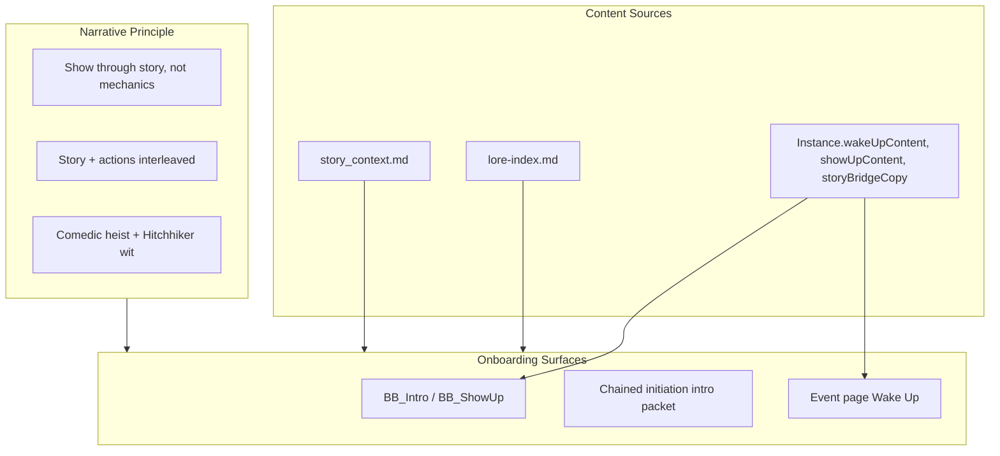

# Plan: Lore-Immersive Onboarding

## Overview

Weave story world (Conclave, heist, nations, archetypes, vibeulons) into onboarding so players are drawn into the fiction and campaign actions equally. Content-first: story before mechanics, show through narrative not explanation.

## Architecture

## File Impacts

| Action | File |
|--------|------|
| Create/update | content/onboarding-story-intro.md or Instance seed — canonical story-first intro copy |
| Modify | Instance seed or EventCampaignEditor — ensure wakeUpContent, showUpContent, storyBridgeCopy have lore-rich defaults |
| Modify | Chained initiation intro packet (compileQuest spineLength short) — use story-world copy or Instance content |
| Modify | BB_Intro, BB_ShowUp nodes (API or Instance) — ensure story-first, lore-embedded |
| Modify | characterCreationPacket.ts — add story beats before nation/playbook/domain hubs |
| Modify | movesGMPacket.ts — ensure vibeulon intro is in-story |
| Create | scripts/seed-cyoa-certification-quests.ts — add cert-lore-immersive-onboarding-v1 |

## Phased Approach

### Phase 1: Canonical story intro (content)

1. Create `content/onboarding-story-intro.md` (or equivalent) with story-first intro copy. Lead with Conclave, heist, constructs. Tone: comedic heist, Hitchhiker's wit.
2. Document narrative principle: "Show through story, not mechanics" from story_context.
3. Use as source for Instance defaults or chained initiation.

### Phase 2: Instance + BB nodes

1. Ensure Instance.wakeUpContent, showUpContent, storyBridgeCopy have lore-rich defaults when Instance is for Bruised Banana.
2. BB_Intro, BB_ShowUp: verify they use Instance content. If empty, fall back to story intro from content.
3. Event page Wake Up: same.

### Phase 3: Character creation story beats

1. characterCreationPacket.ts: Add optional story-beat text before lens hub, nation hub, playbook hub, domain hub. Or: inject via Instance/config.
2. Nation hub: "Each nation channels a different emotional energy. Which calls to you?" — brief flavor from lore.
3. Playbook hub: "How do you approach the heist?" — archetype-as-approach.
4. Domain hub: "How do you want to contribute to the campaign?"

### Phase 4: Chained initiation integration

1. seed-chained-initiation.ts: Intro packet uses story-world copy. Option: fetch Instance content when campaignRef=bruised-banana.
2. Moves packet: Vibeulon intro in-story ("Vibeulons are the emotional energy that powers the construct...").

### Phase 5: Verification + admin

1. Add cert-lore-immersive-onboarding-v1.
2. EventCampaignEditor: ensure story fields are prominent and documented.

## Content Guidelines (from story_context)

- **Don't explain** nations → tell nation stories that players want to inhabit
- **Don't explain** playbooks → show how each approach creates different adventures
- **Don't teach** mechanics → embed learning in compelling narrative
- **Don't ask** "which nation are you?" → ask "which story excites you?"
- **Epiphany**: "That sounds fun! I want to play that!"

## Migration Path

- No breaking changes. Enhance existing content.
- Instance fields already exist; we improve defaults and ensure they're used.
- Chained initiation and BB flows both benefit.
