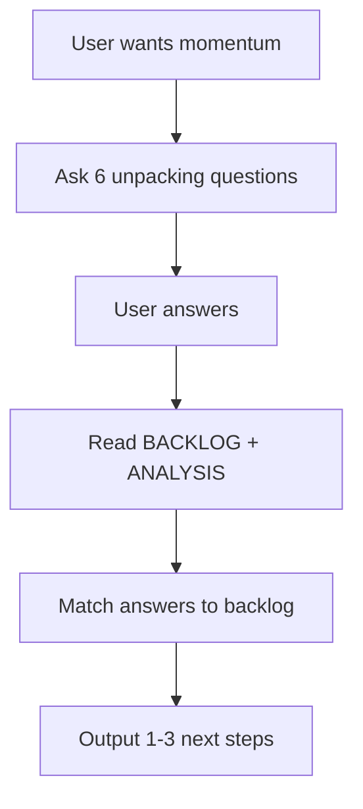

# Spec: Momentum Unpacking Skill

## Purpose

Create a Cursor agent skill that helps the user get momentum on a desired outcome. When the user recognizes they want more momentum, the system asks a version of the 6 unpacking questions, then interfaces with the backlog to generate the next step.

**Extends**: [Spec Kit Translator](../../.agents/skills/spec-kit-translator/SKILL.md) interview protocol; [Admin Agent Forge](../admin-agent-forge/spec.md) 6 unpacking questions (adapted).

## User Story

**As a user**, when I recognize I want more momentum on a desired outcome, I want the system to ask me unpacking questions and then surface the next step from the backlog, so I can dissolve blockers and move forward with clarity.

**Acceptance**:
1. User expresses desire for momentum (e.g. "I want more momentum," "I'm stuck," "what's next," "help me ship").
2. Agent asks a version of the 6 unpacking questions (can be batched or one-by-one).
3. Agent reads BACKLOG.md and related sources.
4. Agent outputs 1–3 prioritized next steps with spec/backlog links.

## 6 Unpacking Questions (Momentum-Adapted)

Adapted from Admin Agent Forge Stage 2; tuned for backlog interface:

| # | Question | Maps to |
|---|----------|---------|
| 1 | What outcome are you trying to create? | Desired outcome; backlog category |
| 2 | How will you feel when you get it? | Satisfaction dimension (triumph, peace, bliss, excitement, etc.) |
| 3 | What is the current state of the work? | Where things stand; done vs ready items |
| 4 | What feels like it's in the way? | Dissatisfaction; emergent blockers |
| 5 | What would have to be true for you to feel momentum? | Conditions; unblock criteria |
| 6 | What reservations do you have about taking the next step? | Internal blockers; scope concerns |

**7th (generation)**: Given your answers, the system interfaces with the backlog and proposes the next step(s).

## Backlog Interface

- **Input**: User answers (or partial answers) to unpacking questions.
- **Sources**: [.specify/backlog/BACKLOG.md](../../.specify/backlog/BACKLOG.md), [.specify/specs/bruised-banana-house-integration/ANALYSIS.md](../bruised-banana-house-integration/ANALYSIS.md), emergent blocker statement, House integration priority.
- **Logic**: Filter Ready items; consider dependencies; match user's desired outcome and dissatisfaction to backlog categories (UI, Economy, Infra, Docs); apply House integration priority (AH, U, V, W, X) when relevant.
- **Output**: 1–3 next steps with: backlog ID, spec link, one-line rationale.

## Functional Requirements

- **FR1**: Skill MUST be invoked when user expresses momentum desire (trigger terms: momentum, stuck, what's next, help me ship, emergent blockers, dissatisfaction).
- **FR2**: Agent MUST ask the 6 unpacking questions (or a subset if user provides context). Questions may be batched (e.g. 2–3 per turn) to reduce friction.
- **FR3**: Agent MUST read BACKLOG.md before generating next steps. Use House integration priority and emergent blocker when present.
- **FR4**: Next steps MUST include spec links for Ready items. Format: `[ID] [Feature Name](path/to/spec.md) — [rationale]`.
- **FR5**: Skill MUST be implementable as a Cursor skill (SKILL.md) in project or personal skills directory.

## Flow

## Out of Scope (v1)

- Persistent storage of answers (conversation-only)
- Automated backlog updates from answers
- Integration with cert_feedback.jsonl parsing (manual triage remains)

## Reference

- Spec Kit Translator: [.agents/skills/spec-kit-translator/SKILL.md](../../.agents/skills/spec-kit-translator/SKILL.md)
- Admin Agent Forge (6 questions): [.specify/specs/admin-agent-forge/spec.md](../admin-agent-forge/spec.md)
- BACKLOG: [.specify/backlog/BACKLOG.md](../../.specify/backlog/BACKLOG.md)
- House integration: [.specify/specs/bruised-banana-house-integration/ANALYSIS.md](../bruised-banana-house-integration/ANALYSIS.md)
