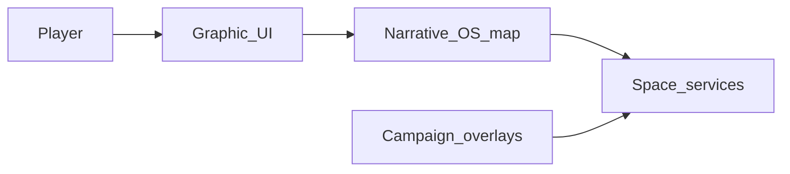

# Architecture — Narrative OS Map v0 (short)

How the **Narrative OS** world shell relates to the **campaign engine** and the **graphic UI** in BARs Engine. Canonical detail lives in [spec.md](./spec.md) and [plan.md](./plan.md).

## Three layers (conceptual)

| Layer | Role | Examples in repo |
|-------|------|------------------|
| **Narrative OS** | **Where** the player is in the world metaphor: four **spaces** (Library, Dojo, Forest, Forge). Owns the **game map** mental model and space-scoped APIs. Playable **without** a campaign via baseline seeds. | Target: `GET /api/world/map`, `/game-map` (space-first), `src/lib/narrative-os/*` |
| **Campaign engine** | **Optional module**: residencies, instances, CYOA, hubs, events, overlays. **Injects** content into spaces; **does not** define the map topology. | `getActiveInstance`, `/campaign/*`, `/event`, seed scripts, overlay adapters |
| **Graphic UI (GUI)** | **How** the device renders: tabs, cards, lists, drawers, editors. **Implements** the Narrative UI; does not replace space language with raw feature lists at the map level. | [UI_COVENANT.md](../../../UI_COVENANT.md), cultivation cards, [`NavBar`](../../../src/components/NavBar.tsx) |

**Top nav** (Now / Vault / Events / Play) is the **app shell** — orthogonal to spaces: *tabs = where in the app*, *spaces = where in the world story* (see spec ontology).

## Data flow (v0)

1. Player uses **GUI** to open the **Game Map** (Narrative OS surface).
2. **World map API** returns space summaries, unlocks, recommendations (deterministic or DB-backed later).
3. **Space** handlers aggregate or delegate to existing routes (library, adventures, capture, etc.).
4. **Campaign** attaches **overlays** (featured rows, badges) into a space without becoming a fifth primary destination.

## Boundaries (rules of thumb)

- **Narrative OS** types and routes **must not** import campaign-specific UI; campaigns integrate through **adapters** and overlay contracts.
- **Forge**-shaped work that lives in Vault (`/hand`) stays **linked**, not duplicated — Forge is the **metaphor** for processing; Vault remains **storage and possession**.
- Swapping **narrative skins** later should touch presentation and copy tokens, not core space domain types.

## See also

- [SIX_FACE_ANALYSIS.md](./SIX_FACE_ANALYSIS.md) — six-face risks and synthesis
- [plan.md](./plan.md) — API inventory and `v0` / `mock` / `defer` tags
