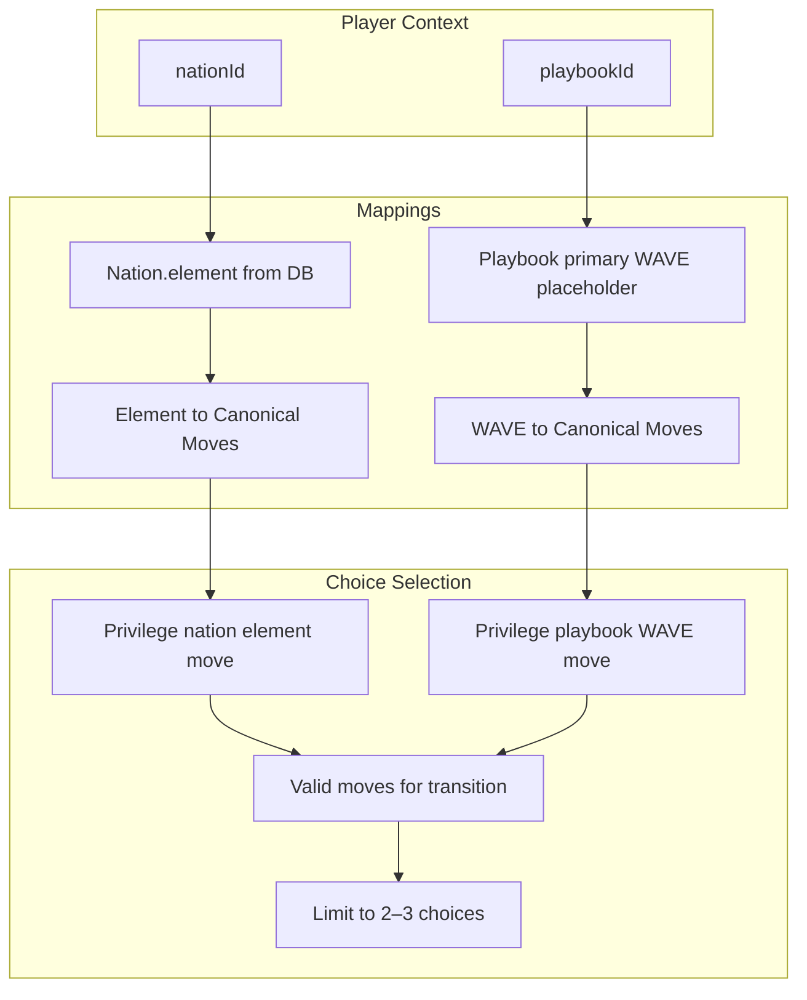

# Nation and Playbook Choice Privileging Plan

## Context

The style guide constrains choices to **2–3 per passage**. The system should know the player's **archetype (playbook)** and **nation** and use them to:
1. **Limit** move choices to 2–3
2. **Privilege** two paths: one tied to the nation's element, one tied to the playbook's WAVE move

## Resolved Open Questions

### 1. Runtime vs Authoring

**Decision**: Generate tailored content at **authoring time** first (simpler). Introduce **runtime filtering** from a choice pool later (more flexible).

- **Phase 1 (authoring)**: When generating quest content, use target nation/playbook to privilege choices. The .twee is tailored for that audience.
- **Phase 2 (future)**: Add choice pool + runtime filtering so the same adventure can serve multiple players with different nation/playbook; filter to 2–3 at render time.

### 2. Playbook Primary WAVE

**Decision**: This feature is not yet implemented. Create a **backlog item** to spec it out. Use a **generic placeholder** for prototyping, knowing we will integrate the real mapping later.

- **Placeholder**: `getPlaybookPrimaryWave(playbookId: string): PersonalMoveType` returns `'showUp'` when playbook has no primary WAVE configured (default). Swap implementation when spec is done.
- **Backlog**: [.specify/backlog/prompts/playbook-primary-wave-spec.md](../backlog/prompts/playbook-primary-wave-spec.md) — spec Playbook → primary WAVE stage mapping (schema, seed, derivation rules).

### 3. Nation Element in DB (Deftness)

**Decision**: Add `element` to the Nation model for **deftness** — deterministic, single source of truth, no runtime mapping.

**Deftness rationale** (per [ai-deftness-token-strategy](../ai-deftness-token-strategy/spec.md)): Deftness = intentional, controlled use of AI; deterministic = predictable outputs without AI when possible.

| Approach | Deftness | Rationale |
|----------|----------|------------|
| **Add `element` to Nation** | High | DB is source of truth. No external lookup. Deterministic. |
| Keep nations.ts only | Medium | Static mapping works but duplicates data; DB nation id ≠ nations.ts key (cuid vs slug). |
| Derive from name at runtime | Low | Fragile; name changes break mapping. |

**Implementation**:
- Add `element String` (required) to Nation schema — all nations must have an element
- Migration + seed: Argyra→metal, Pyrakanth→fire, Virelune→wood, Meridia→earth, Lamenth→water (all five nations; element required)
- Lookup: `nation.element` — no nations.ts needed for element at runtime
- Keep [nations.ts](../../src/lib/game/nations.ts) for game logic that needs slug-keyed lookups (e.g. ELEMENT_TO_NATION); DB is authoritative for Nation records

---

## Data Flow

## Key Files

| Purpose | File |
|---------|------|
| 15 canonical moves (element, WAVE) | [src/lib/quest-grammar/move-engine.ts](../../src/lib/quest-grammar/move-engine.ts) |
| Nation model (add element) | [prisma/schema.prisma](../../prisma/schema.prisma) |
| Playbook model | [prisma/schema.prisma](../../prisma/schema.prisma) |
| Choice generation | [src/lib/quest-grammar/compileQuest.ts](../../src/lib/quest-grammar/compileQuest.ts) |
| Passage render (choices) | [src/app/adventures/[id]/play/PassageRenderer.tsx](../../src/app/adventures/[id]/play/PassageRenderer.tsx) |
| Prompt context builder | [src/lib/quest-grammar/buildQuestPromptContext.ts](../../src/lib/quest-grammar/buildQuestPromptContext.ts) |
| Allyship domains (short context) | [src/lib/allyship-domains-parser-context.ts](../../src/lib/allyship-domains-parser-context.ts) |
| AI cache | [src/lib/ai-with-cache.ts](../../src/lib/ai-with-cache.ts) |
| Emotional alchemy design | [.agent/context/emotional-alchemy-interfaces.md](../../.agent/context/emotional-alchemy-interfaces.md) |

## Implementation Summary

### 1. Nation element (deftness)

- Add `element` to Nation schema; migration; seed with element per nation
- Use `nation.element` for all nation→element lookups

### 2. Add WAVE stage to canonical moves

Extend [move-engine.ts](../../src/lib/quest-grammar/move-engine.ts): each `CanonicalMove` gets `primaryWaveStage?: PersonalMoveType` per design doc.

### 3. Playbook primary WAVE placeholder

- New `src/lib/quest-grammar/playbook-wave.ts`: `getPlaybookPrimaryWave(playbookId: string): PersonalMoveType`
- Returns `'showUp'` when unconfigured (default). Swap when backlog spec is implemented.

### 4. Move-assignment module

New `src/lib/quest-grammar/move-assignment.ts`:
- `getMovesForElement(element)`, `getMovesForWaveStage(stage)`, `selectPrivilegedChoices(params)`

### 5. Extend Choice with moveId

- [types.ts](../../src/lib/quest-grammar/types.ts): `Choice.moveId?: string`

### 6. Choice generation (authoring-time)

- [compileQuest.ts](../../src/lib/quest-grammar/compileQuest.ts): `generateChoices` uses `targetNationId`, `targetPlaybookId` (or from targetArchetypeIds)
- Call `selectPrivilegedChoices`; assign `moveId` per choice
- **AI path** (generateQuestOverviewWithAI): Add `CHOICE_PRIVILEGING_CONTEXT` to buildQuestPromptContext; extend schema with optional `moveId` per choice; include nation/playbook in cache key

### 7. Twee / moveMap

Emit `moveMap` alongside story (e.g. in parsedJson or companion field) for future runtime filtering.

### 8. Future: Runtime filtering

When choice pool exists: PassageRenderer or API filters to 2–3 by player nation/playbook.

## Deftness: Context, Quality, and Token Conservation

**Goal**: Match PDF-analyzer quest quality (actionable, emergent) while conserving tokens at scale. Increase player throughput (vibeulon flow) via personalization.

### Quality bar (match PDF analyzer)

Book analysis produces: short actionable title, clear instructions, moveType, allyshipDomain. Use [ALLYSHIP_DOMAINS_PARSER_CONTEXT_SHORT](../../src/lib/allyship-domains-parser-context.ts) (~80 tokens) for token efficiency. Same bar for quest choices: **actionable, clear, structured** — not necessarily highly narrative.

### Context for actionable prompts

When AI generates choices (e.g. `generateQuestOverviewWithAI`), add a **condensed choice-privileging block** to `buildQuestPromptContext`:

- **CHOICE_PRIVILEGING_CONTEXT** (~100 tokens): "Target nation element: {element}. Target playbook primary WAVE: {stage}. For each passage, offer 2–3 choices. At least one choice privileges the nation's element (e.g. fire → Achieve Breakthrough, Declare Intention). At least one privileges the playbook's WAVE move (e.g. showUp → Step Through, Declare Intention). Choices must be actionable and emergent."
- Include `targetNationId`, `targetPlaybookId` (or derived from targetArchetypeIds) in `BuildQuestPromptContextInput`.
- Fetch nation.element and playbook primary WAVE; inject into context. Do **not** repeat full Voice Style Guide — reference it.

### Token conservation

| Tactic | Implementation |
|--------|----------------|
| **Condensed context** | Add CHOICE_PRIVILEGING_CONTEXT (~100 tokens), not full move-engine dump |
| **Cache key** | Include `targetNationId`, `targetPlaybookId` in `inputKey` for `quest_overview_ai` and `quest_grammar_ai` — same unpacking + same nation/playbook = cache hit |
| **Deterministic first** | Choice *selection* (which 2–3 moves) is deterministic via `selectPrivilegedChoices`. AI only generates *choice text* when needed. Consider: template choice text from move name/narrative when possible (zero AI for choices) |
| **Model** | Use `QUEST_GRAMMAR_AI_MODEL` (gpt-4o-mini when quality sufficient) for overview/choices; reserve gpt-4o for complex narrative |

### Deterministic vs AI for choices

| Approach | Deftness | Quality | Use when |
|----------|----------|---------|----------|
| **Full deterministic** | Highest | Template text from move name | MVP; acceptable if "Continue with [move name]" is sufficient |
| **Hybrid** | High | AI generates text; we constrain to privileged moves | Pass privileged moveIds to schema; AI picks phrasing for each |
| **AI-free constraint** | Medium | AI generates freely; we post-filter | Risky — AI text may not match our moves |

**Recommendation**: Hybrid. Extend `questOverviewSchema` so each choice can include `moveId`. Pass privileged moves (2–3 per passage) in context; AI generates choice text for those moves. Deterministic selection + AI phrasing = actionable + emergent.

### Player throughput (vibeulon flow)

- **Actionable choices** = less friction = more completions
- **Nation/playbook privileging** = personalization = higher engagement
- **Clear move semantics** = player understands what they're choosing
- **2–3 choices** = style guide compliance; avoids choice overload

### Artifacts to create

- `src/lib/quest-grammar/choice-privileging-context.ts` — `CHOICE_PRIVILEGING_CONTEXT(nationElement, playbookWave): string` (~100 tokens)
- Extend `buildQuestPromptContext` to accept and inject choice privileging when `targetNationId`/`targetPlaybookId` present
- Update `generateQuestOverviewWithAI` inputKey to include nation/playbook for cache partitioning

---

## Backlog Items

- **Playbook primary WAVE spec**: [.specify/backlog/prompts/playbook-primary-wave-spec.md](../backlog/prompts/playbook-primary-wave-spec.md)
