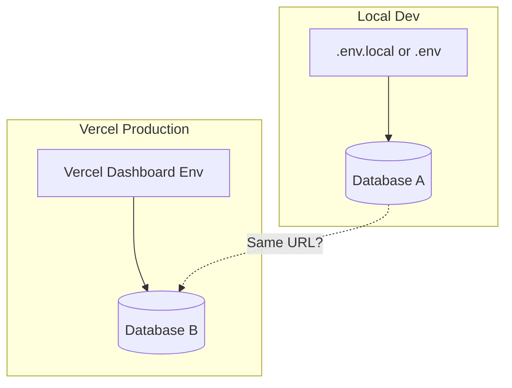

# Spec: Production Database Divergence — Demo Readiness

## Purpose

Resolve the situation where production (Vercel deploy) cannot log in or sign up, while local dev has working data. Ensure `admin@admin.local` exists in production and provide a runbook to diagnose and fix prod/dev database divergence so demos can proceed.

**Problem**: No players can log in or sign up in production. Admin credentials fail. Local dev retains data. This indicates production and local are using different databases or production DB is empty/misconfigured. The canonical admin account is `admin@admin.local` (created by seed), not `admin@bars-engine.local` (created by create-admin script).

**Practice**: Deftness Development — diagnose before fixing; document env and DB flow; provide actionable runbooks.

---

## Design Decisions

| Topic | Decision |
|-------|----------|
| Canonical admin | `admin@admin.local` / `password` — created by `npm run db:seed` in [seed-utils.ts](src/lib/seed-utils.ts). Use this for demos. |
| Prod vs dev DB | Production uses Vercel env (Dashboard → Settings → Environment Variables). Local uses `.env.local` from `vercel env pull` or `.env`. If they differ, prod and dev hit different databases. |
| Diagnosis first | Add a script to verify which DB a given `DATABASE_URL` reaches and whether admin/seed data exists. |
| Ensure admin | Add `ensure-admin-local` script that creates/updates `admin@admin.local` with admin role when run against a target DB. |

---

## Conceptual Model

- **If Local and Prod use same DATABASE_URL**: Both hit same DB; data should match. If prod fails, likely connection/SSL/pooling issue.
- **If Local and Prod use different DATABASE_URL**: Prod DB may be empty, never seeded, or misconfigured. Seed and ensure-admin must run against prod URL.

---

## User Stories

### P1: Admin access in production

**As a** demo owner, **I want** to log in as `admin@admin.local` on the production deploy, **so** I can access `/admin` and demo the app.

**Acceptance**: Log in at production `/conclave` with `admin@admin.local` / `password`; access `/admin` without redirect.

### P2: Signup works in production

**As a** new user, **I want** to create an account on the production deploy, **so** I can participate in the demo.

**Acceptance**: Guided signup and login succeed on production; no generic "Account creation failed" or "Invalid credentials."

### P3: Diagnose prod vs dev divergence

**As a** developer, **I want** to verify which database production uses and whether it has seed data, **so** I can fix prod/dev divergence.

**Acceptance**: A script reports DB host, row counts (accounts, players, roles), and whether `admin@admin.local` exists.

---

## Functional Requirements

### Phase 1: Diagnosis and runbook

- **FR1**: Add `scripts/verify-production-db.ts` that:
  - Accepts `DATABASE_URL` from env (or `--url` flag)
  - Connects and reports: host (redacted), `accounts` count, `players` count, `roles` count, whether `admin@admin.local` exists and has admin role
  - Exits 0 if admin exists and has role; non-zero otherwise

- **FR2**: Document in [docs/ENV_AND_VERCEL.md](docs/ENV_AND_VERCEL.md):
  - How to compare prod vs local `DATABASE_URL` (Vercel Dashboard vs `.env.local`)
  - Vercel env scope: Production, Preview, Development — each can have different `DATABASE_URL`
  - Step-by-step "Production demo readiness" runbook: verify, seed, ensure admin, create invite

### Phase 2: Ensure admin@admin.local

- **FR3**: Add `scripts/ensure-admin-local.ts` that:
  - Creates or updates `admin@admin.local` with password `password`
  - Ensures Player has admin role
  - Idempotent (safe to run multiple times)
  - Uses `require-db-env` and same env loading as other scripts

- **FR4**: Update [docs/ENV_AND_VERCEL.md](docs/ENV_AND_VERCEL.md) production recovery section to reference `admin@admin.local` and `ensure-admin-local` script.

---

## Non-Functional Requirements

- Scripts must not log or expose full `DATABASE_URL` (redact host for display).
- `ensure-admin-local` must work even when `admin@admin.local` already exists (upsert pattern).

---

## Verification

1. Run `DATABASE_URL="<prod>" npx tsx scripts/verify-production-db.ts` — reports DB state.
2. Run `DATABASE_URL="<prod>" npx tsx scripts/ensure-admin-local.ts` — creates/updates admin.
3. Log in at prod `/conclave` with `admin@admin.local` / `password`; access `/admin`.
4. Create a test account via guided signup on prod; log in successfully.

---

## References

- [src/lib/seed-utils.ts](src/lib/seed-utils.ts) — creates `admin@admin.local` in step 7
- [scripts/create-admin.ts](scripts/create-admin.ts) — creates `admin@bars-engine.local` (different account)
- [src/lib/db.ts](src/lib/db.ts) — resolves DATABASE_URL from multiple env vars
- [docs/ENV_AND_VERCEL.md](docs/ENV_AND_VERCEL.md) — env setup
- [docs/DEPLOY.md](docs/DEPLOY.md) — deployment
