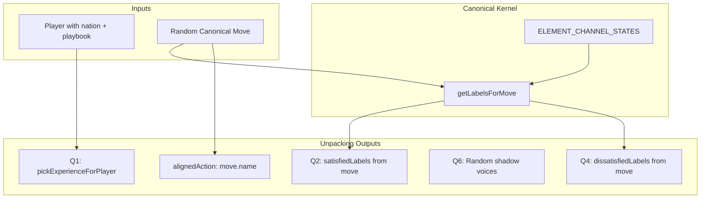

# Spec: Random Unpacking Canonical Kernel

## Purpose

Refactor random unpacking so the data produced is useful and coherent: satisfaction (Q2) and dissatisfaction (Q4) derive from emotional alchemy moves; experience (Q1) derives from nation and playbook; the emotional alchemy move and self-sabotage (Q6) are randomized from canonical sources.

## Design Decisions

| Topic | Decision |
|-------|----------|
| Satisfaction/dissatisfaction source | Canonical kernel derived from emotional alchemy moves (element → channel states) |
| Move selection | Random from ALL_CANONICAL_MOVES (15 moves) |
| Q2/Q4 derivation | From move's fromElement/toElement (or element for transcend) via ELEMENT_CHANNEL_STATES |
| Q6 (self-sabotage) | Random from SHADOW_VOICE_OPTIONS |
| Q1 (experience) | Function of nation element + playbook WAVE; domain-move preference from emotional-alchemy-interfaces |
| alignedAction | Move name (e.g. "Step Through (Excitement)") instead of WAVE label |
| moveType | Pass move.primaryWaveStage to compileQuest so it does not derive from alignedAction |

## Conceptual Model



## API Contracts

### ELEMENT_CHANNEL_STATES

```ts
// ElementKey → { dissatisfiedLabels: string[]; satisfiedLabels: string[] }
// Derived from .agent/context/emotional-alchemy-interfaces.md §5
```

| Element | Dissatisfied | Satisfied |
|---------|--------------|-----------|
| Metal | anxious, scared, worried | excited, relieved |
| Water | sad, disappointed, isolated | poignant, fulfilled |
| Wood | numb, overwhelmed | energized, triumphant, blissful |
| Fire | frustrated | triumphant |
| Earth | boredom, apathy | peaceful |

### getLabelsForMove(move: CanonicalMove)

- Transcend: use `element` for both from and to.
- Translate: use `fromElement` → dissatisfied, `toElement` → satisfied.
- Return 2 labels from each array (pickN-style).

### pickExperienceForPlayer(nationElement?, playbookWave?)

- ELEMENT_TO_DOMAINS: metal→[Raise Awareness, Skillful Organizing], fire→[Raise Awareness, Direct Action], water→[Gather Resource, Raise Awareness], wood→[Gather Resource, Skillful Organizing, Direct Action], earth→[Gather Resource, Skillful Organizing].
- WAVE_TO_DOMAIN: wakeUp→Raise Awareness, cleanUp→Skillful Organizing, growUp→Gather Resource, showUp→Direct Action.
- Intersect when both present; fallback to random from EXPERIENCE_OPTIONS.

### generateRandomUnpacking(playerContext?)

```ts
interface RandomUnpackingPlayerContext {
  nationElement?: ElementKey
  playbookPrimaryWave?: PersonalMoveType
}

interface RandomUnpackingResult {
  unpackingAnswers: UnpackingAnswers
  alignedAction: string
  moveType?: PersonalMoveType
}
```

## Functional Requirements

### Phase 1: Canonical Kernel

- **FR1**: Create `canonical-kernel.ts` with ELEMENT_CHANNEL_STATES, getLabelsForMove, pickExperienceForPlayer.
- **FR2**: ELEMENT_CHANNEL_STATES matches emotional-alchemy-interfaces.md §5 channel states.
- **FR3**: getLabelsForMove returns 2 dissatisfied + 2 satisfied labels per move.

### Phase 2: Random Unpacking Refactor

- **FR4**: generateRandomUnpacking accepts optional playerContext.
- **FR5**: Pick random move from ALL_CANONICAL_MOVES; derive q2, q4 via getLabelsForMove.
- **FR6**: alignedAction = move.name; return moveType = move.primaryWaveStage.
- **FR7**: Q6 remains random from SHADOW_VOICE_OPTIONS (pickN, 2).
- **FR8**: Q1 uses pickExperienceForPlayer when playerContext provided; else random from EXPERIENCE_OPTIONS.

### Phase 3: Integration

- **FR9**: generateGrammaticQuestFromReading fetches player with nation; passes nationElement, playbookPrimaryWave to generateRandomUnpacking.
- **FR10**: compileQuestWithAI receives moveType from result; compileQuest uses it instead of deriving from alignedAction.

## Dependencies

- [I Ching Grammatic Quests](../iching-grammatic-quests/spec.md)
- [Quest Grammar Compiler](../quest-grammar-compiler/spec.md)
- [Emotional Alchemy Interfaces](.agent/context/emotional-alchemy-interfaces.md)

## References

- [src/lib/quest-grammar/](../../src/lib/quest-grammar/)
- [src/lib/quest-grammar/move-engine.ts](../../src/lib/quest-grammar/move-engine.ts)
- [src/lib/quest-grammar/random-unpacking.ts](../../src/lib/quest-grammar/random-unpacking.ts)
- [src/actions/generate-quest.ts](../../src/actions/generate-quest.ts)
