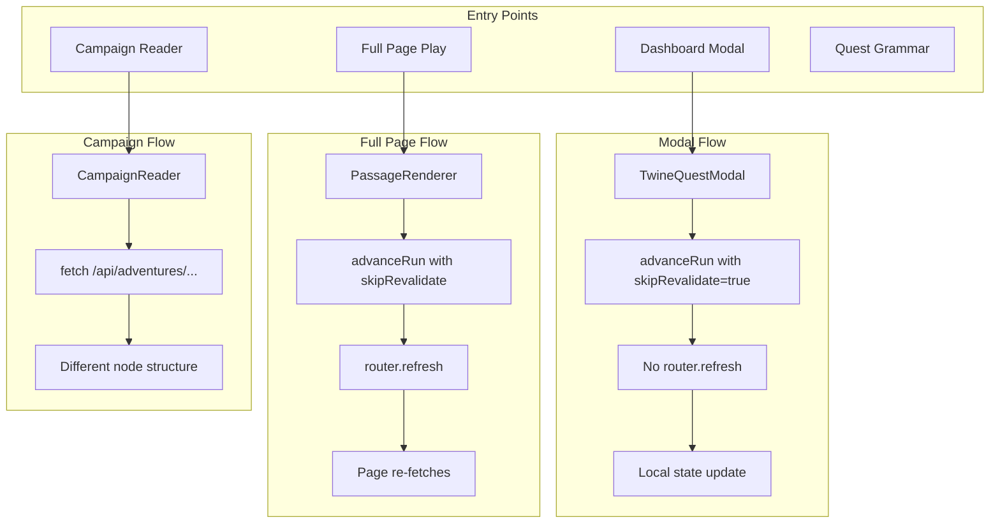

# Analysis: Report Feedback Kick to Dashboard

## Entry Points and Code Paths

## Revalidation Call Graph (Simplified)

| Caller | Path | When |
|--------|------|------|
| advanceRun | /adventures/[id]/play, / | On passage advance (skipped when FEEDBACK) |
| revertRun | Same | On Back (skipped when from FEEDBACK) |
| executeBindingsForPassage | / | When bindings fire (now skipped when advancing to FEEDBACK) |
| donate.ts | /, /event, /wallet | On donation report |
| quest-engine completeQuest | / | On quest completion |
| gameboard actions | /, /campaign/board | On gameboard actions |
| getCurrentPlayer | (none) | Auth check only |
| POST /api/feedback/cert | (none) | Writes file only, no revalidation |

## Full revalidatePath('/') Callers (Audit)

| File | Count | Context |
|------|-------|---------|
| twine.ts | 6 | advanceRun, revertRun, executeBindingsForPassage, DASHBOARD redirect, completeTwineRunForQuest |
| gameboard.ts | 16 | Various gameboard mutations |
| quest-engine.ts | 2 | completeQuest |
| donate.ts | 2 | Donation report |
| instance.ts | 5 | Instance updates |
| onboarding.ts | 5 | Onboarding state changes |
| quest-pack.ts | 5 | Pack mutations |
| quest-thread.ts | 4 | Thread mutations |
| economy-ledger.ts | 2 | Ledger writes |
| Other actions | ~40 | Various mutations |

**Rule**: When user is on FEEDBACK passage (modal or full page), no code path invoked by the advance or submit flow must call revalidatePath('/').

## Hypothesis: Cascade from Concurrent Request

When the user is on FEEDBACK (modal on dashboard):

1. User types in textarea.
2. Some other request runs (e.g. layout re-fetch, a polling request, or a prefetch).
3. That request triggers a server action that calls revalidatePath('/').
4. Dashboard re-renders. Client components (QuestPack) receive new RSC payload.
5. If the component tree or props change, selectedQuest state may reset.
6. Modal closes. User sees dashboard.

## API-First Rationale

Server actions in Next.js can trigger revalidation as part of the action lifecycle. By using a plain Route Handler (POST /api/feedback/cert) with fetch(), we:

- Avoid the server action revalidation path entirely.
- Keep the form submit as a simple HTTP request.
- Ensure no revalidatePath is called from the feedback submit flow.
