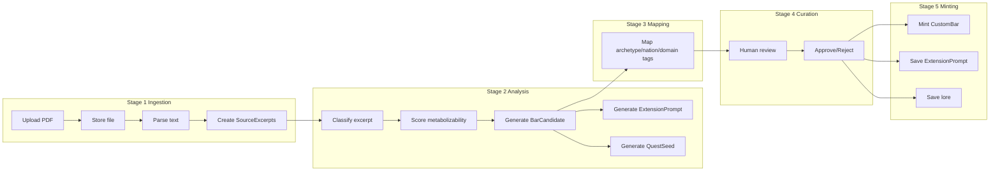

# Plan: Source Ingestion + BAR Candidate Pipeline

## API-First and Deftness Discipline

Per [Deftness Development](.agents/skills/deftness-development/SKILL.md):

- **Contract before UI**: Define data shape and route/action signature before building UI. Implement routes/actions first.
- **Route vs Action**: Use route handlers for external consumers; server actions for form submissions and internal flows.
- **Documentation**: Document method, path, request body, response shape for each endpoint in this plan.
- **Deftness hooks**: Real integration seams—not decorative. Wire into pipeline; emit event surfaces.
- **Scaling robustness**: Blob for uploads; cache for AI; no filesystem writes on Vercel.

## 1. Schema Changes

### Prisma schema additions

```prisma
model SourceDocument {
  id               String   @id @default(cuid())
  title            String
  author           String?
  sourceType       String   // PDF, EPUB, TEXT
  fileUrl          String?
  uploadedByUserId String
  documentKind     String   // NONFICTION, PHILOSOPHY, FICTION, MEMOIR, PRACTICAL, CONTEMPLATIVE
  status           String   @default("UPLOADED") // UPLOADED, PARSED, ANALYZED, FAILED
  pageCount        Int?
  bookId           String?  @unique
  createdAt        DateTime @default(now())
  updatedAt        DateTime @updatedAt
  excerpts         SourceExcerpt[]
  // ...
}

model SourceExcerpt {
  id                 String   @id @default(cuid())
  sourceDocumentId   String
  text               String   @db.Text
  excerptIndex       Int
  pageStart          Int?
  pageEnd            Int?
  chapterTitle       String?
  sectionTitle       String?
  charStart          Int?
  charEnd            Int?
  analysisStatus     String   @default("PENDING") // PENDING, ANALYZED
  createdAt          DateTime @default(now())
  updatedAt          DateTime @updatedAt
  sourceDocument     SourceDocument @relation(...)
  barCandidates      BarCandidate[]
  // ...
}

model BarCandidate {
  id                     String   @id @default(cuid())
  sourceExcerptId        String
  candidateType          String   // INSIGHT, FRICTION, PRACTICE, WORLDVIEW, ARCHETYPE, RELATIONAL, MYTHIC
  titleDraft             String
  bodyDraft              String   @db.Text
  metabolizabilityTier   String   // SYSTEM_NATIVE, PROMPT_SEED, LORE_ARCHIVE, INSIGHT_RESIDUE
  chargeScore            Float?
  actionabilityScore     Float?
  extendabilityScore     Float?
  replayabilityScore    Float?
  shareabilityScore     Float?
  provenanceValueScore  Float?
  recommendedDisposition String  // MINT_BAR, SAVE_AS_EXTENSION_PROMPT, SAVE_AS_LORE, REJECT
  reviewStatus          String   @default("PENDING") // PENDING, APPROVED, REJECTED, MINTED, ARCHIVED
  createdAt              DateTime @default(now())
  updatedAt              DateTime @updatedAt
  sourceExcerpt          SourceExcerpt @relation(...)
  extensionPrompts      ExtensionPrompt[]
  questSeeds            QuestSeed[]
  // ...
}

model ExtensionPrompt {
  id                 String   @id @default(cuid())
  sourceExcerptId    String?
  barCandidateId     String?
  promptTitle        String
  promptBody         String   @db.Text
  promptType         String   // PLAYER_BAR_EXTENSION, REFLECTION, PRACTICE, etc.
  createdByUserId    String?
  status             String
  createdAt          DateTime @default(now())
  updatedAt          DateTime @updatedAt
  // ...
}

model QuestSeed {
  id                 String   @id @default(cuid())
  sourceExcerptId    String?
  barCandidateId     String?
  extensionPromptId  String?
  title              String
  body               String   @db.Text
  questType          String?
  archetypeTags      String   @default("[]") // JSON array
  nationTags         String   @default("[]") // JSON array
  domainTags         String   @default("[]") // JSON array
  status             String
  createdAt          DateTime @default(now())
  updatedAt          DateTime @updatedAt
  // ...
}

model SourceLineageEdge {
  id             String   @id @default(cuid())
  fromEntityType String
  fromEntityId   String
  toEntityType   String
  toEntityId     String
  relationType   String   // EXTRACTED_FROM, GENERATED_CANDIDATE_FROM, MINTED_BAR_FROM, etc.
  createdAt      DateTime @default(now())
  // ...
}
```

### CustomBar extension

Add optional lineage field to CustomBar:

```prisma
// In CustomBar model
barCandidateId  String?  // when minted from pipeline
```

Or use `completionEffects` JSON to store `{ source: 'ingestion', sourceDocumentId, sourceExcerptId, barCandidateId }` for provenance.

---

## 2. Migration / Compatibility Plan

- **Book → SourceDocument**: Optional promotion path. When a Book enters the new pipeline, create a SourceDocument with `bookId` linking back. Existing Book flow continues unchanged.
- **CustomBar**: Minted BARs use existing CustomBar creation flow. Set `completionEffects` or `barCandidateId` for lineage.
- **QuestThread / ThreadQuest**: Quest seeds can be promoted into existing quest system; connect via CustomBar when minted.
- **Lineage**: No existing SourceLineageEdge model; add new. Reuse `completionEffects` JSON pattern for BAR provenance (as in Book-to-Quest).
- **Avoid parallel systems**: Single BAR model (CustomBar); single quest model; SourceLineageEdge is the new provenance graph for ingestion pipeline only.

---

## 3. Ingestion Pipeline Design



- **Async pattern**: If analysis is long-running, support status polling via `GET /api/source-documents/[id]/status`. v1 may use synchronous server action with `maxDuration` (as in book-analyze).
- **Parse**: Reuse `extractTextFromPdf` from [src/lib/pdf-extract.ts](src/lib/pdf-extract.ts).
- **Chunk**: Adapt [src/lib/book-chunker.ts](src/lib/book-chunker.ts) to create SourceExcerpt records.

---

## 4. Service Architecture

### source-document-service.ts

```ts
createFromUpload(params: { title: string; author?: string; fileUrl: string; documentKind: string; uploadedByUserId: string; sourceType?: string }): Promise<{ success: true; document: SourceDocument } | { error: string }>
listDocuments(filters?: { status?: string }): Promise<SourceDocument[]>
getDocumentDetail(id: string): Promise<SourceDocument | null>
parseDocument(id: string): Promise<{ success: boolean; error?: string }>
```

### source-excerpt-service.ts

```ts
createExcerpts(sourceDocumentId: string, chunks: { text: string; index: number; pageStart?: number; pageEnd?: number; chapterTitle?: string; sectionTitle?: string; charStart?: number; charEnd?: number }[]): Promise<SourceExcerpt[]>
listByDocument(sourceDocumentId: string): Promise<SourceExcerpt[]>
getExcerptDetail(id: string): Promise<SourceExcerpt | null>
```

### source-analysis-service.ts

```ts
analyzeExcerpt(excerptId: string, profileId?: string): Promise<{ success: boolean; candidate?: BarCandidate; error?: string }>
```

### bar-candidate-service.ts

```ts
generateCandidate(excerptId: string, analysisResult: AnalysisResult): Promise<BarCandidate>
listByDocument(sourceDocumentId: string): Promise<BarCandidate[]>
getCandidateDetail(id: string): Promise<BarCandidate | null>
```

### extension-prompt-service.ts

```ts
generateFromCandidate(candidateId: string): Promise<ExtensionPrompt>
listByDocument(sourceDocumentId: string): Promise<ExtensionPrompt[]>
```

### quest-seed-service.ts

```ts
generateFromCandidate(candidateId: string): Promise<QuestSeed>
listByCandidate(candidateId: string): Promise<QuestSeed[]>
```

### source-lineage-service.ts

```ts
createEdge(params: { fromEntityType: string; fromEntityId: string; toEntityType: string; toEntityId: string; relationType: string }): Promise<SourceLineageEdge>
getLineage(entityType: string, entityId: string): Promise<SourceLineageEdge[]>
```

### curation-service.ts

```ts
approveCandidate(candidateId: string): Promise<{ success: boolean; error?: string }>
rejectCandidate(candidateId: string): Promise<{ success: boolean; error?: string }>
mintBarFromCandidate(candidateId: string, creatorId: string): Promise<{ success: true; bar: CustomBar } | { error: string }>
saveAsExtensionPrompt(candidateId: string): Promise<{ success: true; prompt: ExtensionPrompt } | { error: string }>
saveAsLore(candidateId: string): Promise<{ success: boolean; error?: string }>
```

### deftness-service.ts (interface + stubs)

```ts
evaluateExcerptSelection(excerpt: SourceExcerpt, context: object): Promise<void>
evaluateCandidateGeneration(candidate: BarCandidate, excerpt: SourceExcerpt): Promise<void>
evaluateExtensionPrompt(prompt: ExtensionPrompt, context: object): Promise<void>
evaluateQuestSeed(seed: QuestSeed, context: object): Promise<void>
evaluateCurationAction(action: string, context: object): Promise<void>
evaluateLineageIntegrity(chain: SourceLineageEdge[]): Promise<void>
```

---

## 5. API / Route Changes

Align with [src/app/api/bars/route.ts](src/app/api/bars/route.ts): GET/POST, NextResponse.json, delegate to actions.

| Route | Method | Response |
|-------|--------|----------|
| `GET /api/source-documents?status=` | GET | `{ documents: SourceDocument[] }` |
| `POST /api/source-documents` | POST | `{ document: SourceDocument }` or `{ error: string }` |
| `GET /api/source-documents/[id]` | GET | `{ document: SourceDocument }` |
| `POST /api/source-documents/[id]/parse` | POST | `{ success: boolean }` |
| `POST /api/source-documents/[id]/analyze` | POST | `{ success: boolean }` |
| `GET /api/source-documents/[id]/status` | GET | `{ status: string }` |
| `GET /api/source-documents/[id]/excerpts` | GET | `{ excerpts: SourceExcerpt[] }` |
| `GET /api/source-documents/[id]/candidates` | GET | `{ candidates: BarCandidate[] }` |
| `GET /api/source-excerpts/[id]` | GET | `{ excerpt: SourceExcerpt }` |
| `POST /api/source-excerpts/[id]/reanalyze` | POST | `{ success: boolean }` |
| `GET /api/bar-candidates/[id]` | GET | `{ candidate: BarCandidate }` |
| `POST /api/bar-candidates/[id]/approve` | POST | `{ success: boolean }` |
| `POST /api/bar-candidates/[id]/reject` | POST | `{ success: boolean }` |
| `POST /api/bar-candidates/[id]/mint` | POST | `{ bar: CustomBar }` |
| `POST /api/bar-candidates/[id]/save-as-prompt` | POST | `{ prompt: ExtensionPrompt }` |
| `POST /api/bar-candidates/[id]/save-as-lore` | POST | `{ success: boolean }` |
| `GET /api/bar-candidates/[id]/quest-seeds` | GET | `{ questSeeds: QuestSeed[] }` |
| `GET /api/extension-prompts?documentId=` | GET | `{ prompts: ExtensionPrompt[] }` |
| `GET /api/extension-prompts/[id]` | GET | `{ prompt: ExtensionPrompt }` |
| `POST /api/extension-prompts/[id]/create-bar` | POST | `{ bar: CustomBar }` (optional) |
| `GET /api/quest-seeds/[id]` | GET | `{ questSeed: QuestSeed }` |
| `POST /api/quest-seeds/[id]/promote` | POST | `{ success: boolean }` (optional) |
| `GET /api/source-analysis-profiles` | GET | `{ profiles: { id, label, barTypes }[] }` |

---

## 6. UI Changes

| Surface | Path | Description |
|---------|------|-------------|
| Source upload entry point | `src/app/admin/source-ingestion/page.tsx` + `SourceUploadForm` | Upload PDF, title, author, analysis profile, optional library |
| Source document detail view | `src/app/admin/source-ingestion/[id]/page.tsx` | Title, author, status, metadata, candidate/prompt/seed counts |
| Candidate review view | `src/app/admin/source-ingestion/[id]/candidates/CandidateReviewList.tsx` | Excerpt, scores, disposition, draft BAR, actions |
| Excerpt detail preview | Inline in CandidateReviewList or expandable `ExcerptPreview` | Source excerpt text |
| Lineage preview | `LineagePreview` component | Chain: Document → Excerpt → Candidate → BAR/Prompt/Seed |
| Analysis profile selector | In SourceUploadForm or analysis trigger | Dropdown: nonfiction, philosophy, fiction, memoir, practical, contemplative |

Add "Source Ingestion" to [AdminNav](src/components/AdminNav.tsx).

---

## 7. Deftness Hooks and Event Surfaces

### Event constants

```ts
// src/lib/source-ingestion-events.ts
export const SOURCE_INGESTION_EVENTS = {
  SOURCE_DOCUMENT_UPLOADED: 'source_document.uploaded',
  SOURCE_DOCUMENT_PARSED: 'source_document.parsed',
  SOURCE_EXCERPT_ANALYZED: 'source_excerpt.analyzed',
  BAR_CANDIDATE_GENERATED: 'bar_candidate.generated',
  EXTENSION_PROMPT_GENERATED: 'extension_prompt.generated',
  QUEST_SEED_GENERATED: 'quest_seed.generated',
  BAR_CANDIDATE_APPROVED: 'bar_candidate.approved',
  BAR_CANDIDATE_MINTED: 'bar_candidate.minted',
  SOURCE_ARTIFACT_CURATED: 'source_artifact.curated',
} as const
```

### Hook call points

- After excerpt creation → `evaluateExcerptSelection`
- After candidate generation → `evaluateCandidateGeneration`
- After extension prompt generation → `evaluateExtensionPrompt`
- After quest seed generation → `evaluateQuestSeed`
- On approve/reject/mint/save → `evaluateCurationAction`
- After minting, when building lineage chain → `evaluateLineageIntegrity`

---

## 8. Test Plan

### Test file locations

- `src/actions/__tests__/source-ingestion.test.ts` — Actions and service integration
- `src/services/__tests__/source-document-service.test.ts` (optional, or colocate in actions test)

### Test list

1. source document creation from upload
2. source excerpt creation from parsed document
3. candidate generation from excerpt
4. metabolizability classification persistence
5. extension prompt generation
6. quest seed generation
7. lineage edge creation across transformations
8. candidate approval and minting to BAR
9. candidate saved as extension prompt instead of BAR
10. rejected candidate remains traceable
11. analysis profile selection changes behavior or selection path
12. deftness hooks are called at the expected pipeline points
13. lineage integrity preserved after minting
14. source metadata preserved on derived artifacts
15. (if async) status transitions

---

## 9. Assumptions / TODOs

- **EPUB, web article ingestion**: Deferred. Schema supports sourceType; add parsers later.
- **libraryId**: Optional on ExtensionPrompt. Add when library concept is clarified.
- **Target library on upload**: Optional in v1. Build UI seam; may be no-op initially.
- **Async job pattern**: v1 may use synchronous server action with `maxDuration`; add job queue later if needed.
- **Analysis profile dynamic config**: v1 can use static `SOURCE_ANALYSIS_PROFILES`; API returns list for UI.

---

## Architecture Overview

```
PDF/Upload → SourceDocument → parse → SourceExcerpt[] → analyze → BarCandidate[]
                                                              ↘ ExtensionPrompt
                                                              ↘ QuestSeed
                                                              ↘ SourceLineageEdge
                                                              ↘ deftness hooks
Curator review → approve/reject → mint CustomBar | save ExtensionPrompt | save lore
```

## File Impacts

| Action | Path |
|--------|------|
| Modify | `prisma/schema.prisma` |
| Create | `src/services/source-document-service.ts` |
| Create | `src/services/source-excerpt-service.ts` |
| Create | `src/services/bar-candidate-service.ts` |
| Create | `src/services/extension-prompt-service.ts` |
| Create | `src/services/quest-seed-service.ts` |
| Create | `src/services/source-lineage-service.ts` |
| Create | `src/services/source-analysis-service.ts` |
| Create | `src/services/source-ingestion-service.ts` |
| Create | `src/services/curation-service.ts` |
| Create | `src/services/deftness-service.ts` |
| Create | `src/lib/source-genre-profiles.ts` |
| Create | `src/lib/source-ingestion-events.ts` |
| Create | `src/actions/source-ingestion.ts` |
| Create | `src/app/api/source-documents/...` routes |
| Create | `src/app/api/source-excerpts/...` routes |
| Create | `src/app/api/bar-candidates/...` routes |
| Create | `src/app/api/extension-prompts/...` routes |
| Create | `src/app/api/quest-seeds/...` routes |
| Create | `src/app/api/source-analysis-profiles/route.ts` |
| Create | `src/app/admin/source-ingestion/page.tsx` |
| Create | `src/app/admin/source-ingestion/[id]/page.tsx` |
| Create | `src/app/admin/source-ingestion/[id]/candidates/CandidateReviewList.tsx` |
| Modify | `src/components/AdminNav.tsx` |
