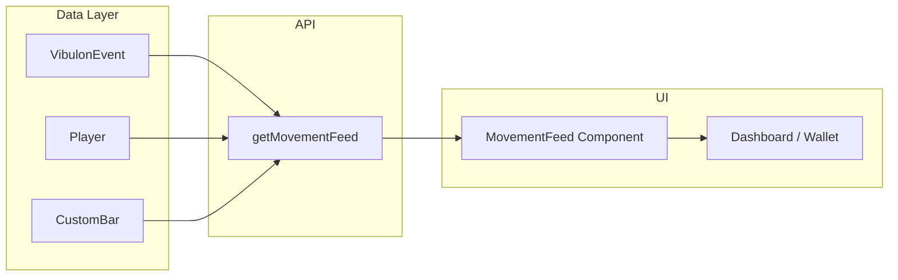

# Plan: Vibeulon Visibility (Movement Feed)

## Architecture

### Current state

- VibulonEvent logs all vibeulon activity (quest completion, p2p transfer, completion_effect).
- Wallet page shows personal transfer history only (p2p_transfer for current player).
- No global or shared feed of "who earned what."

### Target state

1. **getMovementFeed()** — Server action or data fetcher: query VibulonEvent where amount > 0, include player, optionally quest (CustomBar), order by createdAt desc, take 20.
2. **MovementFeed component** — Renders list of feed items: player name, amount, "for [quest/source]".
3. **Surface** — Dashboard or wallet; compact section "Recent Vibeulon Activity" or "Movement Feed."

### Data flow



## Implementation

### 1. Data fetcher

```typescript
// src/actions/economy.ts or src/lib/movement-feed.ts
export async function getMovementFeed(limit = 20) {
  return db.vibulonEvent.findMany({
    where: { amount: { gt: 0 } },
    orderBy: { createdAt: 'desc' },
    take: limit,
    include: {
      player: { select: { id: true, name: true } },
      // questId exists but no relation in schema - join manually or add relation
    }
  })
}
```

Note: VibulonEvent has `questId` but no Prisma relation to CustomBar. Options: (a) Add relation; (b) Fetch quests separately by questId; (c) Parse from notes. For v1, use notes (contains "Quest Completed: {title}") or fetch CustomBar by questId in a second query.

### 2. Component

- MovementFeed.tsx: map events to list items
- Format: "{playerName} earned {amount} ♦ for {questTitle or source}"
- Compact, scrollable

### 3. Surface

- Add to dashboard (/) — below or beside KotterGauge, or in a collapsible "Movement" section
- Or add to wallet (/wallet) — "Recent Activity" section

## File Impacts

| File | Change |
|------|--------|
| src/actions/economy.ts or src/lib/movement-feed.ts | Add getMovementFeed() |
| src/components/MovementFeed.tsx | New component |
| src/app/page.tsx or src/app/wallet/page.tsx | Render MovementFeed |
| prisma/schema.prisma | Optional: add quest relation to VibulonEvent |

## Verification

- Complete a quest → movement feed shows "X earned N ♦ for Quest Title"
- Transfer received → feed shows "X earned N ♦" with "Received from Y" in notes
- Feed visible on chosen surface
