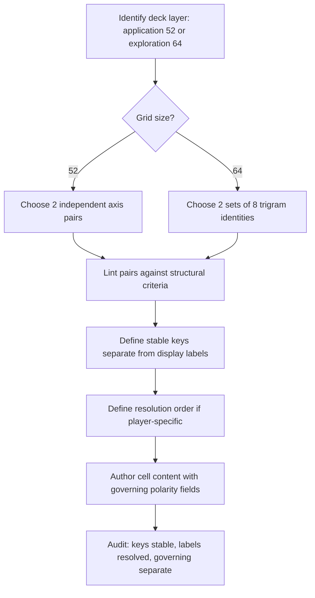

# Formal Structural Polarity Mapping

**Scope:** This document defines the **formal mapping process** for **structural polarity** — how independent axis pairs combine into deck topology. It does **not** define governing polarities (care↔impact, safety↔growth). See `POLARITY-TYPES-CANON.md`.

**One sentence:** Structural polarity mapping is the **Cartesian combinatorics** that turns two interdependent pairs into a labeled grid, with stable storage keys and resolved display labels.

---

## 1. The mapping primitive

Every structural polarity map uses the same algebra:

```
pair1:  poleA (−)  ↔  poleB (+)     // axis dimension 1
pair2:  poleC (−)  ↔  poleD (+)     // axis dimension 2
        ─────────────────────────
product →  N cells with stable keys + resolved labels
```

| Grid size | Formula | Product | Use |
|-----------|---------|---------|-----|
| **Application 52** | 2 × 2 × 13 ranks | 4 suits × 13 = 52 | Scene Atlas, craft application decks |
| **Exploration 64** | 8 × 8 | 64 hexagram cells | Book oracles (I Ching structure) |

**Critical rule:** The two axes are **independent dimensions**. Their Cartesian product is the map. Neither axis is “more true” than the other; both must be valid polarity pairs on their own (see audit criteria below).

---

## 2. Data model (engine)

From `bars-engine` vocabulary (`VALUES_AND_POLARITIES.md`, `POLARITY_DERIVATION.md`):

| Concept | Type / storage | Role |
|---------|----------------|------|
| **`GridAxisPair`** | `{ minus: string, plus: string }` | One axis dimension (two pole labels) |
| **`ResolvedGridPolarities`** | `{ pair1, pair2, source }` | Both axes + provenance |
| **Suit key** | Stable enum / string on `BarDeckCard.suit` | Storage — never changes when labels change |
| **Display label** | Computed from resolved pairs | Player-facing quadrant name |
| **Prisma `Polarity`** | Nation move tag | **Orthogonal** — not grid axes |

**Storage vs display split:**

```
stable key (suit / hexagram index)  →  never breaks saves or APIs
resolved label (pair combination)   →  can change per player or per book edition
```

---

## 3. Scene Atlas — 2×2 application map

**Job:** Teach deck literacy + structural polarity resolution. Not a craft-line product.

### 3.1 Topology

```
              pair2 (−)          pair2 (+)
              ─────────────────────────────
pair1 (−)  │  quadrant LL      │  quadrant LR
pair1 (+)  │  quadrant UL      │  quadrant UR
              ─────────────────────────────
           → 4 suit keys × 13 ranks = 52 cells
```

### 3.2 Axis provenance (split sources)

| Axis | Default source | Override |
|------|----------------|----------|
| **pair1** | `Nation.element` → `ELEMENT_AXIS` table | `storyProgress.gridPolarities.pair1` |
| **pair2** | Playbook / `Archetype` → trigram → `TRIGRAM_RELATIONAL_PAIR2` | `storyProgress.gridPolarities.pair2` |

**Important:** pair1 and pair2 come from **different identity layers** (nation vs playbook). This is intentional — not “nation OR archetype owns the grid.”

### 3.3 Resolution order

1. **`storyProgress.gridPolarities`** — adventure / orientation JSON (`commitDerivedSceneAtlasAxes`, `mergeGridPolarities`)
2. **Derived** — nation element + archetype trigram tables
3. **Default** — Top/Bottom × Lead/Follow

### 3.4 Implementation paths

| Artifact | Path |
|----------|------|
| Pair1 table | `bars-engine/src/lib/creator-scene-grid-deck/polarities.ts` |
| Pair2 table | `bars-engine/src/lib/creator-scene-grid-deck/archetype-trigram-polarities.ts` |
| Derivation spec | `bars-engine/.specify/specs/creator-scene-grid-deck/POLARITY_DERIVATION.md` |
| Pair quality audit | `bars-engine/.specify/specs/creator-scene-grid-deck/VALUE_PAIRS_AUDIT.md` |
| Audit script | `bars-engine/scripts/audit-creator-grid-polarities.ts` |

---

## 4. I Ching exploration map — 8×8 book oracle

**Job:** Exhaustive exploration layer for book-integrated oracles. Same **combinatorics**, different **axis semantics** and **cell content**.

### 4.1 Topology

```
lower trigram (8)  ×  upper trigram (8)  →  64 hexagram cells

Each cell:
  - stable index (hexagram number or row×col key)
  - lower trigram identity (3 lines, yin/yang)
  - upper trigram identity
  - book-specific card content (task, locale beat, governing-pole field)
```

Classic I Ching structure (external): lower trigram ≈ inner/initial conditions; upper ≈ outer/later stages. We use this as **exploratory topology**, not divination authority.

### 4.2 Confirmed product assignments

| Product line | Exploration 64 | Lower axis (8) | Upper axis (8) | Status |
|--------------|----------------|----------------|----------------|--------|
| **Mastering Allyship (MTGOA)** | Gate × Chapter hexagram | Earlier Heaven gates (8) | Later Heaven chapters (8) | **Mapped** — see `BARS_ICHING_ARCHITECTURE.md` |
| **Mastering Friendcraft** | Book oracle 64 | **TBD** (friendship-native 8) | **TBD** (friendship-native 8) | **Structure confirmed; axes pending interview** |
| **Mastering Relationships** | Book oracle 64 | TBD | TBD | Not started |

Full exploration spec: `I-CHING-EXPLORATION-STRUCTURE.md`.

### 4.3 Structural vs governing on the 8×8

| Layer | Question it answers |
|-------|---------------------|
| **Structural (8×8)** | Which cell is this card in? What is the stable key? How do readers navigate the matrix? |
| **Governing (per card)** | What tension does this card hold? What copy rejection test applies? |

**Rule:** Gate×Chapter math does **not** derive care↔impact. Friendcraft trigram choices do **not** derive safety↔growth. Governing polarities **inform** axis and card authorship; structural grids **organize** them.

---

## 5. Validity rules for structural axis labels

Structural axis labels must pass **Johnson-style polarity pair criteria** (from `VALUE_PAIRS_AUDIT.md`). Governing polarities additionally pass **Wendell's FSR rules** (`../FSR/Polarity Rules.md`).

### Structural pair lint (engine / book axes)

| Criterion | Test |
|-----------|------|
| **Interdependence** | Honoring pole A over time naturally calls for pole B |
| **Both legitimate** | Both poles are goods in balance — not hero vs villain |
| **Actionable** | Player can do something toward each pole in ~10 minutes |
| **Map-ready** | Upsides of A, upsides of B, downsides of over-A, downsides of over-B are nameable |
| **Symmetric weight** | Parallel grammar, comparable abstraction |

### What structural pairs are NOT

- Moral binaries (good/bad, healthy/unhealthy)
- Identity labels (insecure vs confident)
- Governing teaching tensions copied without re-derivation
- Prisma move-polarity tags

---

## 6. Mapping process (design workflow)



### Checklist before shipping a structural map

- [ ] Two axes documented with source tables
- [ ] Cartesian product verified (4 or 64 cells, no gaps)
- [ ] Stable keys defined and distinct from display strings
- [ ] Resolution order documented (if player-variable)
- [ ] Governing polarities linked per product line — not inferred from axis math
- [ ] Cross-line copy audit (Friendcraft ≠ allyship trigram content)

---

## 7. Relationship to deck product grammar

From `DECK-PRODUCT-GRAMMAR.md`:

```
INTAKE (dynamic)  →  APPLICATION (52)  →  EXPLORATION (64)
```

| Layer | Structural map |
|-------|----------------|
| Application 52 | 2×2 × 13 (Scene Atlas pattern or fixed WCGS suits with optional label overlay) |
| Exploration 64 | 8×8 I Ching (book oracle) |

Scene Atlas proves the **2×2 engine pattern**. MTGOA proves the **8×8 book pattern**. Friendcraft adopts **both patterns** at different layers (52 quest deck + 64 book oracle).

---

## 8. Open work

| Item | Blocker |
|------|---------|
| Friendcraft lower/upper 8 trigram identities | Governing polarity interview + locale session |
| Shared `deck-polarity` module extraction | Engineering sprint |
| `EXPLORATION_64` seed grid in bars-engine | Friendcraft trigram table locked |
| Wendell formal mapping rules vs FSR Polarity Rules | Interview if research gaps remain — see `POLARITY-THINKING-RESEARCH.md` § Gap analysis |

---

## References

- Polarity types: `POLARITY-TYPES-CANON.md`
- I Ching exploration: `I-CHING-EXPLORATION-STRUCTURE.md`
- External research: `POLARITY-THINKING-RESEARCH.md`
- MTGOA trigram tables: `../07 Book OS/07 Book OS/BARS_ICHING_ARCHITECTURE.md`
- Governing register: `GOVERNING-POLARITIES-REGISTER.md`
- Interview protocol: `GOVERNING-POLARITIES-INTERVIEW-PROTOCOL.md`
