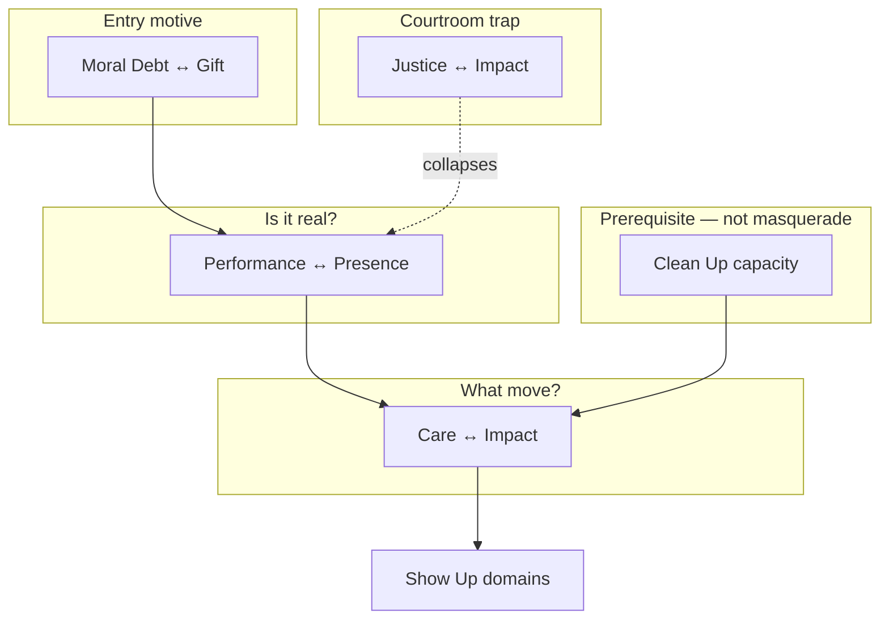

# Governing Polarities Register

**Governing polarities** = living tensions inside how Wendell teaches a craft line. Not grid axes. Not Scene Atlas pair labels.

Each entry: name, poles, tension statement (Wendell's voice), where it shows up, card/copy implications, status.

---

## Mastering Allyship

**Phase A interview:** 2026-05-25 (allyship session 1 — **complete**; Q4/Q5 optional follow-up open)

### GP-A1: Care ↔ Impact

| Field | Content |
|-------|---------|
| **− pole** | Care — over-care, comfort, harm-avoidance, "being supportive" that never costs; **feminized care** as the only model allies know |
| **+ pole** | Impact — change in the world, embodied presence, allyship that leaves a mark; sometimes **helping** requires not caring in the soft way |
| **Tension** | People care **too much** in ways that **remove their impact** — and **confuse care for impact**. Sometimes caring for someone is the exact thing that stops them from being helped. |
| **Shows up in** | Burnout readers; performance allyship; endless listening without resource or action; allies who only know feminized care and can't tell care-as-comfort from care-as-move |
| **Third thing (masquerade)** | **Care mistaken for impact** — not a third pole, but the main confusion that collapses GP-A1 |
| **Card implication** | Tasks must not reward care-as-avoidance; Show Up domain cards especially; cards that "support" without a move toward impact should fail rejection test |
| **Structural relation** | Informs all four **Show Up domains** — see domain pass below; not Gate×Chapter math |
| **Status** | **Validated** — Phase A allyship 2026-05-25 |
| **Source** | Polarity types session + Phase A interview |

**Example card skews (rejection tests):**

| Skew | Why reject |
|------|------------|
| "Send a check-in text so they know you care" (care-only) | Rewards comfort without impact; no evidence of what actually moves |
| "Listen until they feel fully held" (care-only) | Can block the help; feminized care as substitute for showing up |
| "Take direct action now" (impact-only) | Ignores relational cost; performative sprint without presence |

---

### GP-A2: Performance ↔ Presence

| Field | Content |
|-------|---------|
| **− pole** | Performance — looking good, busy optics, right language, credential-collecting, **evidence-avoidance** dressed as activity |
| **+ pole** | Presence — sitting with what you're actually about; integrity held such that **how to show up becomes obvious** |
| **Tension** | Allies optimize for **avoidance** — they do everything that stops them from getting evidence of actual impact vs feared impact, and they do it by **looking busy** rather than showing up. They swing between performance and presence. |
| **Shows up in** | "Read all the right things" + no felt success; absence of stress mistaken for being OK; cancellation-avoidance as proxy for allyship; rarely feeling they're doing well (pernicious shadow — why allyship became a game) |
| **Related pattern** | **Avoidance optimization** (Q2) — shadow of performance pole, not a separate governing pair |
| **Card implication** | Cards must create **evidence** of impact (or honest contact with gap), not just activity; reject busywork prompts; game mechanic should make "doing well" legible without courtroom/compliance frame |
| **Structural relation** | Informs application 52 + hexagram **task design**; links to Ch0 courtroom critique — performance allyship as unwinnable credential game |
| **Status** | **Captured** — Phase A allyship 2026-05-25 |
| **Source** | Phase A interview Q1–Q3 |

**Example card skews:**

| Skew | Why reject |
|------|------------|
| "Post a solidarity statement" (performance-only) | Optics without presence; no contact with actual impact |
| "Sit in silence until you know your truth" (presence-only) | Infinite interior loop; no move toward world |
| "Do one visible allyship action today" (performance-only) | Busy without integrity check; avoidance of real evidence |

---

### GP-A1 ↔ GP-A2 relationship

| | GP-A1 Care ↔ Impact | GP-A2 Performance ↔ Presence |
|---|---------------------|------------------------------|
| **Axis** | What kind of move | Whether the move is real |
| **Failure mode** | Comfort substituting for change | Optics substituting for contact |
| **Link** | Performance often **uses** care-as-comfort to avoid impact evidence |

*Open:* Are these independent governing pairs or one teaching stack (presence → right care/impact choice)? **Pending Wendell somatic check.**

---

### GP-A3: Moral Debt ↔ Gift

| Field | Content |
|-------|---------|
| **− pole** | Moral debt — showing up to allyship to **get out of** a perceived moral debt; discharge obligation |
| **+ pole** | Gift — offering what you actually have to the collective in a **sustainable** way |
| **Tension** | People enter allyship to **escape debt** rather than to **give gifts** — allyship as moral accounting, not contribution. |
| **Shows up in** | Ch0 Infinite Arcade frame; guilt-driven allyship; unsustainable overcommit; "I owe this" energy vs "I have something to offer" |
| **Relation to GP-A1** | **Downwind but distinct** — debt-driven care often masquerades as impact; Wendell: likely separate governing pair |
| **Card implication** | Tasks should not frame allyship as repayment; reward scoped, sustainable offers; reject guilt-as-fuel prompts |
| **Status** | **Captured** — Phase A supplement A 2026-05-25 |
| **Source** | Phase A allyship supplement |

**Example card skews:**

| Skew | Why reject |
|------|------------|
| "Make up for your privilege today" (debt-only) | Fuels unsustainable discharge, not gift |
| "Give until it hurts" (debt-only) | Moral accounting; no sustainability check |
| "Offer one thing you can repeat next month" (gift-only) | Better — but without impact routing, gift may miss leverage |

---

### GP-A4: Justice ↔ Impact

| Field | Content |
|-------|---------|
| **− pole** | Justice — pursuit of justice because people believe **if justice is served, lives will get better** |
| **+ pole** | Impact — **actually making lives better** — sometimes via justice, sometimes despite it |
| **Tension** | The pursuit of justice **keeps people from** actually making lives better — courtroom allyship vs practice allyship. |
| **Shows up in** | Ch0 courtroom critique; credential-collecting unwinnable game; organizing for verdict vs organizing for conditions |
| **Relation to GP-A2** | Courtroom frame is **performance + justice** stack; practice allyship needs presence + impact |
| **Card implication** | Hexagram + domain tasks must distinguish **winning the argument** from **moving conditions**; reject choir-preaching / verdict-seeking |
| **Status** | **Captured** — Phase A supplement B 2026-05-25 |
| **Source** | Phase A allyship supplement |

**Example card skews:**

| Skew | Why reject |
|------|------------|
| "Hold them accountable publicly" (justice-only) | Verdict without conditions change |
| "Fix one person's material condition this week" (impact-only) | May skip systemic justice entirely |
| "Name what justice would look like here" (balanced) | OK if paired with a move toward lived improvement |

---

### Clean Up — not a masquerade (Wendell clarification)

**Question:** Does care masquerade as Clean Up (shadow integration without action)?

**Answer:** **No.** Allies are largely **not doing Clean Up practices** in their allyship at all. Wendell's distinctive contribution is precisely that **if they were doing Clean Up, they would have more energy** to commit to allyship practices — which most people currently lack.

| Implication | Detail |
|-------------|--------|
| **Not a governing pair** | Clean Up absence is a **capacity gap**, not a care/impact confusion |
| **Book/game** | Allyship offering should **teach Clean Up as prerequisite fuel**, not assume allies are already integrating shadow |
| **Card design** | Don't diagnose "fake Clean Up" — design for **real Clean Up** as on-ramp to Show Up domains |

---

### Show Up domain pass — care/impact in each domain

How GP-A1 expresses **inside** each allyship domain (orthogonal to WAVE — see `ALLYSHIP_DOMAINS_SPEC.md`):

| Domain | Care pole (motivation / shadow) | Impact pole (skill / leverage) |
|--------|--------------------------------|--------------------------------|
| **Gather Resources** | Caring **about** gathering resources is what **motivates** gathering | Impact is what makes you **apply resources skillfully** and **choose people who actually have resource need** |
| **Skillful Organizing** | Caring about people makes you **want to organize** them | Impact may have you show up in ways that **don't get credit** for the care you feel; impact wants **directed care vs universal care** |
| **Direct Action** | Care lets you access your **superpower** | Impact **directs** superpower to a **leveraged place** — which may be **outside your care domain** |
| **Raise Awareness** | Caring about what you care about is the **main care shadow** allies face (**choir preaching**) | Impact is **recognizing who needs their awareness raised** — not broadcasting to the already convinced |

**Card authoring rule:** Each domain's Task 2 should name both the care-motivation trap and the impact-leverage move for that domain type.

---

### Allyship governing stack (working model)

*Working model — validate with Wendell somatic check.*

---

## Book & chapter layer (MTGOA)

**Architecture:** Book overarch + one chapter polarity each; Ch8 stuck. Hypothesis pairs **withdrawn** — integral design per chapter required.

| Doc | Purpose |
|-----|---------|
| `../07 Book OS/07 Book OS/BOOK-OVERARCH-6FACE-ANALYSIS.md` | Six GMs on book overarch + Ch8 workshop |
| `../07 Book OS/07 Book OS/CHAPTER-POLARITY-INTEGRAL-DESIGN-PROCESS.md` | Session protocol per chapter |
| `../07 Book OS/07 Book OS/BOOK-CHAPTER-GOVERNING-POLARITIES.md` | Status table |

### GP-BOOK: Performance ↔ Practice

**Teaching grammar:** `../07 Book OS/07 Book OS/POLARITY-TEACHING-GRAMMAR.md`

| | **Performance** | **Practice** |
|---|-----------------|--------------|
| **Healthy** | Visible enactment; showing up where it costs; moves others can trust | Interior preparation; evidenced capacity; BAR; sustainable rhythm |
| **Shadow** | Optics, credentials, busy avoidance, unwinnable game, choir preaching | Infinite interior, forest hoarding, analysis without enactment |

**Tension:** Recognize **shadow** on either pole; return to **healthy** expression of the other — until healthy Performance and healthy Practice rhythm together.

| Field | Content |
|-------|---------|
| **Pole labels** | **Performance ↔ Practice** — Wendell confirmed neutral (2026-05-25) |
| **Status** | **Validated** — integral design Ch1 session |
| **Source** | Wendell 2026-05-25 |

### GP-A-Ch1: Forest ↔ Village

| | **Forest** | **Village** |
|---|------------|-------------|
| **Healthy** | Inner learning; parts; gate walk; center | Application; real others; allyship moves; gift to collective |
| **Shadow** | Endless inner work; credential interiority; no return | Village-first optics; fix world without self-map; burnout sprint |

| Field | Content |
|-------|---------|
| **Chapter** | Ch1 — The Forest |
| **Tension** | Unhealthy village-first vs unhealthy forest-hoarding — Ch1 teaches you can **name two kinds of allyship** |
| **Book relation** | Geographic facet of GP-BOOK |
| **Chapter deliverable** | **Action item** — acknowledge forest vs village allyship (not capacity milestone) |
| **Action item** | Can name the difference + one real example where village allyship was active when forest was needed |
| **Deferred** | Gate-catch in real moment → **book-level** milestone (end of book), not Ch1 |
| **Status** | **Validated** — Wendell 2026-05-25 |
| **Integral design** | `manuscripts/sources/integral-design/chapter-polarities/ch1-forest/` |
| **Chapter goals** | `CHAPTER_GOALS_AND_MILESTONES.md` § Ch1 |

### Ch8 Player

**Status:** **STUCK** — see overarch analysis § Ch8 workshop. May not be a polarity chapter.

---

### Phase A capture notes (allyship session 1)

| Q | Capture |
|---|---------|
| **Q1 — get wrong** | Rarely feel they're doing well; when they do, it's credentials + language + avoided cancellation; sometimes **absence of stress** mistaken for OK |
| **Q2 — optimize for** | **Avoidance** — no evidence of actual vs feared impact; busy over showing up |
| **Q3 — swing** | **Performance ↔ Presence** → GP-A2 |
| **Q4 — best / burnout** | **Partial** — best: growing capacity, aligning with success structures that move the needle *(response cut off)*; burnout: *optional follow-up* |
| **Q5 — card skew** | *Optional follow-up* |
| **Q6 — third thing** | Care confused for impact; feminized care as only model → folded into GP-A1 |
| **Supp A** | Moral debt vs gift → **GP-A3** (distinct from GP-A1, possibly downwind) |
| **Supp B** | Justice vs impact → **GP-A4** (courtroom vs practice) |
| **Supp C** | Clean Up **not** masquerading — allies **skip** Clean Up; Wendell's contribution is teaching it as fuel |
| **Supp D** | Domain pass captured — all four Show Up dimensions |

---

## Mastering Friendcraft

### GP-F1: Safety ↔ Growth

| Field | Content |
|-------|---------|
| **− pole** | Safety — comfort, no rupture, friendship as bunker, "don't challenge me" |
| **+ pole** | Growth — mutual self-actualization, friendship as crucible, becoming more oneself |
| **Tension** | People seek friendship for **safety**, but the safety they want **ruins** what friendship is **for** — helping each other self-actualize. |
| **Shows up in** | Dunbar hoarding; never graduating friends; prompts that only affirm |
| **Card implication** | Quest deck must sometimes **risk** the friendship surface; graduation mechanic is structural expression of this polarity |
| **Structural relation** | May inform Friendcraft **book locale** (journey shape) — not copy allyship Forest hexagrams |
| **Status** | **Captured** — Wendell 2026-05-25 |
| **Source** | Polarity types clarification session |

*Interview follow-ups:* Play vs safety? Async comfort vs ritual depth? How does EA channel choice express this?

---

## Mastering Relationships

*(empty — interview pending)*

---

## Parts work

*(empty — interview pending)*

---

## Flirtcraft / Networking

*(empty — interview pending)*

---

## Rejection test (for new entries)

Before adding a governing polarity:

1. Can Wendell say it in one sentence without grid vocabulary?
2. Does it name a **tension he teaches through**, not a UI axis?
3. Do both poles have shadow forms players actually live in?
4. Would a card that only affirms one pole fail the craft?

---

## Changelog

| Date | Entry | Action |
|------|-------|--------|
| 2026-05-25 | GP-A1, GP-F1 | Initial capture from Wendell |
| 2026-05-25 | GP-A1 | Validated + refined (feminized care, care≠impact confusion) — Phase A allyship |
| 2026-05-25 | GP-A2 | Performance ↔ Presence captured — Phase A allyship |
| 2026-05-25 | GP-A3, GP-A4 | Moral Debt ↔ Gift; Justice ↔ Impact — Phase A supplement |
| 2026-05-25 | Domain pass | Care/impact in four Show Up domains — Phase A supplement D |
| 2026-05-25 | Clean Up note | Not masquerade — capacity gap — Phase A supplement C |
| 2026-05-25 | Allyship Phase A | Marked complete (Q4/Q5 optional) |
| 2026-05-25 | GP-BOOK | Practice↔Performance candidate — six-face analysis |
| 2026-05-25 | GP-A-Ch1 | Forest↔Village Wendell-named; integral design pending |
| 2026-05-25 | GP-BOOK, GP-A-Ch1 | Revised — neutral poles + healthy/shadow grammar (Wendell) |
| 2026-05-25 | GP-BOOK | **Validated** — Performance ↔ Practice labels confirmed |
| 2026-05-25 | GP-A-Ch1 | **Validated** — action item milestone; gate-catch deferred to book |
| 2026-05-28 | Ch2–Ch7 provisional set | Drafted candidates in Book OS; **not registered as validated** pending Wendell-led sessions |
| 2026-05-28 | Ch2 session | Provisional candidate revised to **Trust ↔ Discernment** from manuscript-level analysis |
| 2026-05-28 | Ch2 review workflow | Shifted Ch2 from provisional pair naming to review-spec → change-spec workflow before lock |
