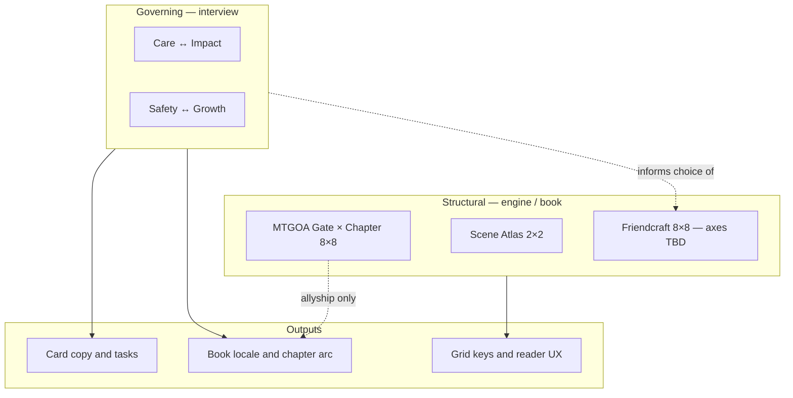

# Polarity Types — Structural vs Governing

**Problem:** We conflated two kinds of polarity in deck design sessions. They share a word but not a job.

---

## The two types

| | **Structural polarity** | **Governing polarity** |
|---|-------------------------|------------------------|
| **What it is** | A **mapping process** — how axes combine to form deck topology | A **living tension** inside how you teach allyship or friendship |
| **Where it lives** | Engine, grid, book matrix | Your ontology, interview, card *field* |
| **Examples** | Scene Atlas pair1×pair2 → 4 suits; MTGOA Gate×Chapter → 64 cells | Allyship: **care ↔ impact**; Friendcraft: **safety ↔ growth** |
| **Source** | Derived (nation/playbook), chosen (orientation), or book-fixed (hexagram) | **Interview / 321** — pulled from Wendell, not inferred from grid math |
| **Purpose** | Organize cells, stable keys, resolved labels, deck literacy | Govern copy, rejection tests, book locale, what cards *hold* |
| **Player feels** | "My grid is labeled Top/Bottom × Lead/Follow" | "This deck keeps asking me to choose between caring and actually changing something" |

**One sentence:** Structural polarity is **how the deck is laid out**. Governing polarity is **what the deck is arguing about**.

---

## What we conflated (and why it felt wrong)

Sessions mixed:

1. **Scene Atlas** — structural 2×2 (polarity mapping *process*)
2. **MTGOA Gate×Chapter** — structural 8×8 (book architecture)
3. **Questions like "what are Friendcraft's two axes?"** — actually asking for **governing** poles (safety vs growth), not grid labels

Governing polarities **cannot** be dropped into `quadrantLabelsFromPairs()` and solved. They inform content and locale; they do not replace the engine pattern.

Structural polarities **must** use the same **I Ching 8×8 exploration pattern** for Friendcraft book 64 as for MTGOA — confirmed 2026-05-25. The **locale** (journey shape), **lower/upper trigram identities**, and **card content** must be chosen *after* governing polarities are named — **not** copied from allyship Gate×Chapter tables. See `I-CHING-EXPLORATION-STRUCTURE.md`.

---

## Governing polarities (seed register)

Captured from Wendell — expand via interview protocol.

### Mastering Allyship

| Polarity | − pole | + pole | Tension (Wendell's words) |
|----------|--------|--------|---------------------------|
| **Care ↔ Impact** | Care (over-care, comfort, harm avoidance) | Impact (material change, presence that costs) | People care *too much* in ways that **remove** their impact — care becomes the excuse for not showing up where it hurts |

*More to interview:* justice vs mercy? performance vs practice? debt vs gift?

### Mastering Friendcraft

| Polarity | − pole | + pole | Tension (Wendell's words) |
|----------|--------|--------|---------------------------|
| **Safety ↔ Growth** | Safety (comfort, no rupture, protective distance) | Growth (self-actualization, mutual becoming) | People seek friendship for **safety**, but the kind of safety they want **ruins** what friendship is *for* — helping each other self-actualize |

*More to interview:* proximity vs space? async vs ritual? graduation vs hoarding?

### Not yet interviewed

- Mastering Relationships (parts-of-other)
- Parts work
- Flirtcraft / Networking

Full register: `GOVERNING-POLARITIES-REGISTER.md`

---

## How they relate (without collapsing)

**Rule:** Governing polarities **inform** structural choices. Structural grids **do not** discover governing polarities.

---

## Friendcraft locale (Wendell's nuance)

You want to **keep** something like MTGOA's movement-through-the-forest — threshold, walk, return — but:

- It is **narrative locale**, not proof that Friendcraft shares I Ching Gate×Chapter
- Allyship forest = prerequisite for **outward allyship** (inner center before showing up for others)
- Friendcraft locale might be a **different place** (same *shape* of journey, different metaphor and governing poles)

**Open:** Name Friendcraft book locale after governing polarities interview (e.g. not "The Forest" unless that image fits friendship native language).

---

## Actionable vault workflow

| Step | Artifact | Owner |
|------|----------|-------|
| 1 | Read this spec | Anyone designing decks |
| 2 | Run governing polarity interview (per line) | Facilitator + Wendell |
| 3 | Log pairs in `GOVERNING-POLARITIES-REGISTER.md` | Facilitator |
| 4 | Only then: structural matrix session (8×8, locale, earn path) | Design session |
| 5 | Scene Atlas stays **structural literacy** only | Engine / onboarding |
| 6 | Update card rejection test: "Which governing pole does this card hold?" | Copy passes |

---

## Research & formal docs

| Doc | Contents |
|-----|----------|
| `POLARITY-THINKING-RESEARCH.md` | External synthesis (Johnson, Jung, Blatt, Integral, I Ching) + application matrix |
| `FORMAL-STRUCTURAL-POLARITY-MAPPING.md` | Scene Atlas 2×2 + I Ching 8×8 mapping process, resolution order, lint |
| `I-CHING-EXPLORATION-STRUCTURE.md` | 8×8 confirmed for allyship + friendcraft exploration 64 |

**Still needed via interview:** Friendcraft lower/upper 8 identities; secondary governing pairs; formal mapping rules if FSR + research insufficient (`POLARITY-THINKING-RESEARCH.md` §6).

---

## Supersedes / amends

- `POLARITY-DESIGN-SESSION-BRIEF.md` — split into Phase A (governing interview) and Phase B (structural matrix)
- `POLARITY-DESIGN-6FACE-ANALYSIS.md` — add footnote: analysis assumed structural; governing pass required first

---

## References

- Scene Atlas structural: `bars-engine/.../POLARITY_DERIVATION.md`
- Deck grammar: `DECK-PRODUCT-GRAMMAR.md`
- Interview protocol: `GOVERNING-POLARITIES-INTERVIEW-PROTOCOL.md`
