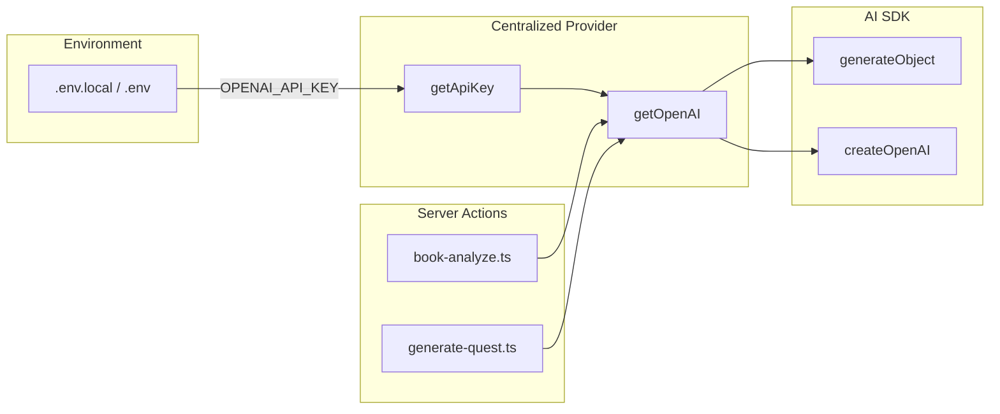

# OpenAI API Usage in bars-engine

This document explains how the codebase uses the OpenAI API key and how to add new AI features (e.g. avatar generation).

## Overview



## 1. Where the key comes from

| Context | Source | Load order |
|---------|--------|------------|
| Next.js (dev/build/start) | `process.env` | Next.js loads `.env.local` then `.env` automatically |
| Server actions | Same as Next.js | Inherit from Node process |
| Standalone scripts (e.g. `test-quest-gen`) | `require-db-env` or `with-env` | `.env.local` then `.env` via dotenv |
| Vercel deploy | Vercel Dashboard → Environment Variables | Set per environment (Production/Preview/Development) |

**Single source of truth**: `OPENAI_API_KEY` in env. Never hardcode; never commit.

## 2. Centralized provider: `src/lib/openai.ts`

All AI features go through this module:

```ts
// src/lib/openai.ts
import { createOpenAI } from '@ai-sdk/openai'

function getApiKey(): string {
  const key = process.env.OPENAI_API_KEY
  if (!key || key.trim() === '') {
    throw new Error('OPENAI_API_KEY is not set. Add it to .env.local (local) or Vercel Environment Variables (deploy). See docs/ENV_AND_VERCEL.md')
  }
  return key
}

export function getOpenAI() {
  return createOpenAI({ apiKey: getApiKey() })
}
```

**Behavior**:
- Reads `process.env.OPENAI_API_KEY`
- Throws a clear error if missing or empty
- Returns a Vercel AI SDK provider instance via `createOpenAI({ apiKey })`
- Does **not** trim the key before passing (potential improvement for env file quirks)

**Usage**:
```ts
import { getOpenAI } from '@/lib/openai'
import { generateObject } from 'ai'

const { object } = await generateObject({
  model: getOpenAI()('gpt-4o'),  // provider(modelId)
  schema: mySchema,
  system: '...',
  prompt: '...',
})
```

## 3. Current AI features (2 call sites)

| Feature | File | Function | Model | Purpose |
|---------|------|----------|-------|---------|
| Book analysis | `src/actions/book-analyze.ts` | `analyzeBook` | gpt-4o-mini (default) | Extract quests from PDF text chunks |
| I Ching quest gen | `src/actions/generate-quest.ts` | `generateQuestCore` | gpt-4o (default) | Create a quest from hexagram + playbook |

Both use `generateObjectWithCache` from `src/lib/ai-with-cache.ts`, which wraps `generateObject` with:
- **Response cache** — identical inputs return cached results (no API call)
- **Rate-limit retry** — 15s wait and retry on TPM/429 errors
- **Configurable models** — `BOOK_ANALYSIS_MODEL`, `QUEST_GEN_MODEL` env vars

## 4. Dependencies

- `@ai-sdk/openai` — OpenAI provider for the Vercel AI SDK
- `ai` — Core SDK (`generateObject`, `generateText`, `streamText`, etc.)

## 5. Adding new AI features (e.g. avatar generation)

1. **Use the centralized provider**:
   ```ts
   import { getOpenAI } from '@/lib/openai'
   ```
2. **Choose the right API**:
   - `generateObject` — structured output (Zod schema)
   - `generateText` — plain text
   - `streamText` — streaming text
   - Image generation: `getOpenAI().image('dall-e-3')` (if supported by your SDK version)
3. **Keep the key in env** — no code changes needed; `getOpenAI()` reads `OPENAI_API_KEY` each time.
4. **Handle errors** — Catch and return user-friendly messages; the API can return "Incorrect API key provided" or rate-limit errors.

## 6. Key validation flow

1. User triggers an AI feature (e.g. "Trigger Analysis" on a book).
2. Server action runs (e.g. `analyzeBook`).
3. Action calls `getOpenAI()('gpt-4o')`.
4. `getOpenAI()` calls `getApiKey()`:
   - If missing/empty → throws "OPENAI_API_KEY is not set..."
   - Otherwise → returns `createOpenAI({ apiKey })`
5. `generateObject` sends the request to `https://api.openai.com/v1/...` with `Authorization: Bearer <key>`.
6. If the key is invalid, OpenAI returns 401 and the SDK throws "Incorrect API key provided".

## 7. Token efficiency and control (AI Deftness)

| Env var | Default | Purpose |
|---------|---------|---------|
| `BOOK_ANALYSIS_MODEL` | gpt-4o-mini | Model for book analysis (cheaper, higher TPM) |
| `QUEST_GEN_MODEL` | gpt-4o | Model for I Ching quest generation |
| `BOOK_ANALYSIS_AI_ENABLED` | (unset = enabled) | Set to `false` to disable book analysis AI |
| `QUEST_GEN_AI_ENABLED` | (unset = enabled) | Set to `false` to disable quest gen AI |
| `QUEST_GRAMMAR_AI_ENABLED` | (unset = enabled) | Set to `false` to disable quest grammar AI (admin unpacking form) |
| `QUEST_GRAMMAR_AI_MODEL` | gpt-4o | Model for quest grammar node text generation |

**Caching**: Responses are cached in `AiResponseCache` (7-day TTL). Re-running analysis on the same book or generating a quest with the same hexagram+playbook+lens returns cached results.

**Chunk filter**: Non-actionable chunks (copyright, tables, pure narrative) are skipped before AI calls.

## 8. Troubleshooting

| Symptom | Likely cause | Action |
|---------|--------------|--------|
| "OPENAI_API_KEY is not set" | Key not in env | Add to `.env.local` or Vercel; run `npm run smoke` |
| "Incorrect API key provided" | Key wrong, revoked, or org/project mismatch | Create new key at platform.openai.com/api-keys; ensure no extra spaces/newlines; try `OPENAI_ORG_ID` if in an org |
| Works locally, fails on Vercel | Env not set for deploy | Add in Vercel Dashboard; redeploy |
| Script fails but app works | Script not loading env | Use `require-db-env` or `with-env`; ensure `.env.local` exists |

## 9. Scripts that use the key

- `scripts/test-quest-gen.ts` — Calls `generateQuestCore`; loads env via `require-db-env` (which loads `.env.local` and `.env`). Does **not** use `getOpenAI` directly; it calls the action, which does.

## 10. What is *not* using AI

- **Cast I Ching** (`cast-iching.ts`) — Picks a random hexagram from DB; no API call.
- **Story Clock** (`world.ts`) — Generates quests deterministically from hexagrams; no API call.
- **Book upload / Extract text** — Uses `pdf-parse-new`; no OpenAI.

`analyzeBook`, `generateQuestFromReading` → `generateQuestCore`, and `compileQuestWithAI` (admin quest grammar) hit the OpenAI API.
