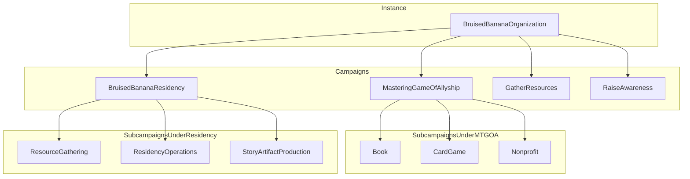
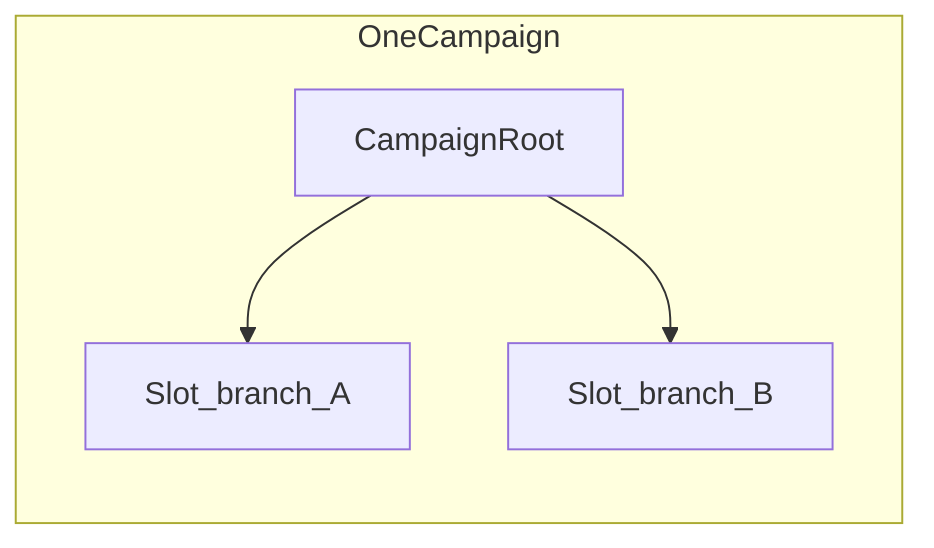

# Campaign ontology — architecture note (Bruised Banana)

**Tracks:** [GitHub issue #39](https://github.com/johnair01/bars-engine/issues/39) · Glossary: [campaign-ontology-glossary.md](./campaign-ontology-glossary.md)

This note gives **one canonical story** for how instance, campaigns, subcampaigns, slots, and hub/spoke topology fit together. It is the product picture specs and UI should converge on; Prisma and routes may still use `campaignRef` strings while [campaign-ontology-alignment](../../.specify/specs/campaign-ontology-alignment/) phases roll out.

---

## Canonical example: Bruised Banana Organization

**Instance (world container)**  
- Bruised Banana Organization

**Campaigns (initiatives inside the instance)**  
- Bruised Banana Residency  
- Mastering the Game of Allyship  
- Gather Resources  
- Raise Awareness  

**Subcampaigns (examples)**  
- Under *Mastering the Game of Allyship:* Book, Card Game, Nonprofit  
- Under *Bruised Banana Residency:* Resource Gathering, Residency Operations, Story Artifact Production  

**CampaignSlot (inside each campaign)**  
- Organizes adventures, branches, and content trees **within** that campaign—not the same as “who owns” a sub-initiative.

**Hub / spoke / node (optional per campaign)**  
- e.g. Residency may use a hub/spoke progression layer; MTGOA may use its own or a simpler pattern.  
- A **node** can mark where a new sub-initiative becomes appropriate (capacity, maturity, or design gates)—product policy, not only UI.

---

## Structure diagram (intent)

**Slots (content tree, simplified)**

---

## Hub, spoke, node — metaphor appendix (stewards and copy)

For **onboarding** non-engineers: think of a **bicycle wheel**. Builders often tension the **rim** and **spokes** first, then add the **hub** to connect and balance load. In product terms:

- **Hub** — where you **return**, connect, or re-orient; not necessarily where all generative work happens.  
- **Spoke** — a run or arc you take from that hub.  
- **Node** — a meaningful threshold (unlock, completion, or social gate) where **new structure** (e.g. a subcampaign) might appear.

This metaphor is **pedagogical**. Database tables keep their existing names; do not rename Prisma models to “Hub” without a dedicated migration spec.

---

## Repository reality (today)

| Layer | Prisma / code pointers |
|-------|-------------------------|
| Instance | `Instance` |
| Campaign | `Campaign`; many flows use `campaignRef` string |
| Subcampaign | Target: `parentCampaignId`-style relation (Phase 2) |
| Slot | `CampaignSlot` |
| Hub/spoke progression | `CampaignPortal`, `SpokeSession`, deck/period/milestone-related models — Phase 4 re-anchors to canonical campaign where needed |
| String inventory | `npm run campaignref:inventory` → [`docs/CAMPAIGNREF_INVENTORY.md`](../CAMPAIGNREF_INVENTORY.md) (migration map + tier-1 action modules) |

---

## Acceptance alignment (issue 39)

- Glossary published: [campaign-ontology-glossary.md](./campaign-ontology-glossary.md)  
- Architecture note with example + diagrams: this document  
- Spec authority: [.specify/specs/campaign-ontology-alignment/spec.md](../../.specify/specs/campaign-ontology-alignment/spec.md)
