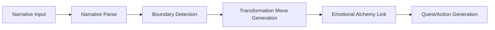

# Narrative Transformation Engine v0

## Purpose

The engine converts a player's stuck narrative into a playable transformation loop. It parses structure, detects lock types, generates transformation moves, links to Emotional Alchemy and 3-2-1, and produces quest seeds. Bounded psychotech—not a therapy engine.

## Pipeline



---

## Part 1: Narrative Structure Model

### Minimal Structure

A stuck narrative is parsed into:

| Field | Description |
|-------|-------------|
| **actor** | Who the statement is about (usually "I") |
| **state** | Emotion, condition, or identity position |
| **object** | What the state is attached to |
| **negations** | Optional negation markers |
| **confidence** | Parse confidence (0–1) |

### Example

```
Input: I am afraid of failing
actor = I
state = afraid
object = failing
```

### Parsed Object Contract

```json
{
  "raw_text": "I am afraid of failing",
  "actor": "I",
  "state": "afraid",
  "object": "failing",
  "negations": [],
  "confidence": 0.78
}
```

v0 uses heuristic parsing, not full NLP.

---

## Part 2: Boundary / Lock Detection

### Lock Conditions

- Actor fused with state
- State fused with object
- Certainty framing
- Repeated identity claim
- Inability claim
- Problem described as fixed reality

### Lock Types

| Type | Example |
|------|---------|
| **identity** | "I'm just this way" |
| **emotional** | "I am afraid of failing" |
| **action** | "I can't change jobs" |
| **possibility** | "There's no way out" |

---

## Part 3: Transformation Moves

### 1. Perspective Shift

Change viewpoint or pronoun position.

- Third-person observation
- Second-person dialogue
- First-person reintegration
- Actor/object inversion

### 2. Boundary Disruption

Challenge or loosen the fixed structure.

- Inversion
- Negation
- Contradiction
- Alternate framing
- Reframing question

### 3. Energy Reallocation

Translate the locked state into emotional movement.

- fear → curiosity
- shame → protection
- anger → boundary signal
- confusion → possibility

### Move Output Contract

```json
{
  "move_id": "perspective_shift_01",
  "move_type": "perspective_shift",
  "prompt": "What is failure afraid of that is not you?",
  "target_effect": "loosen actor-object fusion",
  "source_parse_id": "parse_123"
}
```

Each move has: move_id, move_type, purpose, input requirements, output pattern, safety constraints.

---

## Part 4: Emotional Alchemy Link

Map narrative state into emotional processing prompts.

| Narrative | State | Alchemy Prompt |
|-----------|-------|----------------|
| I am afraid of failing | fear | Where do you feel the fear in your body? |
| I can't ask for help | shame | What does shame protect you from? |
| I'm stuck | confusion | Where is the stuckness located? |

Compatible with existing Emotional Alchemy system (translate/transcend, satisfaction/dissatisfaction). Invites WAVE and somatic metabolization.

---

## Part 5: 3-2-1 / Shadow Work Link

Optional pathway. Convert parsed narrative into 3-2-1 prompts:

| Person | Purpose |
|--------|---------|
| **3rd** | Describe the feared object or shadowed figure |
| **2nd** | Dialogue with it |
| **1st** | Become it / reintegrate it |

Example:

```
Raw: I am afraid of failing

3: Failure is always watching me
2: Failure, what are you trying to show me?
1: I am the part that fears collapse and wants protection
```

---

## Part 6: Quest Generation Link

Output shape:

```json
{
  "quest_seed_type": "narrative_transformation",
  "reflection_prompt": "What does failure protect you from?",
  "alchemy_prompt": "Where do you feel fear in your body?",
  "action_experiment": "Do one small action where imperfect completion is allowed.",
  "bar_prompt": "Capture what you learned from taking this imperfect step."
}
```

v0 produces quest seeds/templates, not full campaign quests.

---

## Part 7: Safety / Scope Boundaries

### Should

- Help generate reflection and action structures
- Support gameplay and personal development use cases
- Remain bounded and inspectable

### Should Not

- Claim diagnostic authority
- Auto-generate high-stakes mental health interventions
- Force one interpretation of a player's narrative
- Mutate player state invisibly

### Favor

- Prompts, options, structured quests, visible transformation steps

### Avoid

- Black-box psychoanalysis, hidden scoring, overstated certainty

---

## Part 8: Constraints

v0 should:

- Use a small number of transformation moves
- Prefer explicit structures over deep linguistic cleverness
- Support quest seed generation, not full autonomous quest authoring
- Integrate with BAR creation and Emotional Alchemy
- Remain compatible with future template extraction

Do not build:

- Full conversational agent
- Rich freeform therapy dialogue
- Massive ontology of psychological states
- Dynamic multi-turn inference engine
