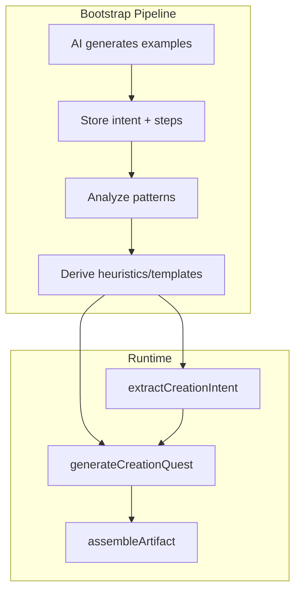

# Creation Quest Bootstrap — Design Doc

## Overview

Creation quests are quests generated from user input (e.g., unpacking answers, creation prompts). A core tension exists: **heuristics** are deterministic and cheap at runtime but costly to design and maintain; **AI** yields higher quality but consumes tokens and is non-deterministic.

The **bootstrap loop** resolves this tension: use AI to generate examples, analyze patterns, derive rules, then run a rules-first runtime with AI as fallback. This document captures the exploration, path comparison, and design decisions.

## API Contracts

Three API contracts form the creation quest pipeline:

| Contract | Input | Output | Role |
|----------|-------|--------|------|
| `extractCreationIntent` | User answers (unpacking, prompts) | `CreationIntent` with confidence | Structured intent from raw input |
| `generateCreationQuest` | Intent + context | `CreationQuestPacket` (nodes, heuristicVsAi) | Quest steps; rules first, AI fallback |
| `assembleArtifact` | creationType + inputs | Artifact (Passages, Twine) | Deterministic assembly |

- **extractCreationIntent**: Rules-based when patterns are clear; AI fallback when ambiguous. Returns `confidence` for downstream routing.
- **generateCreationQuest**: Match templates/heuristics first; call AI when no match or confidence below threshold.
- **assembleArtifact**: Pure deterministic assembly; no AI.

## Path Comparison

| Path | Description | Pros | Cons |
|------|-------------|------|------|
| **A: Heuristic-First** | Rules only; no AI | Deterministic, cheap, fast | Costly to design; brittle; poor edge-case handling |
| **B: AI-First** | AI for all generation | High quality; flexible | Tokens; non-deterministic; rate limits |
| **C: Bootstrap Loop** | AI generates examples → derive rules → rules-first runtime + AI fallback | Best of both; improves over time | Requires bootstrap pipeline |

**Recommendation**: Path C — Bootstrap Loop. Use AI to bootstrap heuristics; run rules-first at runtime; fall back to AI for edge cases.

## Bootstrap Pipeline

1. **AI generates examples**: Prompt AI with seed inputs; produce (intent, steps) pairs.
2. **Store**: Persist to JSON/DB for analysis.
3. **Analyze**: Identify patterns (creationType clusters, common step sequences).
4. **Derive heuristics**: Encode as rules in `extractCreationIntent` and template matchers in `generateCreationQuest`.
5. **Runtime**: Rules-first; AI fallback when confidence < threshold or no template matches.

## Deftness Principles

- **Deterministic over AI**: Prefer rules when confidence is sufficient.
- **Cache**: Cache AI outputs where input is stable (per AI Deftness Strategy).
- **Pre-filter**: Skip AI when heuristics clearly apply.
- **Control plane**: Feature flags, token budgets, graceful degradation.
- **Observability**: Log `intentConfidence`, `heuristicVsAi`, `templateMatched` for tuning.

## Architecture Diagram

## Reference

- Spec: [.specify/specs/creation-quest-bootstrap/spec.md](../.specify/specs/creation-quest-bootstrap/spec.md)
- Plan: [.specify/specs/creation-quest-bootstrap/plan.md](../.specify/specs/creation-quest-bootstrap/plan.md)
- Tasks: [.specify/specs/creation-quest-bootstrap/tasks.md](../.specify/specs/creation-quest-bootstrap/tasks.md)
